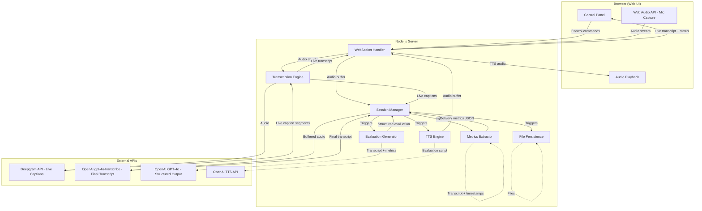
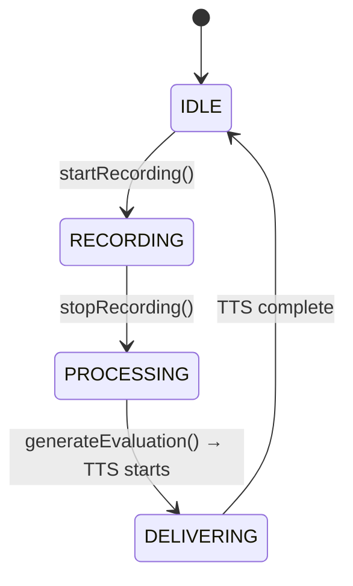

# Design Document: AI Toastmasters Evaluator MVP (Phase 1)

## Overview

The AI Toastmasters Evaluator is a web-based application that captures a live Toastmasters speech via microphone, transcribes it in real time, computes delivery metrics, generates an evidence-based evaluation using an LLM, and delivers it aloud via text-to-speech. The system runs on an internet-connected laptop with a USB/boundary microphone for input and a separate speaker for output.

The architecture follows a pipeline pattern: Audio Capture → Transcription → Metrics Extraction → Evaluation Generation → TTS Delivery. A web-based UI provides manual controls for the Operator. All components communicate through well-defined interfaces to support future extensibility.

### Technology Stack

- **Runtime**: Node.js with TypeScript
- **Web Framework**: Express.js with raw WebSocket (`ws` library) for binary audio streaming efficiency
- **Frontend**: Vanilla HTML/CSS/JS served statically (minimal UI, no framework needed for MVP)
- **Audio Capture**: Web Audio API in the browser, streamed to server via WebSocket as mono 16-bit PCM at 16 kHz
- **Live Transcription**: Deepgram API (native real-time WebSocket streaming) for live captions during recording
- **Post-Speech Transcription**: OpenAI `gpt-4o-transcribe` for high-accuracy final transcript used in evaluation grounding
- **LLM**: OpenAI GPT-4o with structured output (JSON mode) for evaluation generation
- **TTS**: OpenAI TTS API (voice: `cedar` or `nova`, A/B test recommended)
- **Testing**: Vitest for unit/property tests, fast-check for property-based testing

### Audio Format Contract

All audio flowing through the system adheres to a single format:

- **Channels**: Mono (1 channel)
- **Encoding**: 16-bit linear PCM (LINEAR16)
- **Sample Rate**: 16,000 Hz

The browser's Web Audio API captures at the device's native sample rate (typically 48kHz). An AudioWorklet handles downsampling to 16kHz and Float32→Int16 conversion with proper clipping and low-pass filtering (not naive decimation). Before streaming audio chunks, the client sends an `audio_format` handshake message declaring the format. The server validates:
1. The handshake declares the expected format (mono, LINEAR16, 16kHz)
2. Each audio chunk's byte length is a multiple of 2 (16-bit alignment)
3. Chunk arrival rate is within expected bounds

If validation fails, the server emits an `audio_format_error` and stops accepting audio for the session.

### Audio Streaming Contract

- **Chunk duration**: 50ms (800 samples at 16kHz × 2 bytes = 1,600 bytes per chunk, mono)
- **Max acceptable jitter**: 100ms between chunks before a warning is logged
- **Max speech duration**: 1,500 seconds (25 minutes) enforced by the Session Manager; auto-stop with notification to the Operator. Buffer cap matches speech cap to avoid confusion.

### Key Design Decisions

1. **Browser-based audio capture**: Using the Web Audio API in the browser avoids native audio driver complexity and works cross-platform. Audio is streamed to the server via raw WebSocket (not socket.io) for efficient binary transport.
2. **Two-pass transcription**: Deepgram provides live captions during recording for real-time UI display. After recording stops, the full audio is sent to OpenAI `gpt-4o-transcribe` for a higher-accuracy final transcript used for metrics and evaluation. This avoids chunk-stitching complexity and gives stable evidence quotes.
3. **Server-side pipeline**: All processing (metrics, evaluation, TTS) happens server-side. The browser is a thin client for audio capture and UI controls.
4. **Hardened echo prevention**: The mic MediaStream tracks are hard-stopped in DELIVERING state. A 2-3 second cooldown period after TTS completes prevents premature re-arming. A "panic mute" button is available at all times. No DSP-based echo cancellation needed for MVP.
5. **Structured evaluation output**: The LLM produces a structured JSON response with explicit commendation/recommendation objects, each containing an `evidence_quote` and `evidence_timestamp`. Evidence quotes are validated against the transcript text before rendering the spoken script. This reduces hallucination more effectively than prompt-only controls.
6. **Section-based evaluation length**: Instead of a raw word count target, the evaluation is structured into sections (opening, commendations, recommendations, closing) with per-section sentence limits. A hard playback time cap of 3m30s is enforced at the TTS level.
7. **Opt-in persistence**: Session outputs are NOT saved to disk by default. The Operator must explicitly click "Save Outputs" after the evaluation is delivered. This respects privacy in a Toastmasters room setting.

## Architecture



### Data Flow

1. **Recording Phase**: Browser captures mic audio (mono 16-bit PCM 16kHz) → streams via WebSocket → server forwards to Deepgram for live captions → interim/final transcript segments stream back → relayed to browser for live display. Server also buffers the full audio.
2. **Finalization Phase**: When recording stops, the buffered audio is sent to OpenAI `gpt-4o-transcribe` for a high-accuracy final transcript. Only finalized segments (not interim) are used for evaluation.
3. **Processing Phase**: Session Manager receives finalized transcript → Metrics Extractor computes delivery metrics → both passed to Evaluation Generator → LLM returns structured JSON → evidence quotes validated against transcript → spoken script rendered from validated JSON.
4. **Delivery Phase**: TTS Engine converts rendered script to audio → audio streamed to browser for playback → hard playback time cap enforced at 3m30s.
5. **Persistence Phase (opt-in)**: If the Operator clicks "Save Outputs", File Persistence saves transcript, metrics, and evaluation to disk.

## Components and Interfaces

### Session Manager

The central orchestrator that manages session state transitions and coordinates all components.

```typescript
enum SessionState {
  IDLE = "idle",
  RECORDING = "recording",
  PROCESSING = "processing",
  DELIVERING = "delivering",
}

interface Session {
  id: string;
  state: SessionState;
  startedAt: Date | null;
  stoppedAt: Date | null;
  transcript: TranscriptSegment[];       // final transcript (from post-speech pass)
  liveTranscript: TranscriptSegment[];   // live captions (for UI display only)
  audioChunks: Buffer[];                // buffered audio chunks for post-speech transcription
  metrics: DeliveryMetrics | null;
  evaluation: StructuredEvaluation | null;
  evaluationScript: string | null;       // rendered spoken script
  qualityWarning: boolean;
  outputsSaved: boolean;                 // opt-in persistence flag
  runId: number;                         // monotonic integer, incremented on each start/panic; async stages check before committing
  speakerName?: string;                  // extensibility: future multi-speaker
  evaluationObjectives?: string[];       // extensibility: future project-specific
  voiceConfig?: string;                  // extensibility: future voice selection
}

interface SessionManager {
  createSession(): Session;
  startRecording(sessionId: string): void;
  stopRecording(sessionId: string): Promise<void>;
  generateEvaluation(sessionId: string): Promise<void>;
  getSession(sessionId: string): Session;
  panicMute(sessionId: string): void;
}
```

**Panic Mute Behavior**: When `panicMute()` is called from any state:
- Audio capture MediaStream tracks are immediately stopped
- Deepgram WebSocket is closed
- Session transitions to IDLE
- Buffered audio chunks are preserved (not discarded) so the Operator can still attempt evaluation from what was captured
- Any pending post-speech transcription or TTS synthesis is cancelled via AbortController; if results arrive after cancellation, they are ignored (each async pipeline stage captures `session.runId` at start and only commits if it still matches the current `runId`)
- The Web UI resets to show "Start Speech" with a banner indicating the session was interrupted

**State Transitions**:


### Transcription Engine

Manages two transcription passes: Deepgram for live captions and OpenAI for the final transcript.

```typescript
interface TranscriptSegment {
  text: string;
  startTime: number;  // seconds from speech start
  endTime: number;    // seconds from speech start
  words: TranscriptWord[];
  isFinal: boolean;   // true for finalized segments, false for interim
}

interface TranscriptWord {
  word: string;
  startTime: number;
  endTime: number;
  confidence: number;
}

interface TranscriptionEngine {
  // Live captions via Deepgram (for UI display during recording)
  startLive(onSegment: (segment: TranscriptSegment) => void): void;
  feedAudio(chunk: Buffer): void;
  stopLive(): void;

  // Post-speech final transcript via OpenAI gpt-4o-transcribe
  finalize(fullAudio: Buffer): Promise<TranscriptSegment[]>;
}
```

**Single connection per speech**: If the Deepgram WebSocket drops during recording, the system marks a quality warning and stops the live caption stream rather than attempting to reconnect and stitch timestamps. The post-speech OpenAI transcription pass still produces a usable final transcript.

**Interim vs. final segments**: During live captioning, Deepgram returns both interim (speculative) and final (committed) segments. The UI displays both for responsiveness, but only finalized segments from the post-speech pass are used for metrics and evaluation.

**Canonical speech clock**: All timestamps in the system are expressed as "seconds since speech start." The Session Manager records a `speechStartEpochMs` at `startRecording()`. The post-speech transcript timestamps from OpenAI are the canonical source for metrics and evidence. Deepgram live caption timestamps are used only for UI display and are not mixed with the final transcript timestamps.

**Live transcript update semantics**: Each `transcript_update` message from the server includes a `replaceFromIndex` field indicating which segment index to replace from. The `segments` field contains only the replacement suffix (not the full transcript). The client maintains a local segment array and splices from `replaceFromIndex` onward with the new segments. This handles Deepgram's interim→final replacement pattern without flicker or duplication, and keeps payload size small.

**Segment-level timing fallback**: If the post-speech transcription pass does not return word-level timestamps (only segment-level timing), the system degrades gracefully:
- Pause detection uses segment gaps only (instead of inter-word gaps)
- Evidence timestamp locality operates at segment resolution (±20s around segment start/end)
- WPM is computed from total word count and segment-level duration
- A note is added to the metrics indicating reduced timing precision

### Metrics Extractor

Computes delivery metrics deterministically from the finalized transcript.

```typescript
interface DeliveryMetrics {
  durationSeconds: number;
  durationFormatted: string;  // "M:SS"
  totalWords: number;
  wordsPerMinute: number;
  fillerWords: FillerWordEntry[];
  fillerWordCount: number;
  fillerWordFrequency: number; // per minute
  pauseCount: number;
  totalPauseDurationSeconds: number;
  averagePauseDurationSeconds: number;
}

interface FillerWordEntry {
  word: string;
  count: number;
  timestamps: number[];  // when each occurrence happened
}

interface MetricsExtractor {
  extract(segments: TranscriptSegment[]): DeliveryMetrics;
}
```

**Filler Word Detection Strategy**: The Metrics Extractor uses a two-tier approach:
1. **Known filler list**: A base set of common fillers ("um", "uh", "ah", "like", "you know", "so", "basically", "right", "actually", "literally") for fast matching.
2. **Contextual detection**: Words from the known list are only counted as fillers when they appear in filler-like positions (e.g., sentence-initial "so", mid-sentence "like" not used as a verb/preposition). This uses simple heuristic rules based on surrounding word context rather than a full NLP model, keeping it deterministic and fast.

**Pause Detection Strategy**: A pause is defined as a gap between consecutive transcript segments or words exceeding a configurable threshold (default: 1.5 seconds). The threshold is configurable to account for different transcription engine behaviors.

### Evaluation Generator

Produces the evaluation using an LLM with structured JSON output, then validates evidence and renders a spoken script.

```typescript
interface EvaluationConfig {
  objectives?: string[];  // unused in Phase 1, extensibility hook
}

interface EvaluationItem {
  type: "commendation" | "recommendation";
  summary: string;
  evidence_quote: string;      // verbatim snippet from transcript (≤15 words)
  evidence_timestamp: number;  // start time of first quoted word, seconds since speech start
  explanation: string;         // why this matters
}

interface StructuredEvaluation {
  opening: string;             // 1-2 sentences
  items: EvaluationItem[];     // 2-3 commendations + 1-2 recommendations
  closing: string;             // 1-2 sentences
}

interface EvaluationGenerator {
  generate(
    transcript: TranscriptSegment[],
    metrics: DeliveryMetrics,
    config?: EvaluationConfig
  ): Promise<StructuredEvaluation>;

  validate(
    evaluation: StructuredEvaluation,
    transcriptText: string
  ): { valid: boolean; issues: string[] };

  renderScript(evaluation: StructuredEvaluation): string;
}
```

**Two-stage generation pipeline**:
1. **Stage 1 — Structured JSON**: The LLM produces a `StructuredEvaluation` JSON object using OpenAI's structured output mode. Each commendation/recommendation includes an `evidence_quote` (verbatim ≤15 words from the transcript) and `evidence_timestamp` (the timestamp of the first word of the quoted passage, in seconds since speech start).
2. **Stage 2 — Validation**: Each `evidence_quote` is validated against the final transcript using two checks: (a) contiguous match of at least 6 consecutive normalized tokens (lowercased, punctuation-stripped, whitespace-collapsed), and (b) the match must fall within ±20 seconds of the claimed `evidence_timestamp` using post-speech transcript word timestamps. Evidence quotes must be ≤ 15 words. Items failing validation are re-prompted individually (max 1 retry per item). If dropping failed items would violate the shape invariant (< 2 commendations or < 1 recommendation), the full evaluation is regenerated (max 2 total attempts).
3. **Stage 3 — Script rendering**: The validated `StructuredEvaluation` is rendered into a natural spoken script with section-based length constraints. The TTS Engine then estimates duration and trims at sentence boundaries if needed.

**Section-based length constraints**:
- Opening: 1-2 sentences
- Each commendation: 2-3 sentences (evidence quote woven in naturally)
- Each recommendation: 2-3 sentences (evidence quote woven in naturally)
- Closing: 1-2 sentences
- Total target: ~250-400 words, with pre-TTS text trimming to fit within 3m30s at calibrated WPM

**Transcript Quality Assessment**: Before generating the evaluation, the system checks:

- Total word count relative to recording duration (flag if < 10 words per minute)
- Average word confidence score (flag if < 0.5)
- A `qualityWarning` flag is passed to the prompt if issues are detected, instructing the LLM to include caveats

### TTS Engine

Converts evaluation script to spoken audio. Enforces time constraints at the text level before synthesis, not by truncating audio.

```typescript
interface TTSConfig {
  voice: string;          // default: "cedar", extensibility hook
  maxDurationSeconds: number; // default: 210 (3m30s), hard cap
  calibratedWPM: number;  // default: 150, calibrated per voice
}

interface TTSEngine {
  synthesize(text: string, config?: TTSConfig): Promise<Buffer>;
  estimateDuration(text: string, wpm?: number): number; // estimated seconds
  trimToFit(text: string, maxSeconds: number, wpm?: number): string; // trim at sentence boundary
}
```

**Pre-TTS time enforcement**: Before calling the TTS API, the engine estimates the script duration using `word count / calibratedWPM`. If the estimate exceeds `maxDurationSeconds`, the script is shortened by dropping the least important content at sentence boundaries (starting from the closing, then trimming recommendation explanations). The already-compliant script is then synthesized. This avoids audio waveform surgery and produces cleaner speech.

### File Persistence

Saves session outputs to disk when the Operator explicitly requests it.

```typescript
interface FilePersistence {
  saveSession(session: Session): Promise<string[]>; // returns file paths
}
```

**File Naming Convention**: `output/{YYYY-MM-DD_HH-mm-ss}_{sessionId}/`

- `transcript.txt` — full transcript with timestamps
- `metrics.json` — delivery metrics
- `evaluation.txt` — written evaluation

Persistence is opt-in. The Web UI shows a "Save Outputs" button after the evaluation is delivered. Files are only written when the Operator clicks it.

### WebSocket Protocol

```typescript
// Client → Server messages
type ClientMessage =
  | { type: "audio_format"; channels: 1; sampleRate: 16000; encoding: "LINEAR16" }
  | { type: "start_recording" }
  | { type: "audio_chunk"; data: ArrayBuffer }
  | { type: "stop_recording" }
  | { type: "deliver_evaluation" }
  | { type: "save_outputs" }
  | { type: "panic_mute" };

// Server → Client messages
type ServerMessage =
  | { type: "state_change"; state: SessionState }
  | { type: "transcript_update"; segments: TranscriptSegment[]; replaceFromIndex: number }
  | { type: "elapsed_time"; seconds: number }
  | { type: "evaluation_ready"; evaluation: StructuredEvaluation; script: string }
  | { type: "tts_audio"; data: ArrayBuffer }
  | { type: "tts_complete" }
  | { type: "outputs_saved"; paths: string[] }
  | { type: "error"; message: string; recoverable: boolean }
  | { type: "audio_format_error"; message: string };
```

## Data Models

### Session Data Model

```typescript
interface SessionData {
  id: string;                          // UUID
  state: SessionState;
  createdAt: Date;
  startedAt: Date | null;
  stoppedAt: Date | null;
  completedAt: Date | null;
  transcript: TranscriptSegment[];     // final transcript
  liveTranscript: TranscriptSegment[]; // live captions (UI only)
  audioChunks: Buffer[];
  metrics: DeliveryMetrics | null;
  evaluation: StructuredEvaluation | null;
  evaluationScript: string | null;
  qualityWarning: boolean;
  outputsSaved: boolean;
  runId: number;
  speakerName?: string;                // extensibility
  evaluationObjectives?: string[];     // extensibility
  voiceConfig?: string;                // extensibility
}
```

### Structured Evaluation Data Model

```typescript
interface EvaluationItem {
  type: "commendation" | "recommendation";
  summary: string;
  evidence_quote: string;
  evidence_timestamp: number;
  explanation: string;
}

interface StructuredEvaluation {
  opening: string;
  items: EvaluationItem[];
  closing: string;
}
```

### Delivery Metrics Data Model

```typescript
interface DeliveryMetrics {
  durationSeconds: number;
  durationFormatted: string;
  totalWords: number;
  wordsPerMinute: number;
  fillerWords: FillerWordEntry[];
  fillerWordCount: number;
  fillerWordFrequency: number;
  pauseCount: number;
  totalPauseDurationSeconds: number;
  averagePauseDurationSeconds: number;
}

interface FillerWordEntry {
  word: string;
  count: number;
  timestamps: number[];
}
```

### Transcript Data Model

```typescript
interface TranscriptSegment {
  text: string;
  startTime: number;
  endTime: number;
  words: TranscriptWord[];
  isFinal: boolean;
}

interface TranscriptWord {
  word: string;
  startTime: number;
  endTime: number;
  confidence: number;
}
```

### Output File Structures

**transcript.txt format**:
```
[00:00] Hello everyone, today I want to talk about...
[00:15] The first point I'd like to make is...
[01:30] In conclusion...
```

**metrics.json format**: Direct serialization of the `DeliveryMetrics` interface.

**evaluation.txt format**: Plain text of the evaluation, prefixed with a header containing session metadata (date, duration, speaker name if provided).


## Correctness Properties

*A property is a characteristic or behavior that should hold true across all valid executions of a system — essentially, a formal statement about what the system should do. Properties serve as the bridge between human-readable specifications and machine-verifiable correctness guarantees.*

### Property 1: Transcript Structural Invariant

*For any* transcript produced by the Transcription Engine, every segment SHALL have a non-negative `startTime` less than or equal to its `endTime`, and every word within a segment SHALL have timestamps within the segment's time range.

**Validates: Requirements 2.2**

### Property 2: Duration Computation Correctness

*For any* non-empty transcript (list of segments with timestamps), the computed `durationSeconds` SHALL equal the difference between the last segment's `endTime` and the first segment's `startTime`.

**Validates: Requirements 3.1**

### Property 3: WPM Computation Correctness

*For any* non-empty transcript, the computed `wordsPerMinute` SHALL equal `totalWords / (durationSeconds / 60)`, where `totalWords` is the count of all words across all segments.

**Validates: Requirements 3.2**

### Property 4: Filler Word Metrics Internal Consistency

*For any* transcript processed by the Metrics Extractor, the `fillerWordCount` SHALL equal the sum of all individual `FillerWordEntry.count` values, and `fillerWordFrequency` SHALL equal `fillerWordCount / (durationSeconds / 60)`.

**Validates: Requirements 3.3**

### Property 5: Pause Detection Correctness

*For any* transcript with known inter-segment or inter-word time gaps, the Metrics Extractor SHALL identify exactly those gaps exceeding the configured pause threshold as pauses, and `totalPauseDurationSeconds` SHALL equal the sum of all detected pause durations.

**Validates: Requirements 3.4**

### Property 6: Evaluation Script Duration Compliance

*For any* evaluation script rendered by the Evaluation Generator and trimmed by the TTS Engine, the estimated spoken duration (word count / calibrated WPM) SHALL be between 90 seconds and 210 seconds (3 minutes 30 seconds).

**Validates: Requirements 4.5**

### Property 7: Evidence Quote Validation

*For any* `StructuredEvaluation` produced by the Evaluation Generator, every `evidence_quote` in every `EvaluationItem` SHALL satisfy both:
1. A contiguous match of at least 6 consecutive normalized tokens (lowercased, punctuation-stripped, whitespace-collapsed) against the final transcript text.
2. If word-level timestamps are available: `abs(evidence_timestamp - start_time_of_first_matched_word) <= 20`. If only segment-level timestamps are available: the matched tokens SHALL appear within a segment whose time range overlaps with `[evidence_timestamp - 20, evidence_timestamp + 20]`.

Evidence quotes SHALL be at most 15 words.

**Validates: Requirements 4.3, 4.6**

### Property 8: Structured Evaluation Shape Invariant

*For any* `StructuredEvaluation` produced by the Evaluation Generator (after evidence validation and retries), the `items` array SHALL contain between 2 and 3 items of type "commendation" and between 1 and 2 items of type "recommendation". If evidence validation drops items below these minimums, the system SHALL regenerate the full evaluation (max 2 total attempts) before accepting a best-effort result.

**Validates: Requirements 4.1, 4.2**

### Property 9: Audio Capture Inactive During Delivery

*For any* session in the DELIVERING state, the Audio Capture Module SHALL reject or ignore any incoming audio data.

**Validates: Requirements 5.3**

### Property 10: Session Output File Round-Trip

*For any* completed session with a transcript, metrics, and evaluation, saving all outputs to files via File Persistence and reading them back SHALL produce data equivalent to the original session data.

**Validates: Requirements 6.1, 6.2, 6.3**

### Property 11: Output Directory Naming Convention

*For any* completed session, the output directory path SHALL contain a valid ISO-style timestamp and the session ID, and the directory SHALL contain exactly the files `transcript.txt`, `metrics.json`, and `evaluation.txt`.

**Validates: Requirements 6.4**

## Error Handling

### Audio Format Validation

- The server validates incoming audio chunks for expected format (mono, 16-bit PCM, 16kHz)
- If unexpected format is detected, the server emits an `audio_format_error` message to the client with expected vs. received format details
- The client displays the error and stops streaming

### Microphone Detection Failure

- On session creation, the browser checks for available audio input devices via `navigator.mediaDevices.enumerateDevices()`
- If no audio input device is found, the Web UI displays an error message and the "Start Speech" button remains disabled
- The error message specifies that no microphone was detected and suggests checking the connection

### Transcription Errors

- If the Deepgram WebSocket connection drops during recording, the system marks a quality warning on the session
- Live captions stop, but the UI informs the Operator that the final transcript will still be produced from the post-speech pass
- If the OpenAI post-speech transcription fails, the system falls back to whatever Deepgram segments were captured, with a quality warning

### Poor Audio Quality

- After the post-speech transcription finalizes, the system checks transcript quality indicators:
  - Word count relative to recording duration (flag if < 10 words per minute of recording)
  - Average word confidence score (flag if < 0.5)
- If quality is flagged, a `qualityWarning` boolean is set on the session
- The Evaluation Generator prompt includes instructions to acknowledge audio quality limitations and provide caveats in the evaluation

### Evidence Validation Failure

- If an `evidence_quote` in the structured evaluation does not satisfy the contiguous token match (≥ 6 tokens) within the ±20s timestamp window, the system re-prompts the LLM for that specific item (max 1 retry per item)
- If the retry also fails, the item is dropped from the evaluation
- If dropping items would leave fewer than 2 commendations or fewer than 1 recommendation, the full evaluation is regenerated (max 2 total attempts)
- After max retries, the system proceeds with a best-effort result and logs a warning

### TTS Failure

- If the OpenAI TTS API returns an error, the system catches the failure
- The Web UI displays the written evaluation script as a fallback so the Operator can read it aloud
- The session still completes and outputs can be saved

### LLM Failure

- If the OpenAI GPT-4o API returns an error during evaluation generation, the Web UI displays the error
- The Operator can retry the evaluation generation
- The transcript and metrics are preserved regardless of LLM failure

### Session State Invariants

- The Session Manager enforces valid state transitions. Invalid transitions (e.g., calling `stopRecording` when not in RECORDING state) throw descriptive errors
- The Web UI only shows controls valid for the current state, preventing most invalid transitions at the UI level
- A "panic mute" button is available at all times: it immediately stops audio capture, closes the Deepgram socket, transitions to IDLE, preserves buffered audio, cancels pending operations, and resets the UI with an interruption banner

## Testing Strategy

### Testing Framework

- **Unit and Integration Tests**: Vitest
- **Property-Based Tests**: fast-check (with Vitest as the test runner)
- **Minimum iterations**: 100 per property-based test

### Unit Tests

Unit tests cover specific examples, edge cases, and error conditions:

- **Metrics Extractor**: Known transcripts with pre-computed expected metrics; edge cases like empty transcripts, single-word transcripts, transcripts with no pauses, transcripts with all filler words
- **Filler Word Detection**: Specific examples of contextual detection (e.g., "like" as filler vs. "like" as verb)
- **Session Manager**: State transition validation, invalid transition rejection
- **File Persistence**: File creation, directory structure, file content format
- **Evaluation Generator**: Prompt construction with and without quality warnings, script duration validation, section sentence constraints, evidence validation with known transcripts
- **WebSocket Protocol**: Message serialization/deserialization, error message formatting

### Property-Based Tests

Each property test references its design document property and runs a minimum of 100 iterations.

| Property | Component | Generator Strategy |
| -------- | --------- | ----------------- |
| Property 1: Transcript Structural Invariant | TranscriptionEngine output validation | Generate random transcript segments with random timestamps and words |
| Property 2: Duration Computation | MetricsExtractor.extract() | Generate random non-empty transcript segment arrays with valid timestamps |
| Property 3: WPM Computation | MetricsExtractor.extract() | Generate random transcripts with known word counts and durations |
| Property 4: Filler Metrics Consistency | MetricsExtractor.extract() | Generate random transcripts containing known filler words |
| Property 5: Pause Detection | MetricsExtractor.extract() | Generate random transcripts with known inter-segment gaps above and below threshold |
| Property 6: Evaluation Duration Compliance | TTSEngine.estimateDuration() + trimToFit() | Generate random StructuredEvaluation objects, render to script, trim, verify estimated duration in [90, 210] seconds |
| Property 7: Evidence Quote Validation | EvaluationGenerator.validate() | Generate random evaluations with quotes from random transcripts, verify contiguous token match + timestamp locality |
| Property 8: Structured Evaluation Shape | EvaluationGenerator.generate() | Generate random transcripts and metrics, verify commendation/recommendation counts |
| Property 9: Audio Capture Rejection | AudioCaptureModule state check | Generate random audio chunks, verify rejection in DELIVERING state |
| Property 10: File Round-Trip | FilePersistence.saveSession() | Generate random session data, save to files, read back, compare |
| Property 11: Directory Naming | FilePersistence.saveSession() | Generate random session IDs and timestamps, verify directory structure |

**Tag format for each test**: `Feature: ai-toastmasters-evaluator, Property {N}: {property title}`

### Integration Tests

- End-to-end session lifecycle with mocked external APIs (Deepgram, OpenAI)
- WebSocket communication between client and server
- Error recovery flows (TTS failure fallback, transcription error handling)

### What Is NOT Tested

- Actual audio hardware interaction (microphone, speaker)
- Subjective quality of LLM-generated evaluations
- Subjective quality of TTS voice
- Real-time performance under load
- Network reliability with external APIs
