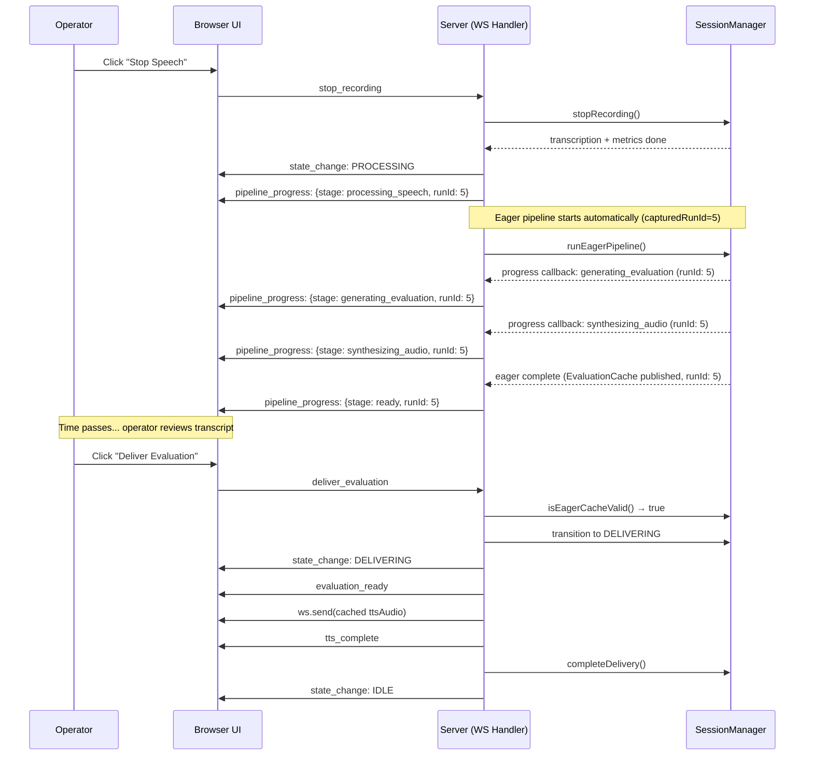
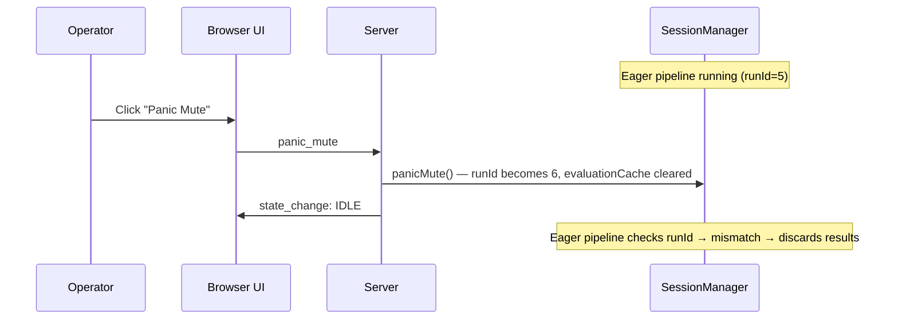

# Design Document: Eager Evaluation Pipeline

## Overview

This design converts the evaluation pipeline from a lazy model (triggered on "Deliver Evaluation" click) to an eager model (triggered automatically after recording stops). The key insight is that the existing `generateEvaluation()` method already produces all the artifacts we need — evaluation, script, and TTS audio. The change is about *when* it runs and *how* the results are delivered.

The design introduces:
1. An `EagerStatus` field and `EvaluationCache` object on the Session for atomic cache management
2. A new `runEagerPipeline()` method on SessionManager that wraps the existing pipeline logic without state transitions
3. A promise-based coordination mechanism so `handleDeliverEvaluation` can await an in-flight eager pipeline
4. A new `pipeline_progress` WebSocket message with `stage` and `runId` for UI feedback
5. Modified `handleStopRecording` to kick off eager generation after transcription/metrics complete
6. Modified `handleDeliverEvaluation` with three-branch delivery logic: cache hit, await eager, synchronous fallback

The existing RunId cancellation pattern handles all cancellation scenarios (panic mute, opt-out, new recording) without modification to the cancellation logic itself.

## Architecture



### Cancellation Flow (Panic Mute During Eager)



## Components and Interfaces

### 1. Session Type Extension (`src/types.ts`)

Add `EagerStatus`, `EvaluationCache`, and `PipelineStage` types:

```typescript
export type EagerStatus = "idle" | "generating" | "synthesizing" | "ready" | "failed";

export type PipelineStage =
  | "processing_speech"   // Historical naming; represents the *completion* of speech processing, not its start
  | "generating_evaluation"
  | "synthesizing_audio"
  | "ready"
  | "failed"
  | "invalidated";        // Cache invalidated due to parameter change (e.g., time limit)

export interface EvaluationCache {
  runId: number;
  timeLimitSeconds: number;
  voiceConfig: string;
  evaluation: StructuredEvaluation;
  evaluationScript: string;
  ttsAudio: Buffer; // exact binary payload for ws.send(), no framing needed
  evaluationPublic: StructuredEvaluationPublic | null; // redacted evaluation for UI; required for delivery (cache invalid if null)
}
```

Add fields to `Session`:

```typescript
export interface Session {
  // ... existing fields ...
  eagerStatus: EagerStatus;
  eagerRunId: number | null;       // runId captured at eager pipeline start; null when idle
  eagerPromise: Promise<void> | null;
  evaluationCache: EvaluationCache | null;
}
```

Add `pipeline_progress` to `ServerMessage`:

```typescript
export type ServerMessage =
  // ... existing variants ...
  | { type: "pipeline_progress"; stage: PipelineStage; runId: number; message?: string };
```

### 2. SessionManager Changes (`src/session-manager.ts`)

#### New Method: `runEagerPipeline()`

```typescript
async runEagerPipeline(
  sessionId: string,
  onProgress?: (stage: PipelineStage) => void,
): Promise<void>
```

This method:

- **State precondition guard**: if `session.state !== "PROCESSING"`, return immediately (no-op). This is a hard correctness boundary — eager generation only makes sense in PROCESSING state. Without this guard, a client bug or reconnect oddity could trigger eager in an unexpected state.
- **Single-flight guard** using `session.eagerRunId`: if `session.eagerRunId === session.runId` and `session.eagerStatus` is `generating` or `synthesizing`, returns the existing `eagerPromise` without starting a new pipeline. The `eagerRunId` field is set at eager start time and makes the guard explicit — no hidden invariant about "every runId mutation path must reset eagerStatus" is required. Cancellation paths (panic mute, opt-out, new recording, parameter change) increment `runId`, which causes the guard to fail on stale pipelines without needing to reset `eagerRunId`.
- Captures the current `runId` and `timeLimitSeconds` and `voiceConfig` at entry. `voiceConfig` MUST be resolved to its concrete value at capture time (e.g., `session.voiceConfig ?? "nova"`), never stored as `undefined` — see Implementation Hazard 3.
- Does NOT call `assertTransition` or change `session.state`
- Sets `eagerStatus = "generating"` and calls `safeProgress("generating_evaluation")`
- Runs the same pipeline stages as `generateEvaluation()` (LLM → energy → script → tone → trim → scope → redact → TTS)
- Sets `eagerStatus = "synthesizing"` before TTS and calls `safeProgress("synthesizing_audio")`
- On success: builds an `EvaluationCache` object atomically, confirms `artifact.runId === session.runId`, then publishes it to `session.evaluationCache` and sets `eagerStatus = "ready"`, calls `safeProgress("ready")`
- On failure: sets `eagerStatus = "failed"`, calls `safeProgress("failed")`, does NOT modify session evaluation/script/audio fields
- On RunId mismatch at any checkpoint: silently returns without publishing `EvaluationCache` or modifying `session.state`. In the `finally` block, if `capturedRunId !== session.runId` and `eagerStatus` is not `"ready"`, resets `eagerStatus` to `"idle"` (restoring coherence — prevents zombie `generating`/`synthesizing` status with null promise/runId). If `eagerStatus` is `"ready"` (cache was published before runId changed), the status is left as-is — the cancellation path's `clearEagerState`/`cancelEagerGeneration` handles the full reset.
- On any terminal state (`ready`, `failed`, or RunId mismatch): SHALL set `session.eagerPromise = null` and `session.eagerRunId = null` in a `finally` block, and on mismatch also `session.eagerStatus = "idle"`. Cleanup is guarded by a dual ownership check (`session.eagerRunId === capturedRunId || session.eagerPromise === promise`) — if neither matches, the finally block skips all field mutations (a newer run owns the session). This ensures the await path in `handleDeliverEvaluation` never observes a resolved-but-non-null promise alongside a terminal `eagerStatus`, and prevents stranding the single-flight guard with a stale `eagerRunId`.
- **Never-reject contract**: `runEagerPipeline()` SHALL always resolve (never reject). This is critical because `handleDeliverEvaluation` Branch 2 awaits `eagerPromise` — if the promise rejects, the await throws, skipping fallback logic and leaving the session stuck in PROCESSING. The contract covers three specific hazard surfaces:
  1. **onProgress callback**: all `onProgress?.()` calls MUST be wrapped in try/catch (as `safeProgress()` helper). If the callback throws (e.g., ws.send fails, closure bug), the eager pipeline must not reject.
  2. **Pre-await synchronous throws**: any code before the first `await` that throws would reject the promise before the catch handler runs. The deferred pattern (see Hazard 1) eliminates this by separating promise creation from async work.
  3. **Pipeline stage errors**: all LLM, TTS, tone check, and other async errors MUST be caught and encoded as `eagerStatus = "failed"`. No rethrow in `finally`.

The `eagerPromise` field on the session is owned exclusively by `SessionManager.runEagerPipeline()`. The method assigns `session.eagerPromise` before setting `eagerStatus` (per Hazard 1), and clears it (along with `eagerRunId`) to `null` in a `finally` block upon reaching any terminal state (`ready`, `failed`, or RunId mismatch — where it also resets `eagerStatus` to `"idle"`). The server layer reads `session.eagerPromise` (to await it in `handleDeliverEvaluation`) but never assigns it. This single-owner model prevents the footgun of two writers disagreeing on the promise reference.

**Implementation Hazard 1: Deferred pattern for promise creation.** The single-flight guard relies on this invariant: "if `eagerRunId === session.runId` and `eagerStatus` is `generating`/`synthesizing`, return existing `eagerPromise`." This only works if `eagerPromise` is assigned *before* `eagerStatus` transitions away from `idle`, and the promise can never reject (even from synchronous throws before the first await). The required implementation pattern is an explicit deferred:

```typescript
// Typed deferred utility in src/utils/deferred.ts — NOT in types.ts (avoid runtime code in type barrel)
// Reusable in runEagerPipeline and tests
interface Deferred<T> { promise: Promise<T>; resolve: (value: T) => void; }
function createDeferred<T>(): Deferred<T> {
  let resolve!: (value: T) => void;
  const promise = new Promise<T>((r) => { resolve = r; });
  return { promise, resolve };
}

runEagerPipeline(sessionId: string, onProgress?: (stage: PipelineStage) => void): Promise<void> {
  const session = this.getSession(sessionId);

  // State precondition — MUST be first, before any field reads or mutations
  if (session.state !== "PROCESSING") return Promise.resolve();

  // Single-flight guard
  if (session.eagerRunId === session.runId
      && (session.eagerStatus === "generating" || session.eagerStatus === "synthesizing")) {
    return session.eagerPromise!;
  }

  // Capture params — only after guards pass
  const capturedRunId = session.runId;
  const capturedTimeLimit = session.timeLimitSeconds;
  const capturedVoice = session.voiceConfig ?? "nova";

  // Safe progress helper — never throws
  const safeProgress = (stage: PipelineStage) => {
    try { onProgress?.(stage); } catch { /* swallow */ }
  };

  // Deferred: create promise BEFORE setting status (all synchronous, no throw possible)
  const { promise, resolve } = createDeferred<void>();
  session.eagerPromise = promise;
  session.eagerRunId = capturedRunId;
  session.eagerStatus = "generating";

  // Async work — always resolves, never rejects
  (async () => {
    try {
      safeProgress("generating_evaluation");
      // ... pipeline stages ...
      // On success: build cache, confirm runId, publish atomically
      // On runId mismatch at checkpoints: return early from try block
    } catch {
      // Encode failure — never rethrow
      if (capturedRunId === session.runId) {
        session.eagerStatus = "failed";
        session.evaluationCache = null;
        safeProgress("failed");
      }
    } finally {
      // Dual-guard cleanup: only touch fields if this run still owns the session.
      // Check BOTH eagerRunId and eagerPromise identity — resilient to future refactors
      // where one field could be reset early while the other still identifies ownership.
      const isOwner = session.eagerRunId === capturedRunId || session.eagerPromise === promise;
      if (isOwner) {
        if (capturedRunId !== session.runId && session.eagerStatus !== "ready") {
          // Mismatch + not ready: restore coherence — prevent zombie generating/synthesizing.
          // If eagerStatus is "ready", the cache was successfully published before runId changed;
          // don't force idle here — clearEagerState/cancelEagerGeneration will handle it.
          session.eagerStatus = "idle";
        }
        session.eagerPromise = null;
        session.eagerRunId = null;
      }
      resolve(); // Always resolve the deferred — never reject
    }
  })();

  return promise;
}
```

Key properties of this pattern:
- `(eagerPromise, eagerRunId, eagerStatus)` are set atomically (synchronously) before any await point
- State precondition guard is first — no field reads or mutations before it
- The promise is created via typed `createDeferred<void>()` from `src/utils/deferred.ts`, so synchronous throws inside the IIFE cannot cause rejection — the `finally` block always calls `resolve()`
- `safeProgress` swallows callback errors
- No `reject` exists — the promise can only resolve
- **Finally cleanup uses a dual-guard: `session.eagerRunId === capturedRunId || session.eagerPromise === promise`** — an older run's finally cannot clobber a newer run's state. If run A (runId=5) finishes after run B (runId=6) has started, run A's finally sees neither condition matches and skips all cleanup, leaving run B's state intact. The dual-guard is resilient to future refactors where one field could be reset early while the other still identifies ownership
- On RunId mismatch (when still owner), `eagerStatus` is reset to `"idle"` only if it's not `"ready"` — if the pipeline successfully published cache before the runId changed, the status stays `"ready"` and the cancellation path's `clearEagerState`/`cancelEagerGeneration` handles the full reset. This prevents a transient `ready → idle` with a still-valid cache object

#### Cache Validity Check

```typescript
isEagerCacheValid(session: Session): boolean {
  const cache = session.evaluationCache;
  return (
    cache !== null &&
    session.eagerStatus === "ready" &&
    cache.runId === session.runId &&
    cache.timeLimitSeconds === session.timeLimitSeconds &&
    cache.voiceConfig === (session.voiceConfig ?? "nova") &&
    cache.ttsAudio.length > 0 &&
    cache.evaluation !== null &&
    cache.evaluationScript !== null &&
    cache.evaluationPublic !== null
  );
}
```

**Implementation Hazard 3: Cache `voiceConfig` must store the resolved value, not `undefined`.** The validity check compares `cache.voiceConfig === (session.voiceConfig ?? "nova")`. This means the eager pipeline MUST capture the resolved voice at entry time — `const capturedVoice = session.voiceConfig ?? "nova"` — and store that resolved string in the cache. If the cache stores `undefined` or an empty string because `session.voiceConfig` was not set, the comparison will fail and the cache will never be considered valid. The same resolved value must be used for the actual TTS synthesis call.

#### New Method: `invalidateEagerCache()`

```typescript
invalidateEagerCache(sessionId: string): void
```

Called when time limit or voiceConfig changes. Calls `cancelEagerGeneration()` which increments `runId` (to cancel in-flight eager) and clears all eager fields atomically.

Note: This expands the meaning of `runId` from "recording epoch" to "generation epoch" — it now also increments on parameter changes that invalidate cached output. This is intentional and consistent with the RunId staleness model used throughout the eager pipeline.

#### Modified: `startRecording()`

Add to the existing reset block — call `clearEagerState()`:
```typescript
this.clearEagerState(sessionId);
```

#### Modified: `panicMute()`

Add to the existing cleanup — call `clearEagerState()`:
```typescript
this.clearEagerState(sessionId);
```

#### Modified: `revokeConsent()`

Already clears `ttsAudioCache`. Add — call `clearEagerState()`:
```typescript
this.clearEagerState(sessionId);
```

### 3. Server Changes (`src/server.ts`)

#### Modified: `handleStopRecording()`

After the existing `stopRecording()` call and transcript/metrics messages, kick off eager generation:

```typescript
// Send initial progress — processing_speech is emitted by the stop-recording flow
// (not by the eager pipeline) to indicate transcription/metrics are complete
sendMessage(ws, { type: "pipeline_progress", stage: "processing_speech", runId: session.runId });

// Kick off eager pipeline — capture runId at this point for progress messages.
// SessionManager owns session.eagerPromise (assigned inside runEagerPipeline per Hazard 1).
// The server only reads it (in handleDeliverEvaluation), never writes it.
const capturedRunId = session.runId;
sessionManager.runEagerPipeline(
  connState.sessionId,
  (stage) => sendMessage(ws, { type: "pipeline_progress", stage, runId: capturedRunId }),
);
```

Note: `processing_speech` is sent *before* eager starts, from the stop-recording handler, to indicate that transcription and metrics extraction have completed and the system is ready to begin evaluation generation. The progress callback captures `runId` at eager start time (not at callback invocation time) so that if `session.runId` changes due to cancellation, stale progress messages still carry the original runId and the client can correctly ignore them.

#### Modified: `handleDeliverEvaluation()`

Three-branch decision logic:

```text
if session.state === DELIVERING → ignore (re-entrancy guard)
else if isEagerCacheValid(session) → deliver from cache (fast path)
else {
  // Snapshot BOTH promise AND runId BEFORE any async work
  const eagerP = session.eagerPromise;
  const snapshotRunId = session.runId;
  if (eagerP !== null && eagerStatus in {generating, synthesizing})
    → await eagerP, then:
      if session.runId !== snapshotRunId → synchronous fallback (runId changed during await)
      else if isEagerCacheValid(session) → deliver from cache
      else → synchronous fallback
  else → synchronous fallback (existing generateEvaluation)
}
```

**Implementation Hazard 6: Snapshot `session.eagerPromise` AND `session.runId` before awaiting.** Branch 2 must read both `session.eagerPromise` and `session.runId` into local variables before any async work. The promise snapshot prevents reading a nulled reference (the pipeline's `finally` block clears it). The runId snapshot detects if the session was invalidated during the await — if `session.runId !== snapshotRunId` after the await, the eager result is stale even if the cache appears valid, so Branch 2 falls through to synchronous fallback. Without the runId snapshot, a rapid invalidate→re-eager sequence could cause Branch 2 to deliver results from the wrong generation epoch.

The fast path (cache hit):
1. Transition to DELIVERING
2. Send `state_change: DELIVERING`
3. Send `evaluation_ready` with evaluation and script from cache
4. `ws.send(cache.ttsAudio)` — single call, no blocking work
5. Send `tts_complete`
6. `completeDelivery()` → IDLE
7. Start purge timer

The synchronous fallback preserves the existing `handleDeliverEvaluation` behavior exactly.

#### New Method: `clearEagerState()` on SessionManager

Pure reset helper — clears all eager fields without incrementing `runId`. Does NOT cancel in-flight work on its own:
```typescript
clearEagerState(sessionId: string): void {
  session.eagerStatus = "idle";
  session.eagerRunId = null;
  session.eagerPromise = null;
  session.evaluationCache = null;
}
```

#### New Method: `cancelEagerGeneration()` on SessionManager

Cancellation primitive — increments `runId` (to cancel in-flight eager via mismatch) then calls `clearEagerState()`:
```typescript
// Cancels by invalidating results via epoch bump; does NOT abort in-flight LLM/TTS calls.
// The in-flight pipeline will detect the runId mismatch at its next checkpoint and discard results.
cancelEagerGeneration(sessionId: string): void {
  session.runId++;
  this.clearEagerState(sessionId);
}
```

`clearEagerState()` is a pure field reset — safe to call when you just need to wipe eager state (e.g., `purgeSessionData`). `cancelEagerGeneration()` is the cancellation primitive — use it when you need to cancel in-flight work (e.g., `invalidateEagerCache`, `panicMute`, `revokeConsent`). This separation prevents a future refactor from calling `clearEagerState()` alone when cancellation was intended, which would leave a stale pipeline able to commit results.

All purge/reset paths SHALL use the appropriate method:
- `invalidateEagerCache()` → calls `cancelEagerGeneration()` (needs runId++ to cancel in-flight)
- `panicMute()` → already increments `runId`, then calls `clearEagerState()` (runId++ is part of existing panic mute logic)
- `revokeConsent()` → already increments `runId`, then calls `clearEagerState()`
- `startRecording()` → already increments `runId`, then calls `clearEagerState()`
- `purgeSessionData()` → calls `clearEagerState()` only (no in-flight work to cancel — purge happens after delivery)

The server layer SHALL NOT mutate eager session fields directly — all eager state mutations go through SessionManager methods.

#### Modified: `handleSetTimeLimit()`

After updating `session.timeLimitSeconds`, check if the session is in PROCESSING state and eager data exists or eager is in-flight. If so, call `sessionManager.invalidateEagerCache(connState.sessionId)`. After invalidation, send a UI reset signal: `sendMessage(ws, { type: "pipeline_progress", stage: "invalidated", runId: session.runId })` using the *new* `runId` (post-increment). This tells the client that the cached evaluation is stale due to a parameter change. The client's stale-runId filter (`message.runId < pipelineRunId`) will accept this because the new `runId` is higher than the old one. If eager is re-triggered after invalidation, the new pipeline's progress messages will naturally supersede this reset.

#### Future: `handleSetVoiceConfig()` (if added)

If a `set_voice_config` message handler is added in the future, it MUST follow the same pattern as `handleSetTimeLimit()`: update `session.voiceConfig`, then call `sessionManager.invalidateEagerCache()` if the session is in PROCESSING state and eager data exists or is in-flight, then send a UI reset signal (`pipeline_progress: invalidated` with the new `runId`). Currently `voiceConfig` is defined on the Session type but has no runtime mutation handler — it is set at session creation. If this changes, cache invalidation MUST be wired.

### 4. Frontend Changes (`public/index.html`)

#### New Client State

```javascript
let pipelineStage = "idle";
let pipelineRunId = 0;
```

#### Message Handler

Add `pipeline_progress` to `handleServerMessage()`:

```javascript
case "pipeline_progress":
  // Ignore stale progress from cancelled pipelines
  if (message.runId < pipelineRunId) break;
  pipelineRunId = message.runId;
  pipelineStage = message.stage;
  updateProcessingIndicator(message.stage);
  updateDeliverButtonState(message.stage);
  break;
```

**Implementation Hazard 2: `pipelineRunId` monotonic comparison assumes no downward reset.** The `message.runId < pipelineRunId` guard is correct under the current model where `runId` is monotonically increasing within a session and each WebSocket connection maps to exactly one session. If a "new session" were ever created on the same WebSocket connection with a reset `runId` (starting from 0 again), the UI would ignore all progress forever. The current session lifecycle guarantees prevent this — a new WebSocket connection always creates a fresh session with `runId = 0`, and the client resets `pipelineRunId = 0` on reconnect. This invariant must be preserved: `pipelineRunId` resets to 0 whenever the WebSocket connection is re-established.

**Implementation Hazard 5: Stage ordering within a runId.** The client uses last-writer-wins for stage updates within the same `runId`. This means if messages arrive out of order (e.g., `ready` then `synthesizing_audio` due to network reordering), the UI could regress. The server MUST avoid sending regressive stages for the same `runId` — the eager pipeline's sequential execution model guarantees this under normal operation. The client does NOT enforce a stage ordering guard (accepting last-writer-wins), but the server's sequential stage emission is the correctness guarantee.

#### Processing Indicator Updates

```javascript
function updateProcessingIndicator(stage) {
  const messages = {
    processing_speech: "Speech processed \u2014 preparing evaluation...",
    generating_evaluation: "Generating evaluation...",
    synthesizing_audio: "Synthesizing audio...",
    ready: "\u2713 Evaluation ready \u2014 click \"Deliver Evaluation\"",
    failed: "\u26A0 Evaluation generation failed \u2014 click \"Deliver Evaluation\" to retry",
    invalidated: "Settings changed \u2014 evaluation will regenerate on delivery",
  };
  dom.processingIndicator.querySelector("span").textContent =
    messages[stage] || "Processing...";
}
```

#### Deliver Button Gating

In the PROCESSING state block of `updateUI()`:
- If `pipelineStage` is `generating_evaluation` or `synthesizing_audio` or `processing_speech`: disable Deliver button
- If `pipelineStage` is `ready` or `failed` or `invalidated`: enable Deliver button


## Data Models

### Session Field Additions

| Field | Type | Default | Purpose |
|---|---|---|---|
| `eagerStatus` | `EagerStatus` | `"idle"` | Tracks eager pipeline progress |
| `eagerRunId` | `number \| null` | `null` | RunId captured at eager pipeline start; null when idle |
| `eagerPromise` | `Promise<void> \| null` | `null` | Reference to in-flight eager pipeline for await coordination |
| `evaluationCache` | `EvaluationCache \| null` | `null` | Single immutable cache object containing all delivery artifacts |

### EvaluationCache Object

| Field | Type | Purpose |
|---|---|---|
| `runId` | `number` | RunId at time of generation, for validity check |
| `timeLimitSeconds` | `number` | Time limit used for script trimming |
| `voiceConfig` | `string` | Voice config used for TTS synthesis |
| `evaluation` | `StructuredEvaluation` | Generated evaluation |
| `evaluationScript` | `string` | Rendered and redacted script |
| `ttsAudio` | `Buffer` | Exact binary payload for `ws.send()` |
| `evaluationPublic` | `StructuredEvaluationPublic \| null` | Redacted evaluation for UI/save; required for delivery (cache invalid if null) |

### New WebSocket Message

| Message | Direction | Fields | Purpose |
|---|---|---|---|
| `pipeline_progress` | Server → Client | `stage: PipelineStage, runId: number, message?: string` | Granular progress updates during eager generation |

### PipelineStage Values

| Stage | Eager_Status | Meaning |
|---|---|---|
| `processing_speech` | `idle` | Speech processing complete; transcription and metrics done, eager pipeline about to start. **Implementation Hazard 4:** This stage means "complete" — it is emitted *after* transcription and metrics finish, from `handleStopRecording`, not from the eager pipeline. It must never be emitted earlier in the flow (e.g., before transcription starts). If someone wires it earlier, the UI text "Speech processed — preparing evaluation..." becomes a lie. The binding is: `processing_speech` is sent only from `handleStopRecording`, only after `stopRecording()` returns successfully. |
| `generating_evaluation` | `generating` | LLM evaluation generation in progress |
| `synthesizing_audio` | `synthesizing` | TTS synthesis in progress |
| `ready` | `ready` | Evaluation_Cache published, ready for delivery |
| `failed` | `failed` | Eager pipeline failed; operator can retry via Deliver |
| `invalidated` | `idle` | Cache invalidated due to parameter change (e.g., time limit). Sent by `handleSetTimeLimit()` after calling `invalidateEagerCache()`. UI shows "Settings changed — evaluation will regenerate on delivery". Deliver button enabled — clicking triggers synchronous fallback. **`invalidated` is never emitted by SessionManager** — it is a server/UI hint only, sent from server-layer handlers (`handleSetTimeLimit`, future `handleSetVoiceConfig`). The eager pipeline's `onProgress` callback only emits `generating_evaluation`, `synthesizing_audio`, `ready`, and `failed`. |

### Cache Validity Invariant

Cached data is valid when ALL of:
- `session.evaluationCache !== null`
- `session.eagerStatus === "ready"`
- `cache.runId === session.runId`
- `cache.timeLimitSeconds === session.timeLimitSeconds`
- `cache.voiceConfig === (session.voiceConfig ?? "nova")`
- `cache.ttsAudio.length > 0`
- `cache.evaluation !== null`
- `cache.evaluationScript !== null`
- `cache.evaluationPublic !== null`

### Delivery Decision Table

| Session State | Eager Status | Cache Valid | Action |
|---|---|---|---|
| DELIVERING | any | any | Ignore (re-entrancy guard, Req 5.6) |
| PROCESSING | `ready` | yes | Fast-path: deliver from cache (Req 5.1) |
| PROCESSING | `generating`/`synthesizing` | no | Await eagerPromise, then re-check cache; if valid deliver, else fallback (Req 5.2) |
| PROCESSING | `failed` | no | Synchronous fallback pipeline (Req 5.3) |
| PROCESSING | `idle` | no | Synchronous fallback pipeline (Req 5.3) |
| PROCESSING | `ready` | no (stale) | Synchronous fallback pipeline (Req 5.3) |


## Correctness Properties

*A property is a characteristic or behavior that should hold true across all valid executions of a system — essentially, a formal statement about what the system should do. Properties serve as the bridge between human-readable specifications and machine-verifiable correctness guarantees.*

### Property 1: State and behavioral boundary during eager execution

*For any* session in PROCESSING state with an in-flight eager pipeline, the session state SHALL remain PROCESSING throughout the entire eager pipeline execution. The eager pipeline SHALL never transition the session to DELIVERING state. At the SessionManager layer, `runEagerPipeline()` SHALL NOT call `assertTransition()`, modify `session.state`, or invoke any delivery-side methods. At the server layer, the eager pipeline kickoff and its progress callbacks SHALL only produce `pipeline_progress` messages — never `evaluation_ready`, TTS audio binary frames, or `tts_complete`.

Note on test layering: SessionManager property tests assert state invariants only (session.state unchanged, evaluationCache unchanged until atomic publish, no calls to delivery methods). Server property tests instrument `sendMessage()`/`ws.send()` and assert that the eager kickoff path produces only `pipeline_progress` messages until `deliver_evaluation` is received.

**Validates: Requirements 1.4, 8.1, 8.2**

### Property 2: Eager status transition sequence with atomic cache publication

*For any* eager pipeline execution, the `eagerStatus` field SHALL follow one of these valid transition sequences:
- Success: `idle` → `generating` → `synthesizing` → `ready`
- Early failure: `idle` → `generating` → `failed`
- Late failure: `idle` → `generating` → `synthesizing` → `failed`

When `eagerStatus` reaches `ready`, `session.evaluationCache` SHALL be non-null, contain all required fields (`runId`, `timeLimitSeconds`, `voiceConfig`, `evaluation`, `evaluationScript`, `ttsAudio`, `evaluationPublic`), and `cache.runId` SHALL equal `session.runId`. The progress callback SHALL be invoked with stages matching the eager status transitions in order, and `ready` SHALL be emitted only after the cache is published. Upon reaching any terminal state (`ready` or `failed`), `session.eagerPromise` SHALL be `null`.

**Validates: Requirements 2.2, 2.3, 2.4, 1.5, 9.2, 9.3**

### Property 3: Failure handling clears partial results

*For any* eager pipeline execution that fails for reasons other than RunId mismatch/cancellation (e.g., LLM error, TTS error, tone check error), `eagerStatus` SHALL be `failed`, `session.state` SHALL be `PROCESSING`, `session.evaluationCache` SHALL be `null` (no partial artifacts published), and `session.eagerPromise` SHALL be `null`. RunId mismatch is cancellation, not failure — it is covered by Property 9, where the pipeline silently returns without modifying session state, eagerStatus, or evaluationCache.

**Validates: Requirements 1.6**

### Property 4: Cache validity invariant

*For any* session, `isEagerCacheValid()` SHALL return true if and only if ALL of: `evaluationCache !== null`, `eagerStatus === "ready"`, `cache.runId === session.runId`, `cache.timeLimitSeconds === session.timeLimitSeconds`, `cache.voiceConfig === (session.voiceConfig ?? "nova")` (i.e., the cache stores the resolved `capturedVoiceConfig`, not the raw session field), `cache.ttsAudio.length > 0`, `cache.evaluation !== null`, `cache.evaluationScript !== null`, `cache.evaluationPublic !== null`.

**Validates: Requirements 6.1**

### Property 5: Cache invalidation on generation parameter change

*For any* session in PROCESSING state with a cached artifact or an in-flight eager pipeline, changing `timeLimitSeconds` (or `voiceConfig`) SHALL reset `eagerStatus` to `idle`, set `evaluationCache` to `null`, clear `eagerPromise`, and increment `runId` to cancel any in-flight pipeline.

**Validates: Requirements 6.2**

### Property 6: Reset on new recording

*For any* session, calling `startRecording()` SHALL reset `eagerStatus` to `idle`, set `evaluationCache` to `null`, clear `eagerPromise`, and clear all cached evaluation data regardless of the previous eager state.

**Validates: Requirements 2.5, 6.3**

### Property 7: Panic mute cancellation and cleanup

*For any* session with an in-flight eager pipeline or cached artifacts, calling `panicMute()` SHALL increment `runId` (causing the in-flight pipeline to discard results on next checkpoint), reset `eagerStatus` to `idle`, set `evaluationCache` to `null`, and transition to IDLE.

**Validates: Requirements 6.4, 7.1**

### Property 8: Opt-out cancellation and full purge

*For any* session with an in-flight eager pipeline or cached artifacts, calling `revokeConsent()` SHALL increment `runId`, reset `eagerStatus` to `idle`, set `evaluationCache` to `null`, and clear all session data including evaluation, script, transcript, metrics, and audio chunks.

**Validates: Requirements 6.5, 7.2**

### Property 9: RunId staleness — stale eager results are discarded

*For any* eager pipeline execution, if the session's `runId` changes during execution (due to panic mute, opt-out, new recording, or parameter change), the pipeline SHALL discard all results and SHALL NOT publish an `EvaluationCache` to the session or modify `session.state`. In the `finally` block, the pipeline SHALL use a dual ownership guard (`session.eagerRunId === capturedRunId || session.eagerPromise === promise`) — if ownership holds, reset `eagerStatus` to `"idle"` only if it is not `"ready"` (if the pipeline successfully published cache before the runId changed, the status stays `"ready"` and the cancellation path's `clearEagerState`/`cancelEagerGeneration` handles the full reset), and clear `eagerPromise` and `eagerRunId` to `null`. If neither guard matches (a newer run owns the session), the finally block SHALL skip all field mutations. This prevents both zombie `generating`/`synthesizing` status and old-run clobbering of newer-run state, while avoiding a transient `ready → idle` with a still-valid cache object.

**Validates: Requirements 5.5, 7.3**

### Property 10: Cache-hit delivery skips generation

*For any* session where `isEagerCacheValid()` returns true, calling the delivery handler SHALL NOT invoke `generateEvaluation()` or any LLM/TTS API calls, and SHALL deliver the cached `ttsAudio` via `ws.send()` directly.

**Validates: Requirements 5.1**

### Property 11: Fallback delivery on failure or missing cache

*For any* session where `eagerStatus` is `failed` or `idle` or the cache is invalid, calling the delivery handler SHALL run the full synchronous evaluation pipeline as a fallback, and the session SHALL remain in PROCESSING during fallback execution.

**Validates: Requirements 5.3**

### Property 12: Replay availability after delivery

*For any* session that has completed delivery (transitioned from DELIVERING back to IDLE), `evaluationCache` SHALL remain non-null and available for replay via `replay_tts` until the auto-purge timer fires (10 minutes per retention lifecycle). Tests for this property SHALL use fake timers and assert: (a) cache is non-null immediately after delivery, (b) cache remains non-null before the purge timer fires, (c) cache becomes null after the purge timer fires.

**Validates: Requirements 5.7**

### Property 13: Auto-purge clears cache

*For any* session where auto-purge fires, `evaluationCache` SHALL be set to `null` and `eagerStatus` SHALL be reverted to `idle`.

**Validates: Requirements 6.7**

### Property 14: Single-flight per RunId

*For any* RunId value, at most one eager pipeline instance SHALL be executing at any time. A second call to `runEagerPipeline()` with the same RunId SHALL not start a new pipeline.

**Validates: Requirements 1.2**

## Error Handling

### Eager Pipeline Failures

| Failure Point | Behavior | Recovery |
|---|---|---|
| LLM generation fails | `eagerStatus` → `failed`, `evaluationCache` remains null, session stays PROCESSING | Operator clicks Deliver → synchronous fallback pipeline runs |
| Tone check fails | Same as LLM failure | Same |
| TTS synthesis fails | `eagerStatus` → `failed`, evaluation and script discarded (no partial cache) | Deliver runs synchronous pipeline; if TTS still fails, written evaluation fallback (existing Req 7.4) |
| RunId mismatch mid-pipeline | Pipeline silently returns, no session modifications | No recovery needed — session was intentionally cancelled |

### Delivery Path Failures

| Scenario | Behavior |
|---|---|
| Cache hit but WebSocket closed | Audio send skipped (existing `ws.readyState` check), written evaluation fallback |
| Eager in-flight, await completes with failure | Falls through to synchronous fallback |
| Synchronous fallback also fails | Error surfaced to client, session stays PROCESSING, cache empty |
| deliver_evaluation during DELIVERING | Ignored (re-entrancy guard) |

### Edge Cases

- **Rapid stop → panic mute**: Eager pipeline starts, RunId increments immediately. Pipeline discards results at first checkpoint.
- **Stop → time limit change → Deliver**: Cache invalidated by time limit change. Deliver runs synchronous pipeline with new time limit.
- **Stop → eager completes → time limit change → Deliver**: Cache invalidated. Deliver runs synchronous pipeline.
- **Multiple rapid stop/start cycles**: Each `startRecording()` increments RunId and resets eager state. Only the latest recording's eager pipeline can commit results.
- **Deliver during eager synthesizing**: Server awaits eagerPromise. If eager succeeds, delivers from cache. If fails, falls through to synchronous.

## Testing Strategy

### Property-Based Testing

Use `fast-check` (already available in the project's test dependencies) for property-based tests. Each property test runs a minimum of 100 iterations.

Property tests focus on:
- Session state invariants during eager execution (Property 1)
- Eager status transition sequences and atomic cache publication (Property 2)
- Cache validity logic (Property 4)
- Cache invalidation behavior (Properties 5, 6, 7, 8)
- RunId staleness detection (Property 9)
- Delivery path selection (Properties 10, 11)
- Single-flight constraint (Property 14)

Each property test MUST be tagged with a comment referencing the design property:
```typescript
// Feature: eager-evaluation-pipeline, Property N: <property_text>
```

### Unit Testing

Unit tests complement property tests for:
- Specific examples of progress callback sequences (Property 2)
- Behavioral boundary verification at the server layer — instrumenting `sendMessage()`/`ws.send()` and asserting that eager kickoff produces only `pipeline_progress` messages (Property 1, server side)
- Message ordering during cached delivery — evaluation_ready before audio (Req 5.4)
- Integration between `handleStopRecording` and eager pipeline kickoff (Req 1.1)
- Await-then-deliver flow when eager is in-flight (Req 5.2)
- Re-entrancy guard: deliver during DELIVERING is ignored (Req 5.6)
- Edge cases: rapid stop→panic, stop→time-limit-change→deliver
- Auto-purge clears cache (Property 13)
- Replay availability after delivery with fake timers (Property 12)

### Test File Organization

- `src/session-manager.test.ts` — extend with eager pipeline unit tests
- `src/session-manager.property.test.ts` — new file for property-based tests on SessionManager eager behavior
- `src/server.test.ts` — extend with delivery path tests (cache hit, await, fallback)
- `src/server.property.test.ts` — extend with behavioral boundary property tests

### PBT Library

Use `fast-check` with `vitest` (existing test runner). Configure minimum 100 runs per property. Use `fc.assert(fc.property(...))` pattern.
