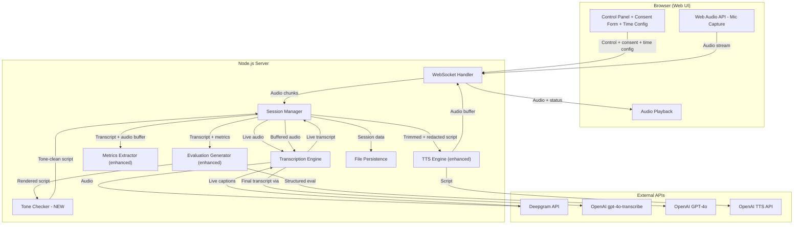
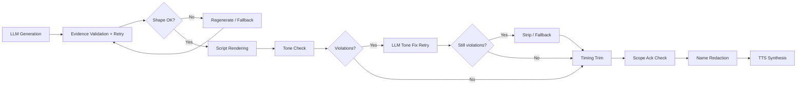

# Design Document: Phase 2 — Stability & Credibility

## Overview

Phase 2 extends the existing AI Toastmasters Evaluator MVP to make evaluations consistent, evidence-grounded, and safe for regular meeting use. The system already captures audio, transcribes, computes metrics, generates LLM-based evaluations with evidence validation, and delivers via TTS. Phase 2 adds six capability areas on top of this foundation:

1. **Evidence anchoring strengthening** — explicit pass-rate reporting and tighter validation rules (extending existing `EvidenceValidator`)
2. **Speaker consent capture** — `ConsentRecord` on `Session`, UI gating, immutability after recording starts
3. **Tone guardrails** — new `ToneChecker` component with deterministic regex/rule-based prohibited content detection
4. **Speech structure awareness** — new `structure_commentary` field on `StructuredEvaluation`, LLM-driven with heuristic fallback
5. **Delivery metrics improvements** — pause classification, RMS-based energy variation, filler word classification (extending existing `MetricsExtractor`)
6. **Meeting timing enforcement** — configurable 2-minute default time limit, safety margin, structured trimming (extending existing `TTSEngine`)

Plus cross-cutting concerns: pipeline ordering (Req 11), shape enforcement with short-form fallback (Req 9), quality warning propagation (Req 10), privacy/redaction (Req 8), and consistency monitoring (Req 7).

### Technology Stack (unchanged from Phase 1)

- **Runtime**: Node.js with TypeScript
- **Web Framework**: Express.js with raw WebSocket (`ws` library)
- **Frontend**: Vanilla HTML/CSS/JS
- **Testing**: Vitest + fast-check for property-based testing
- **Live Transcription**: Deepgram API
- **Post-Speech Transcription**: OpenAI gpt-4o-transcribe
- **LLM**: OpenAI GPT-4o with structured output (JSON mode)
- **TTS**: OpenAI TTS API

### Terminology: Words vs Normalized Tokens

Throughout this document:
- **Words** refers to whitespace-separated tokens in the original text (used for human-facing constraints like "evidence quote ≤ 15 words" and duration estimation via WPM).
- **Normalized tokens** refers to tokens after the normalization pipeline (lowercase, strip punctuation, collapse whitespace, trim) — used internally by the `EvidenceValidator` for contiguous matching (≥ 6 normalized tokens).
- The LLM contract uses "words" (≤ 15 words per evidence quote). The validator uses "normalized tokens" (≥ 6 contiguous match). In practice these are nearly identical for English text, but the distinction matters for edge cases with punctuation or contractions.

### Key Design Decisions

1. **Tone checking is deterministic, not LLM-based.** The `ToneChecker` uses regex patterns and rule-based checks against a curated prohibited content list. This ensures reproducibility and avoids adding another LLM call to the critical path. The LLM is only re-prompted if violations are found (max 1 retry).

2. **Speech structure analysis is LLM-driven, not heuristic-only.** The LLM already analyzes the transcript for evaluation — adding structure commentary to the same prompt is cheaper and more accurate than building a separate NLP pipeline. Heuristic fallback (keyword markers) is used only for short transcripts (<120 words).

3. **Energy variation uses audio amplitude data, not transcript-derived proxies.** RMS computation on the buffered audio chunks provides a direct measurement of vocal variety. The energy profile is computed in fixed 250ms windows, normalized for gain invariance, with silence excluded via adaptive thresholding.

4. **Pipeline ordering is explicit and sequential.** The processing pipeline follows a strict order: evidence validation → shape check → script rendering → tone checking → timing trim → scope ack check → redaction → TTS synthesis. This prevents ordering bugs and ensures each stage operates on the correct input.

5. **Meeting timing defaults to 2 minutes (down from Phase 1's 3m30s cap).** Phase 2 targets meeting-appropriate evaluation length. The existing `trimToFit` logic is extended with structured trimming that preserves opening + at least one commendation + strongest recommendation + closing, with an 8% safety margin on duration estimation.

6. **Consent is a session-level metadata record, not a separate service.** The `ConsentRecord` is stored directly on the `Session` object, becomes immutable once recording starts, and is included in saved outputs. Opt-out triggers the existing purge mechanism.

7. **Consistency scoring is background telemetry, not a delivery gate.** Thematic overlap measurement (cosine similarity of summary embeddings) runs asynchronously and logs results. It does not block or modify evaluation delivery in Phase 2.

## Architecture

The Phase 2 architecture extends the existing pipeline with new components and enhanced existing ones:



### Phase 2 Processing Pipeline (Req 11)



### Stage Contracts

Each pipeline stage has explicit input/output types and constraints:

| Stage | Input | Output | Redacted? | Can Call LLM? | Cancellable (runId)? |
|-------|-------|--------|-----------|---------------|---------------------|
| 1. LLM Generation | Transcript + Metrics | `StructuredEvaluation` (raw) | No | Yes | Yes |
| 2. Evidence Validation + Retry | `StructuredEvaluation` + Transcript | `StructuredEvaluation` (validated) | No | Yes (retry) | Yes |
| 3. Shape Check / Fallback | `StructuredEvaluation` (validated) | `StructuredEvaluation` (shape-compliant) | No | Yes (regen) | Yes |
| 4. Script Rendering | `StructuredEvaluation` (shape-compliant) | `string` (rendered script with `[[Q:*]]`/`[[M:*]]` markers, unredacted) | No | No | No |
| 5. Tone Check + Fix | `string` (marked script) + `StructuredEvaluation` + `DeliveryMetrics` | `string` (tone-clean script, markers stripped, unredacted) | No | Yes (fix retry) | Yes |
| 6. Timing Trim | `string` (tone-clean script) | `string` (trimmed script, unredacted) | No | No | No |
| 7. Scope Ack Check | `string` (trimmed script) | `string` (with scope ack if needed, idempotent — appends only if not already present) | No | No | No |
| 8. Name Redaction | `RedactionInput { script, evaluation, consent }` | `RedactionOutput { scriptRedacted, evaluationPublic }` | Yes | No | No |
| 9. TTS Synthesis | `RedactionOutput.scriptRedacted` | `Buffer` (audio) | Yes | No (API call) | Yes |

Key invariants:
- Stages 1-7 operate on **unredacted** text. Redaction happens exactly once at stage 8.
- Only stages 1, 2, 3, and 5 may call the LLM. All other stages are deterministic.
- Stages 1, 2, 3, 5, and 9 are cancellable via `runId` check before committing results.
- The `StructuredEvaluation` object is immutable after stage 3. Stages 4-9 operate on the rendered script string.
- **Marker invariant:** After stage 5 completes, the script MUST NOT contain any `[[Q:*]]` or `[[M:*]]` markers. `stripMarkers()` is called exactly once at the end of stage 5.
- **Redaction scope:** Stage 8 produces both a redacted script (for TTS) and a redacted `StructuredEvaluationPublic` (for UI display and saving). The `evaluation_ready` WebSocket message sends the public (redacted) version, never the internal (unredacted) version.

### Shared Sentence Segmentation

All components that operate on sentence boundaries use a single shared `splitSentences()` utility:

```typescript
function splitSentences(text: string): string[]
```

**Algorithm:** Split on sentence-ending punctuation (`.` `!` `?`) followed by whitespace or end of string, preserving the punctuation with the preceding sentence. Handles common abbreviations and decimal numbers to avoid false splits.

This function is used by:
- `ToneChecker` — sentence extraction for violation detection and stripping
- `TTSEngine.trimToFit()` — sentence-boundary trimming
- `EvaluationGenerator.renderScript()` — section parsing

Using a single implementation prevents divergent sentence segmentation behavior across components.

## Components and Interfaces

### EvidenceValidator Contract (inherited from Phase 1, restated for completeness)

The `EvidenceValidator` implements the exact algorithm defined in the `evidence-grounding-and-validation` steering rule:

1. **Normalize** both the evidence quote and full transcript text (lowercase, strip punctuation, collapse whitespace, trim)
2. **Tokenize** both into arrays of normalized tokens
3. **Contiguous match:** quote tokens must appear as a contiguous subsequence in transcript tokens with ≥ 6 consecutive matching tokens
4. **Timestamp locality:** `abs(evidence_timestamp - start_time_of_first_matched_token) ≤ 20` seconds (configurable). Falls back to segment-level overlap when word-level timestamps are unavailable.
5. **Length check:** evidence quote ≤ 15 words (LLM contract, checked on the original quote string before normalization). The validator warns but does not fail if normalized tokens differ from word count due to punctuation handling.

The length check is independent of the contiguous match rule. A quote that satisfies the ≤15-word limit but does not achieve ≥6 contiguous normalized tokens SHALL fail validation (match check failure).

An item passes only if all required checks succeed:
1. **Match check** (normalize + tokenize + contiguous subsequence ≥ 6 normalized tokens)
2. **Timestamp locality check** (≤ 20s)
3. **Quote length check** (≤ 15 words in the original quote string)

The `evidence_timestamp` in each `EvaluationItem` represents the start time of the first token in the validated contiguous match from the canonical post-speech transcript.

### ConsentRecord (New — Req 2)

A metadata object stored on the `Session` that captures speaker consent before recording begins.

```typescript
interface ConsentRecord {
  speakerName: string;
  consentConfirmed: boolean;
  consentTimestamp: Date;
}
```

**Behavior:**
- Created when the operator fills in the consent form and confirms
- Immutability is derived from `Session.state !== SessionState.IDLE` — once recording starts, the `ConsentRecord` cannot be modified. There is no separate `immutable` boolean; the session state is the single source of truth for immutability.
- Included in saved output metadata when "Save Outputs" is clicked
- On opt-out: entire session data purged per privacy retention policy; `ConsentRecord` itself is nulled

**Session interface extension:**
```typescript
interface Session {
  // ... existing fields ...
  consent: ConsentRecord | null; // new field, replaces speakerName usage
}
```

The existing `speakerName` field on `Session` is superseded by `consent.speakerName`. For backward compatibility, `speakerName` is kept as a computed getter that reads from `consent?.speakerName`.

### ToneChecker (New — Req 3)

A deterministic, rule-based component that validates evaluation scripts against prohibited content patterns. No LLM calls — pure regex and keyword matching.

```typescript
interface ToneViolation {
  category: "ungrounded_claim" | "psychological_inference" | "visual_scope" | "punitive_language" | "numerical_score";
  sentence: string;       // the offending sentence
  pattern: string;        // the pattern that matched
  explanation: string;    // human-readable reason
}

interface ToneCheckResult {
  passed: boolean;
  violations: ToneViolation[];
}

interface ToneChecker {
  check(markedScript: string, evaluation: StructuredEvaluation, metrics: DeliveryMetrics): ToneCheckResult;
  stripViolations(markedScript: string, violations: ToneViolation[]): string; // operates on marked script
  stripMarkers(markedScript: string): string; // removes [[Q:*]] and [[M:*]] markers; called once at end of stage 5
  appendScopeAcknowledgment(script: string, qualityWarning: boolean, hasStructureCommentary: boolean): string;
}
```

**Stage 5 execution order:**
1. `check(markedScript)` — detect violations using markers for grounding
2. If violations found → LLM tone fix retry → `check(newMarkedScript)` again
3. If still violations → `stripViolations(markedScript, violations)` — removes offending sentences (markers still present)
4. `stripMarkers(resultScript)` — removes all `[[Q:*]]` and `[[M:*]]` markers exactly once
5. Output: clean script with no markers, no violations

**Marker-based grounding approach:**

During script rendering (pipeline stage 4), the renderer emits lightweight invisible markers:
- `[[Q:item-N]]` after sentences derived from `items[N].evidence_quote`
- `[[M:fieldName]]` after sentences referencing a `DeliveryMetrics` field (e.g., `[[M:wordsPerMinute]]`)

The ToneChecker (stage 5) validates that assertive sentences contain a marker or match the general coaching language allowlist. After tone checking completes, `stripMarkers()` removes all markers before the script proceeds to trimming.

**Marker placement rule:** Markers are appended at the end of the sentence, after terminal punctuation and before the following whitespace. Multiple markers may appear on the same sentence if it references both an evidence quote and a metric. Example: `"Your pace was steady throughout. [[Q:item-1]][[M:wordsPerMinute]]"`

**Marker stripping:** `stripMarkers()` removes all occurrences matching the pattern `\s*\[\[(Q|M):[^\]]+\]\]` and then normalizes whitespace to single spaces without altering punctuation adjacency. This handles adjacent markers cleanly. After marker removal, whitespace normalization SHALL preserve a single space between sentences when markers were adjacent to sentence boundaries (e.g., `"close. [[Q:item-1]] Next"` becomes `"close. Next"`, not `"close.Next"`).

**Assertive sentence classification:** A sentence is classified as assertive if it contains past-tense claims about the speaker's behavior or content (verb stems: "said", "used", "mentioned", "described", "paused", "delivered", "opened", "closed") OR sensory claims ("it sounded like", "the audience heard"). A sentence is classified as non-assertive (general coaching) if it is framed as a suggestion or option using modal verbs ("consider", "one option", "you could try", "you might", "it may help to", "next time"). This classification uses a deterministic allowlist/denylist of verb stems and modal patterns. Assertive classification runs per sentence as returned by `splitSentences()`, and the marker requirement applies to that sentence unit.

**Pattern categories and implementation approach:**

1. **Ungrounded claims (Req 3.2):** Uses a lightweight marker-based approach. During script rendering (stage 4), the renderer emits invisible markers after sentences derived from evidence items (`[[Q:item-N]]`) and sentences referencing metrics fields (`[[M:fieldName]]`). The ToneChecker validates that any assertive sentence (one that claims a specific speaker action or behavior) contains a `[[Q:*]]` or `[[M:*]]` marker, or matches a "general coaching language allowlist" (e.g., "One option you could try is…", "Next time, consider…"). Sentences without markers that don't match the allowlist are flagged as ungrounded. Markers are stripped before the script leaves stage 5 — they never reach TTS or the user.

2. **Psychological inferences (Req 3.3):** Regex patterns matching phrases like "you seem", "you appear to feel", "you lack", "you were nervous", "your anxiety", etc. Curated list of ~30 patterns.

3. **Visual scope violations (Req 3.4):** Regex patterns matching "eye contact", "body language", "facial expression", "gesture", "posture", "looked at", "smiled", "nodded", etc. Curated list of ~20 patterns.

4. **Punitive/diagnostic language (Req 3.5):** Regex patterns matching "you failed to", "you struggle with", "you were unable to", "your weakness", "poor attempt", etc. Curated list of ~25 patterns.

5. **Numerical scores (Req 3.6):** Regex matching patterns like "X/10", "X out of 10", "X%", "score of", "rating of", "grade of", digit followed by "/".

**Stripping behavior:** When violations remain after tone-fix retry, `stripViolations()` removes the offending sentences. If stripping would remove all commendations or all recommendations, the system falls back to short-form evaluation (Req 9) instead of stripping.

**Scope acknowledgment:** Appended only when `qualityWarning` is true OR `hasStructureCommentary` is true. Example: "This evaluation is based on audio content only."

### StructureCommentary (New — Req 4)

A new field on `StructuredEvaluation` that holds descriptive commentary about speech structure.

```typescript
interface StructureCommentary {
  opening_comment: string | null;  // null if no reliable markers detected
  body_comment: string | null;
  closing_comment: string | null;
}

interface StructuredEvaluation {
  opening: string;
  items: EvaluationItem[];
  closing: string;
  structure_commentary: StructureCommentary; // NEW
}
```

**Generation approach:**
- The LLM prompt is extended to request structure commentary as part of the structured JSON output
- The prompt instructs the LLM to analyze the transcript in three segments: opening (~10-15% of words), body (~70-80%), closing (~10-15%)
- For transcripts <120 words, the prompt instructs the LLM to use heuristic markers ("today I want to talk about", "in conclusion", "to wrap up") instead of percentage-based segmentation
- If the LLM cannot identify a reliable opening or closing, it returns `null` for that field — the system omits that commentary rather than speculating
- All commentary must be descriptive (no scores, no ratings)

**Script rendering integration:**
- Structure commentary is woven into the evaluation script between the opening and the first item
- If all three fields are null, no structure commentary section is rendered
- Commentary is subject to tone checking like all other script content

### Enhanced MetricsExtractor (Req 5)

The existing `MetricsExtractor` is extended with three new capabilities:

#### Pause Classification

```typescript
interface ClassifiedPause {
  start: number;
  end: number;
  duration: number;
  type: "intentional" | "hesitation";
  reason: string; // e.g., "follows complete sentence", "preceded by filler word"
}
```

**Algorithm:**
1. Detect pause candidates: gaps ≥ 300ms (configurable `candidateThreshold`)
2. Filter to reportable pauses: gaps ≥ 1.5s (configurable `reportableThreshold`, inherited from Phase 1)
3. For each reportable pause, classify using the **canonical post-speech transcript** punctuation (not live transcript):
   - **Intentional** if: the preceding text ends with sentence-ending punctuation (`.!?`) AND the following text starts a new clause/sentence
   - **Intentional** if: the pause duration is 1.5-4s and follows a complete thought
   - **Hesitation** if: the preceding text ends mid-word or mid-sentence (no terminal punctuation)
   - **Hesitation** if: the preceding word is a known filler word
   - **Hesitation** if: the following word repeats or rephrases the preceding word
   - **Fallback** when punctuation is absent or unreliable: use a heuristic combining pause duration + capitalization of the next token + whether the preceding token is a common sentence-final word ("right", "so", etc.)
   - **Precedence:** when both intentional and hesitation indicators are present for the same pause, hesitation takes precedence (conservative bias)
   - Default: **hesitation** (conservative — don't over-attribute intentionality)

#### Speech Energy Variation

```typescript
interface EnergyProfile {
  windowDurationMs: number;     // 250ms default
  windows: number[];            // normalized RMS values per window
  coefficientOfVariation: number; // CV = stddev / mean (excluding silence)
  silenceThreshold: number;     // adaptive, computed from distribution
}
```

**Algorithm:**
1. Take the buffered audio chunks (raw PCM 16-bit mono 16kHz)
2. Segment into fixed 250ms windows (4000 samples per window at 16kHz)
3. Compute RMS for each window: `sqrt(mean(samples^2))`
4. Normalize: divide all RMS values by the maximum RMS value (gain invariance)
5. Compute adaptive silence threshold: `median(RMS) + k * MAD(RMS)` where `k` is configurable (default 1.0) and MAD is median absolute deviation
6. Exclude windows below silence threshold
7. Compute coefficient of variation on remaining windows: `stddev / mean`
8. Store only the derived `EnergyProfile` — raw per-sample amplitude is NOT persisted

#### Enhanced Filler Word Classification

```typescript
interface ClassifiedFillerEntry {
  word: string;
  count: number;
  timestamps: number[];
  classification: "true_filler" | "discourse_marker";
}
```

**Algorithm extension:**
- The existing contextual filler detection is enhanced with a classification step
- After detecting a filler candidate, classify it:
  - **True filler**: "um", "uh", "ah" are always true fillers; contextual words ("like", "so", "right", "actually") classified as true fillers when in filler position (existing heuristic)
  - **Discourse marker**: contextual words that appear in non-filler positions but were initially flagged — these are reclassified as discourse markers
- The `FillerWordEntry` type is extended to `ClassifiedFillerEntry` with the `classification` field

#### Extended DeliveryMetrics Interface

```typescript
interface DeliveryMetrics {
  // ... existing fields ...
  
  // Phase 2 additions
  intentionalPauseCount: number;
  hesitationPauseCount: number;
  classifiedPauses: ClassifiedPause[];
  energyVariationCoefficient: number;
  energyProfile: EnergyProfile;
  classifiedFillers: ClassifiedFillerEntry[];
}
```

### Enhanced TTSEngine (Req 6)

The existing `TTSEngine` is extended with structured trimming and configurable time limits.

**Changes to `TTSConfig`:**
```typescript
interface TTSConfig {
  voice: string;
  maxDurationSeconds: number;   // Phase 1: 210 (3m30s). Phase 2: 120 (2min) default
  calibratedWPM: number;        // default: 150
  safetyMarginPercent: number;  // NEW: default 8, applied to duration estimate
}
```

**Enhanced `trimToFit` algorithm (Req 6.3-6.6):**

The Phase 1 `trimToFit` removes sentences from the end. Phase 2 adds structured awareness:

1. Parse the script into labeled sections: opening, items (commendations/recommendations), structure commentary, closing
2. If `estimateDuration(script, wpm, safetyMarginPercent) <= maxDurationSeconds`, return as-is
3. Trimming priority (remove in this order):
   a. Structure commentary (lowest priority content)
   b. Recommendation explanations (shorten to summary only)
   c. Additional commendations beyond the first
   d. Additional recommendations beyond the strongest
4. Always preserve: opening + at least 1 commendation + strongest recommendation + closing
5. If trimming would remove all recommendations, preserve the strongest recommendation instead of a second commendation (Req 6.5)
6. If the preserved minimum (opening + 1 commendation + 1 recommendation + closing) still exceeds the limit, apply further shortening:
   a. Cap opening to 1 sentence
   b. Cap closing to 1 sentence
   c. Shorten item explanations to summary-only (remove explanation text)
   d. If still over limit: deliver the hard-minimum script as-is (safety messaging takes priority over time compliance)
7. Ensure the trimmed script ends with a complete sentence
8. Note: trimming is purely subtractive — it MUST NOT append scope acknowledgments. Stage 7 (Scope Ack Check) is the sole owner of acknowledgment appending.

**Duration estimation with safety margin (Req 6.2):**

The system uses a single convention: the estimate includes the safety margin, and the comparison is `estimate(text) <= limit`.

```typescript
estimateDuration(text: string, wpm: number, safetyMarginPercent: number): number {
  const words = countWords(text);
  if (words === 0 || wpm <= 0) return 0;
  const baseEstimate = (words / wpm) * 60;
  return baseEstimate * (1 + safetyMarginPercent / 100);
}
```

Trimming uses the same function: `while (estimateDuration(script, wpm, margin) > maxDurationSeconds) { trim(); }`. There is no separate "effective time limit" computation — the margin lives in the estimate, not the limit.

### Enhanced EvaluationGenerator (Req 1, 4, 7, 9, 10)

The existing `EvaluationGenerator` is extended with:

1. **Structure commentary in LLM prompt** — the system prompt requests `structure_commentary` as part of the JSON output
2. **Pass-rate reporting** — after validation, compute and log `passedFirstAttempt / totalDeliveredItems`
3. **Short-form fallback (Req 9.2)** — if shape invariant cannot be met after all retries, produce a minimal evaluation with ≥1 commendation + ≥1 recommendation
4. **Quality warning propagation (Req 10)** — when `qualityWarning` is true, the prompt instructs the LLM to include an uncertainty qualifier and limit observations to high-confidence segments (mean word confidence ≥ 0.7)
5. **Consistency monitoring (Req 7)** — after generating an evaluation, asynchronously compute summary embeddings and log similarity scores (background telemetry, non-blocking)

**Enhanced `generate()` pipeline:**
```typescript
async generate(
  transcript: TranscriptSegment[],
  metrics: DeliveryMetrics,
  audioChunks: Buffer[],  // needed for energy computation
  config?: EvaluationConfig,
): Promise<{
  evaluation: StructuredEvaluation;
  passRate: number;
  script: string;  // fully processed: validated, tone-checked, trimmed, redacted
}>
```

Note: The actual orchestration of the full pipeline (evidence → tone → trim → redact) happens in the `SessionManager`, not inside `EvaluationGenerator`. The generator is responsible for LLM interaction, evidence validation, and script rendering. The session manager wires the stages together per Req 11.

### Enhanced WebSocket Protocol

New client → server messages:
```typescript
type ClientMessage =
  | // ... existing messages ...
  | { type: "set_consent"; speakerName: string; consentConfirmed: boolean }
  | { type: "revoke_consent" }
  | { type: "set_time_limit"; seconds: number };
```

New server → client messages:
```typescript
type ServerMessage =
  | // ... existing messages ...
  | { type: "consent_status"; consent: ConsentRecord | null }
  | { type: "duration_estimate"; estimatedSeconds: number; timeLimitSeconds: number }
  | { type: "data_purged"; reason: "opt_out" | "auto_purge" };
```

### Enhanced Session Manager Pipeline

The `generateEvaluation()` method in `SessionManager` is updated to orchestrate the full Phase 2 pipeline:

```
1. Generate evaluation via LLM (with structure commentary)
2. Evidence validation + per-item retry
3. Shape check → regenerate if needed → short-form fallback if exhausted
4. Tone check on rendered script
5. Tone fix retry if violations found → strip if retry fails → fallback if strip empties
6. Render final script
7. Timing trim (with safety margin, structured awareness)
8. Scope acknowledgment check (idempotent append if required by quality warning or structure commentary)
9. Name redaction (conservative, private individuals only, with tie-breaker: if uncertain whether a token is a person name or a place/brand/organization, do NOT redact). Also produces `StructuredEvaluationPublic` with redacted evidence quotes for the UI.
10. TTS synthesis (audio is fully buffered before sending to client — cancellation via runId means "don't send the buffer", not "stop mid-stream")
11. Log pass rate + consistency telemetry (async, non-blocking)
```

## Data Models

### ConsentRecord

```typescript
interface ConsentRecord {
  speakerName: string;
  consentConfirmed: boolean;
  consentTimestamp: Date;
  // Immutability is derived from Session.state !== IDLE, not stored here
}
```

### Extended Session

```typescript
interface Session {
  id: string;
  state: SessionState;
  startedAt: Date | null;
  stoppedAt: Date | null;
  transcript: TranscriptSegment[];
  liveTranscript: TranscriptSegment[];
  audioChunks: Buffer[];
  metrics: DeliveryMetrics | null;
  evaluation: StructuredEvaluation | null;
  evaluationScript: string | null;
  ttsAudioCache: Buffer | null;
  qualityWarning: boolean;
  outputsSaved: boolean;
  runId: number;
  consent: ConsentRecord | null;           // NEW (replaces speakerName)
  evaluationObjectives?: string[];
  voiceConfig?: string;
  timeLimitSeconds: number;                // NEW (default: 120)
  evaluationPassRate: number | null;       // NEW (telemetry)
  speakerName?: string;                    // DEPRECATED — getter from consent
}
```

### Extended StructuredEvaluation

```typescript
interface StructureCommentary {
  opening_comment: string | null;
  body_comment: string | null;
  closing_comment: string | null;
}

// Internal version — used during pipeline stages 1-7, contains unredacted evidence quotes
interface StructuredEvaluation {
  opening: string;
  items: EvaluationItem[];
  closing: string;
  structure_commentary: StructureCommentary;
}

// Public version — sent to UI and saved to disk, with third-party names redacted in evidence quotes
// Defined explicitly (not via Omit) to prevent accidental exposure of future internal-only fields
interface EvaluationItemPublic {
  type: "commendation" | "recommendation";
  summary: string;
  explanation: string;
  evidence_quote: string;        // may contain redacted names (e.g., "a fellow member")
  evidence_timestamp: number;
}

interface StructuredEvaluationPublic {
  opening: string;
  items: EvaluationItemPublic[];
  closing: string;
  structure_commentary: StructureCommentary;
}

// Redaction stage input/output types (Stage 8 contract)
interface RedactionInput {
  script: string;                          // final unredacted script
  evaluation: StructuredEvaluation;        // internal (unredacted quotes)
  consent: ConsentRecord;
}

interface RedactionOutput {
  scriptRedacted: string;                  // for TTS synthesis
  evaluationPublic: StructuredEvaluationPublic; // for UI display + save
}
```

**Redaction replacement invariant:** The redaction replacement phrase SHALL be identical across `scriptRedacted` and `evaluationPublic.items[*].evidence_quote` within a session. The canonical replacement is `"a fellow member"` (no brackets). The replacement phrase is not configurable in Phase 2; it is a fixed literal to ensure consistent public outputs.

### Extended DeliveryMetrics

```typescript
interface ClassifiedPause {
  start: number;
  end: number;
  duration: number;
  type: "intentional" | "hesitation";
  reason: string;
}

interface EnergyProfile {
  windowDurationMs: number;
  windows: number[];
  coefficientOfVariation: number;
  silenceThreshold: number;
}

interface ClassifiedFillerEntry {
  word: string;
  count: number;
  timestamps: number[];
  classification: "true_filler" | "discourse_marker";
}

interface DeliveryMetrics {
  durationSeconds: number;
  durationFormatted: string;
  totalWords: number;
  wordsPerMinute: number;
  fillerWords: FillerWordEntry[];           // kept for backward compat
  fillerWordCount: number;
  fillerWordFrequency: number;
  pauseCount: number;
  totalPauseDurationSeconds: number;
  averagePauseDurationSeconds: number;
  // Phase 2 additions
  intentionalPauseCount: number;
  hesitationPauseCount: number;
  classifiedPauses: ClassifiedPause[];
  energyVariationCoefficient: number;
  energyProfile: EnergyProfile;
  classifiedFillers: ClassifiedFillerEntry[];
}
```

### ToneChecker Types

```typescript
interface ToneViolation {
  category: "ungrounded_claim" | "psychological_inference" | "visual_scope" | "punitive_language" | "numerical_score";
  sentence: string;
  pattern: string;
  explanation: string;
}

interface ToneCheckResult {
  passed: boolean;
  violations: ToneViolation[];
}
```

### Extended TTSConfig

```typescript
interface TTSConfig {
  voice: string;
  maxDurationSeconds: number;
  calibratedWPM: number;
  safetyMarginPercent: number;  // NEW: default 8
}
```

### Extended WebSocket Protocol Types

```typescript
// New client messages
type ClientMessage =
  | { type: "audio_format"; channels: 1; sampleRate: 16000; encoding: "LINEAR16" }
  | { type: "start_recording" }
  | { type: "audio_chunk"; data: ArrayBuffer }
  | { type: "stop_recording" }
  | { type: "deliver_evaluation" }
  | { type: "save_outputs" }
  | { type: "panic_mute" }
  | { type: "replay_tts" }
  | { type: "set_consent"; speakerName: string; consentConfirmed: boolean }
  | { type: "revoke_consent" }
  | { type: "set_time_limit"; seconds: number };

// New server messages
type ServerMessage =
  | { type: "state_change"; state: SessionState }
  | { type: "transcript_update"; segments: TranscriptSegment[]; replaceFromIndex: number }
  | { type: "elapsed_time"; seconds: number }
  | { type: "evaluation_ready"; evaluation: StructuredEvaluationPublic; script: string }
  | { type: "tts_audio"; data: ArrayBuffer }
  | { type: "tts_complete" }
  | { type: "outputs_saved"; paths: string[] }
  | { type: "error"; message: string; recoverable: boolean }
  | { type: "audio_format_error"; message: string }
  | { type: "consent_status"; consent: ConsentRecord | null }
  | { type: "duration_estimate"; estimatedSeconds: number; timeLimitSeconds: number }
  | { type: "data_purged"; reason: "opt_out" | "auto_purge" };
```


## Correctness Properties

*A property is a characteristic or behavior that should hold true across all valid executions of a system — essentially, a formal statement about what the system should do. Properties serve as the bridge between human-readable specifications and machine-verifiable correctness guarantees.*

Note: Phase 1 properties (P1-P11) and TTS Replay properties (P1-P6) remain in effect. The properties below are additive — they cover Phase 2 capabilities only. Property numbering starts at 1 within this document to avoid confusion with Phase 1 numbering.

### Property 1: Extended Structural Shape Invariant

*For any* `StructuredEvaluation` produced by the Phase 2 Evaluation Generator, the object SHALL contain: (a) a non-empty `opening` string, (b) a non-empty `closing` string, (c) an `items` array where every item has non-empty `evidence_quote`, numeric `evidence_timestamp`, non-empty `summary`, and non-empty `explanation`, and (d) a `structure_commentary` object with `opening_comment`, `body_comment`, and `closing_comment` fields (each either a non-empty string or null).

**Validates: Requirements 1.1, 4.9, 5.10**

### Property 2: Consent Record Immutability

*For any* Session where recording has started (state is not IDLE), attempting to modify the `ConsentRecord` (change `speakerName` or `consentConfirmed`) SHALL fail, and the `ConsentRecord` SHALL remain unchanged from its value at the time recording began. Immutability is derived from `Session.state !== IDLE`, not from a stored boolean.

**Validates: Requirements 2.4**

### Property 3: Consent Round-Trip in Saved Outputs

*For any* Session with a `ConsentRecord` and saved outputs, reading the saved metadata file SHALL produce a `ConsentRecord` equivalent to the one stored on the Session at save time.

**Validates: Requirements 2.6**

### Property 4: Session Data Purge Completeness

*For any* Session with transcript, metrics, evaluation, audio chunks, and evaluation script data, after a purge operation (either opt-out or auto-purge), all of these fields SHALL be null, the `ttsAudioCache` SHALL be null, and the Session object SHALL still exist with a valid `id` and `state`.

**Validates: Requirements 2.7, 8.6, 8.7**

### Property 5: Tone Checker Detection Completeness

*For any* evaluation script containing at least one prohibited content pattern from any category (psychological inference, visual scope claim, punitive language, or numerical score), the `ToneChecker.check()` method SHALL return `passed: false` with at least one `ToneViolation` whose `category` matches the pattern category and whose `sentence` contains the offending text.

**Validates: Requirements 3.2, 3.3, 3.4, 3.5, 3.6**

### Property 6: Tone Violation Stripping Correctness

*For any* evaluation script and set of `ToneViolation` objects, `ToneChecker.stripViolations()` SHALL return a script where (a) none of the flagged sentences appear, (b) all non-flagged sentences are preserved in their original order, and (c) the result is a valid string (no orphaned whitespace or broken sentence structure).

**Validates: Requirements 3.8**

### Property 7: Scope Acknowledgment Conditional Append

*For any* evaluation script where `qualityWarning` is true OR `hasStructureCommentary` is true, `ToneChecker.appendScopeAcknowledgment()` SHALL return a script that ends with a sentence containing "based on audio content only" (or equivalent). *For any* script where both conditions are false, the script SHALL be returned unchanged. The append is idempotent — if the acknowledgment is already present, it SHALL NOT be duplicated.

**Validates: Requirements 3.10, 6.7**

### Property 8: Null Structure Commentary Omission

*For any* `StructuredEvaluation` where `structure_commentary.opening_comment` is null, the rendered script SHALL NOT contain opening structure commentary. The same applies independently for `body_comment` and `closing_comment`. If all three are null, no structure commentary section SHALL appear in the rendered script.

**Validates: Requirements 4.3**

### Property 9: Pause Classification Correctness

*For any* transcript with inter-segment or inter-word gaps, the Metrics Extractor SHALL: (a) identify all gaps ≥ 300ms as pause candidates, (b) report only gaps ≥ 1.5s (configurable) as pauses, (c) classify each reported pause as "intentional" when it follows sentence-ending punctuation and precedes a new sentence, (d) classify each reported pause as "hesitation" when it occurs mid-sentence, is preceded by a filler word, or is followed by a repeated word, and (e) when both intentional and hesitation indicators are present for the same pause, the pause SHALL be classified as "hesitation". The sum of `intentionalPauseCount` and `hesitationPauseCount` SHALL equal `pauseCount`.

**Validates: Requirements 5.1, 5.2, 5.3**

### Property 10: Energy Profile Computation Correctness

*For any* non-empty audio buffer of 16-bit PCM mono 16kHz samples, the Metrics Extractor SHALL: (a) produce an energy profile with `ceil(totalSamples / samplesPerWindow)` windows where `samplesPerWindow = sampleRate * windowDurationMs / 1000`, (b) compute each window's RMS as `sqrt(mean(samples²))`, (c) exclude windows below the adaptive silence threshold from the coefficient of variation computation, and (d) compute `coefficientOfVariation` as `stddev / mean` of the non-silence windows.

**Validates: Requirements 5.5, 5.7, 5.8**

### Property 11: Energy Gain Invariance

*For any* audio buffer and any positive gain factor `g`, computing the energy profile on the original buffer and on the buffer with all samples multiplied by `g` SHALL produce the same normalized energy profile (same `coefficientOfVariation` value within floating-point tolerance).

**Validates: Requirements 5.6**

### Property 12: Filler Word Classification Consistency

*For any* transcript processed by the enhanced Metrics Extractor, every entry in `classifiedFillers` SHALL have `classification` equal to either `"true_filler"` or `"discourse_marker"`, and the sum of all `classifiedFillers[*].count` where `classification === "true_filler"` SHALL equal `fillerWordCount` (backward compatibility with Phase 1 metric).

**Validates: Requirements 5.9**

### Property 13: Duration Estimation with Safety Margin

*For any* text string and positive WPM value and non-negative safety margin percentage, the estimated duration SHALL equal `(wordCount / WPM) * 60 * (1 + safetyMarginPercent / 100)`. For empty text, the estimated duration SHALL be 0 regardless of safety margin.

**Validates: Requirements 6.2**

### Property 14: Structured Trimming Correctness

*For any* evaluation script that exceeds the configured time limit (after safety margin), the trimmed script SHALL: (a) have an estimated duration at or below the time limit (unless the hard-minimum script itself exceeds it), (b) contain the opening section, (c) contain at least one commendation, (d) contain at least one recommendation (if the original had any), and (e) end with a complete sentence (terminal punctuation). Trimming is purely subtractive and SHALL NOT append any content.

**Validates: Requirements 6.3, 6.4, 6.5, 6.6**

### Property 15: Redaction Correctness

*For any* evaluation script containing third-party private individual names (not the speaker's name) and non-name entities (places, organizations, brands), redaction SHALL: (a) replace each third-party name with "a fellow member" or equivalent generic phrase, (b) preserve the speaker's own name unchanged, (c) leave non-name entities unredacted, and (d) not introduce new words other than the generic replacement phrase.

**Validates: Requirements 8.1, 8.2, 8.4, 8.5**

### Property 16: Short-Form Fallback Shape and Evidence

*For any* evaluation produced in short-form fallback mode (when the standard shape invariant cannot be met), the evaluation SHALL contain at least 1 commendation and at least 1 recommendation, and every item SHALL pass evidence validation (contiguous normalized token match ≥ 6 tokens, timestamp locality ≤ 20s, evidence quote ≤ 15 words).

**Validates: Requirements 9.2, 9.3**

### Property 17: Quality Warning Threshold Correctness

*For any* transcript and metrics where either (a) `totalWords / (durationSeconds / 60) < 10` or (b) the mean word confidence (excluding silence/non-speech markers) is below 0.5, the quality warning flag SHALL be set to true. For transcripts meeting both thresholds, the flag SHALL be false.

**Validates: Requirements 10.1**

### Property 18: Evidence Pass Rate Computation

*For any* set of evaluation items with known first-attempt pass/fail status, the computed pass rate SHALL equal `passedOnFirstAttempt / totalDeliveredItems`, where `totalDeliveredItems` is the count of items in the final accepted evaluation and `passedOnFirstAttempt` is the count of those that passed evidence validation without item-level retry.

**Validates: Requirements 1.6**

### Property 19: Cosine Similarity Computation Correctness

*For any* two non-zero vectors of equal dimension, the computed cosine similarity SHALL equal `dot(a, b) / (norm(a) * norm(b))` and SHALL be in the range [-1, 1]. For identical vectors, the similarity SHALL be 1.0 (within floating-point tolerance).

**Validates: Requirements 7.3**

### Property 20: Marker Elimination After Tone Check

*For any* script that has passed through pipeline stage 5 (tone check + fix), the output SHALL NOT contain any `[[Q:` or `[[M:` marker substrings. Markers are emitted in stage 4 and stripped exactly once at the end of stage 5.

**Validates: Requirements 11.2, 11.5 (pipeline ordering)**

### Property 21: Public Output Redaction Completeness

*For any* `StructuredEvaluationPublic` or script string sent to the Web UI (via `evaluation_ready` message) or saved to disk (via "Save Outputs"), the content SHALL NOT contain any third-party private individual names. The speaker's own name (from `ConsentRecord`) MAY appear. Non-name entities (places, organizations, brands) MAY appear.

**Validates: Requirements 8.1, 8.4, 8.5**

## Error Handling

### Tone Check Failures

- If the `ToneChecker` detects violations, the `EvaluationGenerator` re-prompts the LLM with the specific violations and flagged sentences (max 1 retry)
- If the retry still contains violations, `stripViolations()` removes offending sentences
- If stripping would empty all commendations or all recommendations, the system falls back to short-form evaluation (Req 9) instead of delivering an imbalanced evaluation
- All tone violations are logged with category, pattern, and sentence for debugging

### Consent Violations

- If `startRecording()` is called without a confirmed `ConsentRecord`, the session manager throws an error and the session remains in IDLE
- If `set_consent` is received while the session is not in IDLE state, the server responds with an error message ("Consent cannot be changed after recording starts")
- If `revoke_consent` is received, all session data is purged immediately regardless of current state; the session transitions to IDLE with a `data_purged` message

### Energy Computation Edge Cases

- Empty audio buffer: returns an `EnergyProfile` with zero windows and `coefficientOfVariation` of 0
- All-silence audio: if all windows fall below the silence threshold, `coefficientOfVariation` is 0 (no variation in silence)
- Single non-silence window: `coefficientOfVariation` is 0 (stddev of a single value is 0)

### Timing Trim Edge Cases

- Script already fits: returned unchanged
- Single sentence exceeding limit: returned as-is (cannot trim further without losing all content)
- Scope acknowledgment: if stage 7 appends a scope acknowledgment and that pushes the estimated duration over the time limit, the acknowledgment is kept anyway (safety messaging takes priority over time compliance)

### Pipeline Stage Failures

- If any stage in the pipeline fails (evidence validation, tone check, trim, redaction), the error is caught and the session manager decides whether to retry, fall back, or surface the error to the operator
- RunId checking continues at every async boundary to handle panic mute during processing
- All pipeline stage errors are logged with the stage name and error details

## Testing Strategy

### Testing Framework

- **Unit and Integration Tests**: Vitest
- **Property-Based Tests**: fast-check (with Vitest as the test runner)
- **Minimum iterations**: 100 per property-based test

### Unit Tests

Unit tests cover specific examples, edge cases, and error conditions:

- **ToneChecker**: Known prohibited patterns (each category), edge cases (patterns at sentence boundaries, partial matches that should NOT trigger), clean scripts that should pass
- **Pause Classification**: Known transcript patterns with expected classification (sentence-final pause = intentional, mid-sentence pause after filler = hesitation)
- **Energy Computation**: Known audio buffers with pre-computed expected RMS values, silence-only buffers, single-sample buffers
- **Structured Trimming**: Scripts of various lengths with known section structure, edge cases (single sentence, all recommendations, scope acknowledgment at end)
- **Consent**: Immutability enforcement, opt-out purge, save-with-consent
- **Redaction**: Known names vs. organizations vs. places, speaker name preservation, edge cases (name at sentence start, name inside evidence quote)

### Property-Based Tests

Each correctness property (1-21) is implemented as a separate property-based test using fast-check. Each test:
- Runs minimum 100 iterations
- Uses custom generators for domain types (TranscriptSegment, EvaluationItem, audio buffers, etc.)
- References its design document property with a tag comment

**Tag format**: `Feature: phase-2-stability-credibility, Property {N}: {title}`

**Generator strategy:**
- `TranscriptSegment` generator: random text, timestamps with valid ordering, optional word-level data
- `EvaluationItem` generator: random type, summary, evidence quote (drawn from generated transcript), timestamp
- `StructuredEvaluation` generator: valid shape (2-3 commendations, 1-2 recommendations), with structure commentary
- Audio buffer generator: random 16-bit PCM samples, configurable length and amplitude
- Script generator: random sentences with optional prohibited patterns injected
- Name generator: random first/last names for redaction testing

### Property-Based Testing Library

- **Library**: fast-check (already installed as project dependency)
- **Configuration**: 100 iterations minimum per test, seed logged for reproducibility
- **Each property test references its design property number and the requirements it validates**
