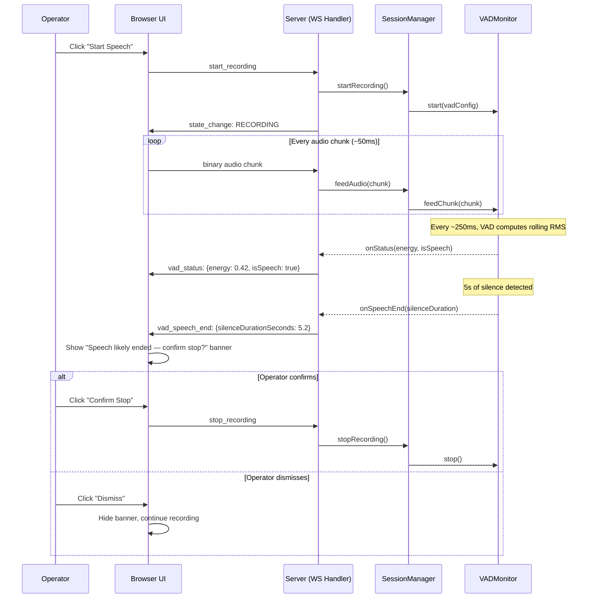
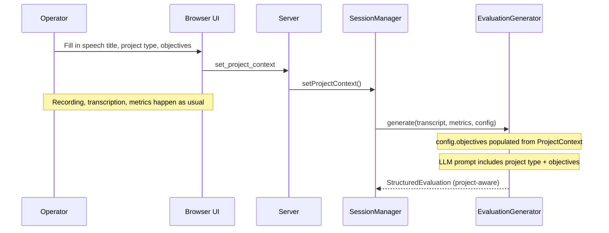
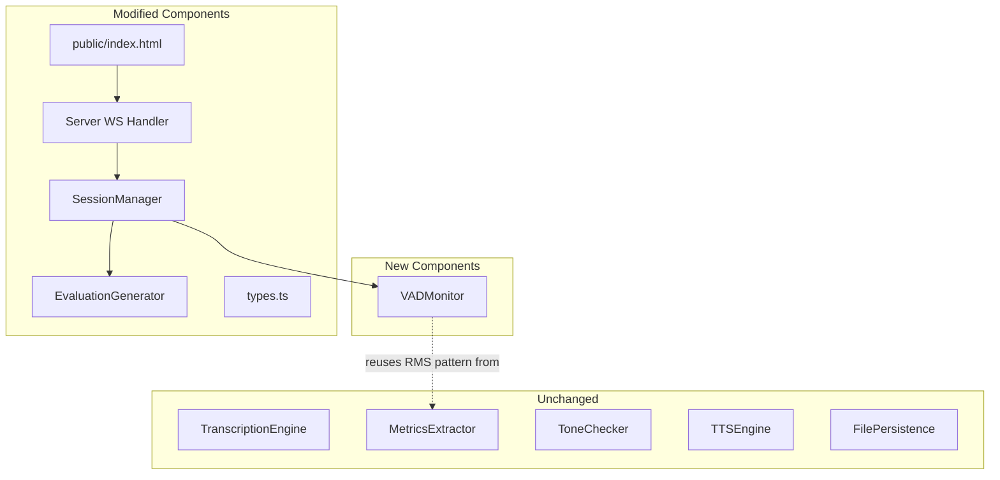

# Design Document: Phase 3 — Semi-Automation

## Overview

Phase 3 extends the AI Toastmasters Evaluator with three capability areas that reduce operator workload while preserving human oversight:

1. **Voice Activity Detection (VAD)** — A server-side `VADMonitor` component that analyzes audio chunks in real time during recording to detect sustained silence, emitting speech-end suggestions to the operator. The operator must still confirm before recording stops. The VAD reuses the same RMS energy computation pattern already established in `MetricsExtractor.computeEnergyProfile()`, adapted for streaming (per-chunk) rather than batch (post-recording) analysis.

2. **Project Awareness** — A `ProjectContext` metadata object on the Session that carries speech title, Toastmasters project type, and project-specific objectives. The existing `EvaluationConfig.objectives` extensibility hook (Req 8.2 from Phase 1) is activated and extended. The LLM prompt is augmented to reference project goals alongside general feedback.

3. **Evidence Highlight UI (Optional)** — Client-side transcript navigation and metrics dashboard. Evidence quotes in the evaluation become clickable, scrolling to and highlighting the matching transcript passage. A compact metrics summary panel displays key delivery statistics.

### Technology Stack (unchanged)

- **Runtime**: Node.js with TypeScript
- **Web Framework**: Express.js with raw WebSocket (`ws` library)
- **Frontend**: Vanilla HTML/CSS/JS in `public/index.html`
- **Testing**: Vitest + fast-check for property-based testing
- **Live Transcription**: Deepgram API
- **Post-Speech Transcription**: OpenAI gpt-4o-transcribe
- **LLM**: OpenAI GPT-4o with structured output (JSON mode)
- **TTS**: OpenAI TTS API

### Key Design Decisions

1. **VAD runs server-side, not in the AudioWorklet.** The server already receives every audio chunk during recording. Computing RMS on the server avoids duplicating audio analysis in the browser and keeps the detection logic testable in Node.js. The client receives `vad_speech_end` notifications and `vad_status` updates via WebSocket — no new browser APIs needed.

2. **VAD uses adaptive thresholding, not a fixed dB level.** Different microphones, rooms, and speakers produce wildly different absolute energy levels. The VAD computes a rolling median of speech-active RMS values and sets the silence threshold as a fraction of that median (default 0.15×). This mirrors the adaptive approach already used in `MetricsExtractor.computeEnergyProfile()`.

3. **VAD is a suggestion, never an action.** The VAD emits a notification; the operator confirms or dismisses. This preserves the "system never acts unprompted" behavioral boundary. The `stop_recording` message still comes from the client, triggered by operator click.

4. **Project context activates the existing `EvaluationConfig.objectives` hook.** Phase 1 defined `EvaluationConfig.objectives` as an extensibility hook (Req 8.2). Phase 3 populates it from `ProjectContext.objectives` and extends the LLM prompt to reference the project type and speech title. No new LLM call is needed — the existing `generate()` method already accepts `EvaluationConfig`.

5. **Project context is immutable after recording starts.** Consistent with `ConsentRecord` immutability (Phase 2 Req 2.4). Both are pre-speech metadata that should not change mid-session.

6. **Evidence highlight is purely client-side.** The server already sends `evaluation_ready` with evidence quotes and timestamps, and `transcript_update` with segment data. The client has all the data it needs to match quotes to transcript segments using the same normalization rules as `EvidenceValidator`. No new server endpoints or messages are needed for this feature.

7. **Predefined project types are a client-side lookup table.** The list of Toastmasters Pathways projects and their standard objectives is static data embedded in the frontend. The server receives the selected project type as a string — it doesn't need to know the full catalog.

8. **VAD status messages are throttled to 4/second.** Audio chunks arrive at ~20/second (50ms each). Sending a `vad_status` for every chunk would flood the WebSocket. The server accumulates chunks and sends status updates at most every 250ms.

## Architecture

### VAD Flow During Recording



### Project-Aware Evaluation Flow



### Component Dependency Map



## Components and Interfaces

### 1. VADMonitor (`src/vad-monitor.ts`) — NEW

A stateful component that processes audio chunks in real time during recording to detect sustained silence.

```typescript
export interface VADConfig {
  silenceThresholdSeconds: number; // default: 5
  enabled: boolean;                // default: true
  silenceFactor: number;           // fraction of median speech energy; default: 0.15
  minSpeechSeconds: number;        // minimum speech before detection activates; default: 3
  suppressionSeconds: number;      // suppress detection in first N seconds; default: 10
  statusIntervalMs: number;        // throttle interval for status updates; default: 250
  speechEnergyWindowChunks: number; // sliding window cap for speech RMS values; default: 6000
  noiseFloorBootstrapChunks: number; // minimum chunks before adaptive threshold activates; default: 40 (2s of audio)
  thresholdMultiplier: number;     // alias for silenceFactor — fraction of median speech energy; default: 0.15
}
```

**Note on `thresholdMultiplier` vs `silenceFactor`:** These are the same value. `thresholdMultiplier` is the explicit named parameter; `silenceFactor` is retained as an alias for backward compatibility. Implementations should use `thresholdMultiplier` (falling back to `silenceFactor` if provided).

export interface VADStatus {
  energy: number;     // current RMS energy (0..1 normalized)
  isSpeech: boolean;  // true if current chunk is above silence threshold
}

export type VADEventCallback = {
  onSpeechEnd: (silenceDurationSeconds: number) => void;
  onStatus: (status: VADStatus) => void;
};

export class VADMonitor {
  private config: VADConfig;
  private callbacks: VADEventCallback;

  // Rolling state
  private speechRmsValues: number[];     // RMS values of speech-active chunks (capped at config.speechEnergyWindowChunks)
  private silenceStartChunk: number | null; // chunk index when current silence episode began (audio-time based)
  private totalChunksProcessed: number;
  private speechChunksProcessed: number;
  private lastStatusEmitTime: number;    // wall-clock time for status throttling only
  private hasSuggestedForCurrentSilence: boolean;
  private stopped: boolean;              // true after stop(); feedChunk() returns immediately

  constructor(config: VADConfig, callbacks: VADEventCallback);

  /** Process a single audio chunk (16-bit PCM, mono, 16kHz). Returns immediately if stopped. */
  feedChunk(chunk: Buffer): void;

  /** Reset all state. Re-arms the monitor (sets stopped = false). */
  reset(): void;

  /** Stop monitoring. Sets stopped = true; subsequent feedChunk() calls are no-ops. */
  stop(): void;
}
```

**RMS computation per chunk:**
```typescript
// Same pattern as MetricsExtractor.computeEnergyProfile but per-chunk
function computeChunkRMS(chunk: Buffer): number {
  const sampleCount = Math.floor(chunk.length / 2);
  if (sampleCount === 0) return 0;
  let sumSquares = 0;
  for (let i = 0; i < sampleCount; i++) {
    const sample = chunk.readInt16LE(i * 2);
    sumSquares += sample * sample;
  }
  return Math.sqrt(sumSquares / sampleCount);
}
```

**Adaptive silence threshold:**
- Maintain a sliding window of the last `speechEnergyWindowChunks` (default 6000) RMS values from speech-active chunks (cap prevents unbounded memory growth for long speeches)
- Compute `medianSpeechRMS` from this array
- `silenceThreshold = medianSpeechRMS * thresholdMultiplier` (default 0.15, same as `silenceFactor`)
- A chunk is classified as silence when `chunkRMS < silenceThreshold`
- The threshold adapts as more speech is observed

**Early-recording behavior (noise floor bootstrap):**
- During the first `noiseFloorBootstrapChunks` (default 40, i.e., 2 seconds of audio) chunks, the VADMonitor uses a fixed conservative RMS threshold (e.g., 50 raw RMS units) to avoid misclassifying ambient noise as speech. This prevents the adaptive threshold from being seeded with noise-floor values.
- After `noiseFloorBootstrapChunks` chunks have been processed, the adaptive median-based threshold takes over.
- If fewer than `noiseFloorBootstrapChunks` speech-active chunks have been observed when the bootstrap period ends, the fixed threshold continues until enough speech data is available.

**Silence episode tracking (audio-time based):**
- Silence duration is computed using audio time: `totalChunksProcessed * 0.05` seconds (each chunk is 50ms at 16kHz). This avoids false positives from network jitter or browser scheduling delays that would affect wall-clock `Date.now()` measurements. Wall-clock time is NOT used for silence detection.
- When a chunk transitions from speech to silence: record `silenceStartChunk = totalChunksProcessed`
- While silence continues: compute silence duration as `(totalChunksProcessed - silenceStartChunk) * 0.05` seconds
- When silence duration ≥ `config.silenceThresholdSeconds` AND `hasSuggestedForCurrentSilence` is false: emit `onSpeechEnd`, set `hasSuggestedForCurrentSilence = true`
- When speech resumes: reset `silenceStartChunk` and `hasSuggestedForCurrentSilence`

**Suppression rules (audio-time based):**
- Recording elapsed time is computed as `totalChunksProcessed * 0.05` seconds (audio time, not wall-clock)
- Speech accumulated time is computed as `speechChunksProcessed * 0.05` seconds (audio time)
- No `onSpeechEnd` until recording elapsed time ≥ `config.suppressionSeconds` (default 10s)
- No `onSpeechEnd` until speech accumulated time ≥ `config.minSpeechSeconds` (default 3s)
- At most one `onSpeechEnd` per silence episode

**Status throttling:**
- `onStatus` is called at most once per `config.statusIntervalMs` (default 250ms)
- Energy is normalized to 0..1 using `Math.max(maxObservedRms, 100)` — the floor of 100 prevents wild normalization swings during early recording when `maxObservedRms` is very small

### 2. Session Type Extension (`src/types.ts`)

```typescript
// ─── Project Context (Phase 3 — Req 4, 5, 6) ───────────────────────────────────

export interface ProjectContext {
  /** Speech title, free text. Max 200 characters (Req 4.8). */
  speechTitle: string | null;
  /** Toastmasters Pathways project type. Max 100 characters (Req 4.8). */
  projectType: string | null;
  /** Project-specific evaluation objectives. Max 10 items, each max 500 characters (Req 4.8). */
  objectives: string[];
}

// ─── VAD Configuration (Phase 3 — Req 1, 2, 3) ─────────────────────────────────

export interface SessionVADConfig {
  /** Silence duration threshold in seconds. Range: 3-15, default: 5 (Req 3.1). */
  silenceThresholdSeconds: number;
  /** Whether VAD is enabled. Default: true (Req 3.5). */
  enabled: boolean;
}

// Add to Session interface:
// projectContext: ProjectContext | null;
// vadConfig: SessionVADConfig;
```

**Deprecation note:** The existing `session.evaluationObjectives?: string[]` field (Req 8.2 extensibility hook) is superseded by `projectContext.objectives`. Task 1.1 should add a `@deprecated` JSDoc comment to `evaluationObjectives` indicating that `projectContext.objectives` is the new source of truth. The field is retained for backward compatibility but should not be read by any new code.

**New ClientMessage types:**

```typescript
export type ClientMessage =
  // ... existing types ...
  | { type: "set_project_context"; speechTitle: string; projectType: string; objectives: string[] }
  | { type: "set_vad_config"; silenceThresholdSeconds: number; enabled: boolean };
```

**New ServerMessage types:**

```typescript
export type ServerMessage =
  // ... existing types ...
  | { type: "vad_speech_end"; silenceDurationSeconds: number }
  | { type: "vad_status"; energy: number; isSpeech: boolean }
  | { type: "data_purged"; reason: "opt_out" | "auto_purge" };
```

### 3. SessionManager Changes (`src/session-manager.ts`)

**New dependency:**

```typescript
export interface SessionManagerDeps {
  // ... existing deps ...
  vadMonitorFactory?: (config: VADConfig, callbacks: VADEventCallback) => VADMonitor;
}
```

A factory function rather than a singleton because each recording session needs a fresh VADMonitor instance with reset state.

**VADMonitor storage:**

`SessionManager` maintains a private `Map<string, VADMonitor>` keyed by session ID, rather than adding a field to the `Session` interface. This keeps `types.ts` as pure data interfaces with no runtime class dependencies.

```typescript
private vadMonitors: Map<string, VADMonitor> = new Map();
```

**New methods:**

```typescript
/** Store project context on the session. Only valid in IDLE state. */
setProjectContext(sessionId: string, context: ProjectContext): void;

/** Store VAD config on the session. Only valid in IDLE state. */
setVADConfig(sessionId: string, config: SessionVADConfig): void;

/** Register per-session VAD callbacks. Called by the server layer BEFORE startRecording(). */
registerVADCallbacks(sessionId: string, callbacks: VADEventCallback): void;
```

**`registerVADCallbacks()` design:**

The server layer calls `registerVADCallbacks(sessionId, callbacks)` before `startRecording()` to wire per-session WebSocket-sending callbacks. This keeps `startRecording()` signature unchanged (no `vadCallbacks` parameter) and avoids coupling WebSocket concerns into the SessionManager API. Internally, SessionManager stores callbacks in a private `Map<string, VADEventCallback>` keyed by session ID. When `startRecording()` creates the VADMonitor via `vadMonitorFactory`, it looks up the registered callbacks from this map. If no callbacks are registered, VAD events are silently discarded (backward compat).

```typescript
private vadCallbacksMap: Map<string, VADEventCallback> = new Map();

registerVADCallbacks(sessionId: string, callbacks: VADEventCallback): void {
  this.vadCallbacksMap.set(sessionId, callbacks);
}
```

**`startRecording()` signature — UNCHANGED:**

The existing `startRecording()` signature is NOT modified. It remains:

```typescript
startRecording(
  sessionId: string,
  onLiveSegment?: (segment: TranscriptSegment) => void,
): void
```

When `vadConfig.enabled` is true and `vadMonitorFactory` is available, `startRecording()` creates a `VADMonitor` instance, stores it in `this.vadMonitors`, and wires the callbacks from `this.vadCallbacksMap.get(sessionId)` to the monitor's event callbacks. If no callbacks were registered, VAD events are silently discarded.

Note: `projectContext` and `vadConfig` are NOT cleared by `startRecording()` — they are pre-speech configuration set during IDLE state, analogous to `consent`. The absence of these fields from the clear list in `startRecording()` is intentional, not an omission.

**Cleanup:** `stopRecording()`, `panicMute()`, and `revokeConsent()` remove entries from both `this.vadMonitors` and `this.vadCallbacksMap` for the session.

**Other modified methods:**

- `createSession()`: Initialize `projectContext: null`, `vadConfig: { silenceThresholdSeconds: 5, enabled: true }`
- `feedAudio()`: Forward chunk to VADMonitor via `vadMonitor.feedChunk(chunk)` in addition to existing Deepgram forwarding (lookup from `this.vadMonitors`). **HARD GUARD**: `feedAudio()` SHALL only forward chunks to VADMonitor when `session.state === 'RECORDING'` AND the monitor exists in `this.vadMonitors`. If state is not RECORDING, chunks are silently ignored (no error thrown). This prevents late chunks (network jitter) from reaching a stopped/removed monitor and prevents resurrection of a monitor after stop.
- `stopRecording()`: Stop and remove VADMonitor from `this.vadMonitors`
- `panicMute()`: Stop and remove VADMonitor from `this.vadMonitors`
- `revokeConsent()`: Stop and remove VADMonitor, clear `projectContext`
- `generateEvaluation()` / `runEagerPipeline()`: Build `EvaluationConfig` from `session.projectContext` and pass to `evaluationGenerator.generate()`. **CRITICAL**: Both code paths must pass config — `runEagerPipeline()` currently calls `generate()` without a config argument. The eager pipeline is the primary evaluation path; missing this would silently ignore project context.

```typescript
// Build EvaluationConfig from session.projectContext (used in both generateEvaluation and runEagerPipeline)
const config: EvaluationConfig | undefined = session.projectContext
  ? {
      objectives: session.projectContext.objectives,
      speechTitle: session.projectContext.speechTitle ?? undefined,
      projectType: session.projectContext.projectType ?? undefined,
    }
  : undefined;

const generateResult = await this.deps.evaluationGenerator.generate(
  session.transcript,
  metrics,
  config,  // ← MUST be passed in both generateEvaluation() AND runEagerPipeline()
);
```

**Privacy compliance:**
- `projectContext` is purged on opt-out (revokeConsent) and auto-purge, consistent with other session data
- VADMonitor holds no persistent data — it processes chunks in real time and emits events. `reset()` clears all rolling state.

**IMPORTANT — `purgeSessionData()` in `server.ts`:**
The auto-purge function `purgeSessionData()` lives in `server.ts` (not `session-manager.ts`). It must be updated to also clear:
- `session.projectContext = null` (Phase 3 addition)
- `session.evaluationPublic = null` (existing omission — this field is not currently purged)
- `session.evaluationPassRate = null` (existing omission — telemetry data should be cleared)
- `session.qualityWarning = false` (existing omission — should be reset)

After purging, `purgeSessionData()` SHALL send a `data_purged` message to the client via WebSocket with `reason: "auto_purge"`. This is REQUIRED (not optional) so the UI can clear stale local state (project context form, VAD config, evaluation/transcript display).

The `data_purged` ServerMessage type SHALL be added to the `ServerMessage` union with a `reason` field: `"opt_out" | "auto_purge"`.

Note: `session.consent` and `session.outputsSaved` are intentionally NOT cleared by auto-purge. Consent is session metadata (not speech data), and `outputsSaved` tracks whether files were already written to disk (the operator's responsibility after save). This matches the privacy-and-retention steering rule which says "all transcript, metrics, evaluation, and audio chunk references are nulled" — consent and save status are not speech data.

This is separate from `revokeConsent()` in `session-manager.ts`, which handles opt-out purge and clears everything including consent.

### 4. Server Changes (`src/server.ts`)

**New message handlers:**

- `handleSetProjectContext()`: Validate IDLE state, call `sessionManager.setProjectContext()`
- `handleSetVADConfig()`: Validate IDLE state, validate `silenceThresholdSeconds` is a number in range [3, 15] and `enabled` is a boolean — reject with recoverable error if out of range or wrong type, call `sessionManager.setVADConfig()`

**Modified `handleStartRecording()`:**

Before calling `sessionManager.startRecording()`, the server registers per-session VAD callbacks via `registerVADCallbacks()`:

```typescript
// Register VAD callbacks BEFORE startRecording()
sessionManager.registerVADCallbacks(sessionId, {
  onSpeechEnd: (silenceDuration: number) => {
    sendMessage(ws, { type: "vad_speech_end", silenceDurationSeconds: silenceDuration });
  },
  onStatus: (status: VADStatus) => {
    sendMessage(ws, { type: "vad_status", energy: status.energy, isSpeech: status.isSpeech });
  },
});

// startRecording() signature is UNCHANGED — no vadCallbacks parameter
sessionManager.startRecording(sessionId, onLiveSegment);
```

This keeps the SessionManager API pure — it does not know about WebSocket concerns. The server layer is responsible for wiring per-session callbacks before starting recording.

**Modified `handleClientMessage()` switch:**

Add cases for `set_project_context`, `set_vad_config`.

### 5. EvaluationGenerator Changes (`src/evaluation-generator.ts`)

**Modified `buildUserPrompt()`:**

The existing `buildUserPrompt()` already receives `EvaluationConfig` and renders objectives. Extend it to also include the project-specific evaluation section when `config.projectType` is provided. This keeps `buildSystemPrompt()` unchanged (it only takes `qualityWarning: boolean`).

When `config.projectType` is provided, add a new section to the user prompt that **replaces** the existing `## Evaluation Objectives` section (to avoid duplicate objectives listings). When `projectType` is absent but `objectives` are present (edge case — e.g., custom objectives without a project type), the existing `## Evaluation Objectives` rendering is preserved unchanged:

```text
## Project-Specific Evaluation
This speech is a {projectType} project titled "{speechTitle}".

### Project Objectives
{objectives as numbered list}

### Instructions
- Reference the project type and speech title in your opening.
- Include at least one commendation or recommendation that directly addresses a project objective.
- Balance project-specific feedback with general Toastmasters evaluation criteria.
- Project objectives supplement, not replace, evidence-based feedback.
```

Note: `buildSystemPrompt(qualityWarning: boolean)` signature is NOT changed. The project-specific section goes in the user prompt because `buildSystemPrompt()` does not receive `EvaluationConfig` and changing its signature would be an unnecessary refactor. The user prompt is the correct place for per-request context like project metadata.

**Testing note for Properties 6 and 8:** `buildUserPrompt()` is a `private` method on `EvaluationGenerator`. Property tests will use `(generator as any).buildUserPrompt(...)` to access it directly, which is a common TypeScript testing pattern. This avoids changing the method's visibility or adding test-only public methods.

**Modified `EvaluationConfig`:**

```typescript
export interface EvaluationConfig {
  objectives?: string[];
  speechTitle?: string;    // Phase 3: speech title from ProjectContext
  projectType?: string;    // Phase 3: Toastmasters project type from ProjectContext
}
```

### 6. FilePersistence Changes (`src/file-persistence.ts`)

**Modified `saveSession()`:**

Include `projectContext` in saved metadata when present. Add a `project-context.json` file to the output alongside existing `transcript.txt`, `metrics.json`, `evaluation.txt`.

### 7. Frontend Changes (`public/index.html`)

**New UI elements:**

- **VAD notification banner**: Non-blocking banner with "Confirm Stop" and "Dismiss" buttons. Positioned below the status bar, above controls. Styled with the existing `--color-warning` palette.
- **VAD config controls**: Silence threshold slider (3-15s) and enable/disable toggle. Shown in IDLE state alongside existing time limit control.
- **Project context form**: Speech title input, project type dropdown, objectives textarea. Shown in IDLE state below the consent form.
- **Evidence highlight rendering**: In the evaluation panel, evidence quotes wrapped in `<span class="evidence-link" data-quote="..." data-timestamp="...">` elements. Click handler scrolls transcript panel and highlights matching segment.
- **Metrics summary panel** (optional): Compact row of metric badges below the evaluation panel.

**New client-side state:**

```javascript
let vadEnabled = true;
let vadSilenceThreshold = 5;
let vadNotificationVisible = false;
let projectContext = { speechTitle: "", projectType: "", objectives: [] };
```

**Evidence highlight redaction caveat:**
The `evaluation_ready` message sends `StructuredEvaluationPublic`, which contains redacted evidence quotes (e.g., "[a fellow member]"). These redacted quotes will not match the transcript text. This is acceptable behavior per Req 7.4: redacted quotes are rendered without clickable navigation and without visual error indication. The evidence highlight feature gracefully degrades for redacted quotes.

**Evidence matching (client-side):**

```javascript
function normalizeForMatch(text) {
  return text.toLowerCase().replace(/[^\w\s]/g, "").replace(/\s+/g, " ").trim();
}

function findTranscriptMatch(quote, segments) {
  const normalizedQuote = normalizeForMatch(quote);
  const quoteTokens = normalizedQuote.split(" ");
  for (let i = 0; i < segments.length; i++) {
    const segText = normalizeForMatch(segments[i].text);
    if (segText.includes(normalizedQuote)) {
      return { segmentIndex: i, segment: segments[i] };
    }
  }
  return null;
}
```

**Predefined project types (client-side lookup):**

```javascript
const PROJECT_TYPES = {
  "Ice Breaker": [
    "Introduce yourself and share your personal story",
    "Organize your speech with an opening, body, and conclusion",
    "Speak for 4-6 minutes"
  ],
  "Evaluation and Feedback": [
    "Present a speech on any topic",
    "Receive and apply feedback from evaluators",
    "Speak for 5-7 minutes"
  ],
  "Researching and Presenting": [
    "Research a topic and present your findings",
    "Use credible sources to support your points",
    "Speak for 5-7 minutes"
  ],
  "Introduction to Vocal Variety": [
    "Use vocal variety to enhance your message",
    "Vary pace, pitch, volume, and pauses",
    "Speak for 5-7 minutes"
  ],
  "Connect with Storytelling": [
    "Share a personal story that connects with the audience",
    "Use vivid language and emotional appeal",
    "Speak for 5-7 minutes"
  ],
  "Persuasive Speaking": [
    "Persuade the audience to adopt your viewpoint",
    "Use logical arguments and emotional appeals",
    "Speak for 5-7 minutes"
  ],
  "Custom / Other": []
};
```

## Data Models

### Session Fields (additions)

| Field | Type | Default | Mutable During Recording | Purged on Opt-Out | Purged on Auto-Purge |
|-------|------|---------|--------------------------|-------------------|---------------------|
| `projectContext` | `ProjectContext \| null` | `null` | No (immutable after recording starts) | Yes | Yes |
| `vadConfig` | `SessionVADConfig` | `{ silenceThresholdSeconds: 5, enabled: true }` | No | No (config, not data) | No |

### VADMonitor Internal State

| Field | Type | Purpose |
|-------|------|---------|
| `speechRmsValues` | `number[]` | Sliding window of the last `speechEnergyWindowChunks` (default 6000) speech-active RMS values (~5 minutes of speech at 20 chunks/sec) for adaptive threshold. Older entries are dropped to cap memory and keep median computation O(n log n) bounded. |
| `silenceStartChunk` | `number \| null` | Chunk index when current silence episode began (audio-time based: silence duration = `(totalChunksProcessed - silenceStartChunk) * 0.05` seconds) |
| `totalChunksProcessed` | `number` | Total chunks seen (for audio-time calculations: elapsed audio time = `totalChunksProcessed * 0.05` seconds) |
| `speechChunksProcessed` | `number` | Chunks classified as speech (for minimum speech requirement: speech time = `speechChunksProcessed * 0.05` seconds) |
| `lastStatusEmitTime` | `number` | Last wall-clock time `onStatus` was called (for throttling — wall-clock is appropriate here since this is rate-limiting, not correctness) |
| `hasSuggestedForCurrentSilence` | `boolean` | Whether `onSpeechEnd` was emitted for the current silence episode |
| `maxObservedRms` | `number` | Maximum RMS seen so far (for energy normalization in status) |

### ProjectContext

```typescript
{
  speechTitle: string | null;   // "My Journey to Toastmasters"
  projectType: string | null;   // "Ice Breaker"
  objectives: string[];         // ["Introduce yourself...", "Organize your speech..."]
}
```

### WebSocket Message Examples

**Client → Server:**

```json
{ "type": "set_project_context", "speechTitle": "My Journey", "projectType": "Ice Breaker", "objectives": ["Introduce yourself", "Speak for 4-6 minutes"] }
```

```json
{ "type": "set_vad_config", "silenceThresholdSeconds": 7, "enabled": true }
```

**Server → Client:**

```json
{ "type": "vad_speech_end", "silenceDurationSeconds": 5.2 }
```

```json
{ "type": "vad_status", "energy": 0.42, "isSpeech": true }
```


## Correctness Properties

*A property is a characteristic or behavior that should hold true across all valid executions of a system — essentially, a formal statement about what the system should do. Properties serve as the bridge between human-readable specifications and machine-verifiable correctness guarantees.*

### VAD-P1: Chunk RMS classification matches adaptive threshold

*For any* audio chunk and any speech energy baseline (array of prior speech-active RMS values), the VAD_Monitor SHALL classify the chunk as silence if and only if its computed RMS energy is below `median(speechRmsValues) * silenceFactor`. Chunks at or above the threshold SHALL be classified as speech.

**Validates: Requirements 1.1, 1.2**

### VAD-P2: Speech-end suggestion emitted on sustained silence

*For any* sequence of audio chunks where (a) the suppression window has elapsed, (b) minimum speech activity has been observed, and (c) consecutive silence chunks span at least `silenceThresholdSeconds`, the VAD_Monitor SHALL emit exactly one `onSpeechEnd` callback with a `silenceDurationSeconds` value greater than or equal to the configured threshold.

**Validates: Requirements 1.3**

### VAD-P3: At most one suggestion per silence episode

*For any* sequence of audio chunks fed to the VAD_Monitor, the number of `onSpeechEnd` emissions SHALL be at most equal to the number of distinct silence episodes (where a silence episode is a maximal contiguous run of silence chunks bounded by speech chunks on both sides or by recording start/end). No two consecutive `onSpeechEnd` emissions SHALL occur without an intervening speech-active chunk.

**Validates: Requirements 1.4**

### VAD-P4: Suppression rules prevent premature suggestions

*For any* sequence of audio chunks, the VAD_Monitor SHALL NOT emit an `onSpeechEnd` callback if either (a) fewer than `suppressionSeconds` (default 10) have elapsed since monitoring started, or (b) fewer than `minSpeechSeconds` (default 3) of speech-active chunks have been observed. Both conditions must be satisfied before any suggestion can be emitted.

**Validates: Requirements 1.5, 1.7**

### VAD-P5: Adaptive threshold tracks median speech energy

*For any* set of speech-active RMS values observed by the VAD_Monitor, the computed silence threshold SHALL equal `median(speechRmsValues) * silenceFactor`. As new speech chunks are observed, the threshold SHALL update to reflect the new median.

**Validates: Requirements 1.6**

### CTX-P1: Absent project context produces no project prompt sections

*For any* `EvaluationConfig` where `speechTitle` is undefined/null and `projectType` is undefined/null and `objectives` is empty, the LLM prompt built by `buildUserPrompt()` SHALL NOT contain the strings "Project-Specific Evaluation", "Project Objectives", or any of the project-specific instruction text. The prompt SHALL be identical to the Phase 2 prompt.

**Validates: Requirements 4.6, 5.3**

### CTX-P2: Project context immutability after recording starts

*For any* session in a non-IDLE state (RECORDING, PROCESSING, DELIVERING), calling `setProjectContext()` SHALL throw an error. The session's `projectContext` field SHALL remain unchanged after the error.

**Validates: Requirements 4.7, 6.3**

### CTX-P3: Project context included in prompt when provided

*For any* non-null `ProjectContext` with a non-empty `projectType` and at least one objective, the LLM prompt built by `buildUserPrompt()` SHALL contain the project type string, the speech title string (if non-null), and each objective string. The prompt SHALL also contain instructions to reference project objectives in the evaluation. (Note: `buildSystemPrompt()` is NOT modified — all project context goes in the user prompt.)

**Validates: Requirements 5.1, 5.2, 5.5**

### CTX-P4: Project context purged on speaker opt-out

*For any* session that has a non-null `projectContext`, calling `revokeConsent()` SHALL set `projectContext` to null. After revocation, `session.projectContext` SHALL be null.

**Validates: Requirements 9.4**

### VAD-P6: VAD status messages throttled to configured interval

*For any* sequence of N audio chunks fed to the VAD_Monitor within a time window of T milliseconds, the number of `onStatus` callbacks emitted SHALL be at most `ceil(T / statusIntervalMs)`. With the default `statusIntervalMs` of 250ms, this means at most 4 status updates per second.

**Validates: Requirements 10.2**

### UI-P1: Evidence quote normalization is consistent with EvidenceValidator

*For any* string, the client-side `normalizeForMatch()` function SHALL produce the same output as the server-side evidence normalization (lowercase, strip all non-alphanumeric non-whitespace characters, collapse whitespace, trim). Specifically: `normalizeForMatch(s) === serverNormalize(s)` for all strings `s`.

**Validates: Requirements 7.3**

## Error Handling

### VAD Errors

- **VAD initialization failure** (e.g., invalid config): Log warning, disable VAD for the session. Recording proceeds without VAD. The operator can still manually stop recording.
- **RMS computation error** (e.g., malformed chunk): Skip the chunk, log warning. Do not emit status or suggestion for that chunk. Continue processing subsequent chunks.
- **VAD callback error** (e.g., WebSocket send fails during `onStatus`/`onSpeechEnd`): The server wraps VAD callbacks in try/catch. Errors are logged but do not affect recording or transcription.

### Project Context Errors

- **Invalid project context message** (e.g., missing fields): Server sends recoverable error. Session state unchanged.
- **setProjectContext in non-IDLE state**: Server sends recoverable error with message explaining that project context can only be set before recording starts.
- **LLM prompt too long with project context**: The existing prompt length is well within GPT-4o limits. If objectives are excessively long, the `buildUserPrompt()` truncates the objectives list to the first 10 items.

### Evidence Highlight Errors (Client-Side)

- **Quote not found in transcript**: Display quote without clickable navigation. No error shown to operator.
- **Multiple matches for a quote**: Use the first match (earliest segment). This is consistent with the server-side EvidenceValidator behavior.

## Testing Strategy

### Dual Testing Approach

- **Unit tests**: Verify specific examples, edge cases, and error conditions for VADMonitor, project context handling, and evidence matching.
- **Property tests**: Verify universal properties across all inputs using fast-check. Each property test references a design document property.

### Property-Based Testing Configuration

- **Library**: fast-check (already used in the project)
- **Minimum iterations**: 100 per property test
- **Tag format**: `Feature: phase-3-semi-automation, {PropertyID}: {property_text}` (e.g., `Feature: phase-3-semi-automation, VAD-P1: Chunk RMS classification`)

### Test Files

| Component | Unit Test File | Property Test File |
|-----------|---------------|-------------------|
| VADMonitor | `src/vad-monitor.test.ts` | `src/vad-monitor.property.test.ts` |
| SessionManager (Phase 3) | `src/session-manager.test.ts` (extend) | `src/session-manager.property.test.ts` (extend) |
| EvaluationGenerator (Phase 3) | `src/evaluation-generator.test.ts` (extend) | `src/evaluation-generator.property.test.ts` (extend) |
| Evidence matching (client) | `src/evidence-matching.test.ts` | `src/evidence-matching.property.test.ts` |

### Property Test Generators

**Audio chunk generator** (for VAD tests):
```typescript
// Generate a sequence of PCM audio chunks with controlled speech/silence patterns
const arbitraryAudioChunkSequence = fc.record({
  chunks: fc.array(
    fc.record({
      isSpeech: fc.boolean(),
      amplitude: fc.integer({ min: 0, max: 32767 }),
      sampleCount: fc.constant(800), // 50ms at 16kHz
    }),
    { minLength: 1, maxLength: 200 }
  ),
  config: fc.record({
    silenceThresholdSeconds: fc.integer({ min: 3, max: 15 }),
    silenceFactor: fc.double({ min: 0.05, max: 0.5 }),
    minSpeechSeconds: fc.integer({ min: 1, max: 5 }),
    suppressionSeconds: fc.integer({ min: 5, max: 15 }),
  }),
});
```

**Project context generator** (for prompt tests):
```typescript
const arbitraryProjectContext = fc.record({
  speechTitle: fc.option(fc.string({ minLength: 1, maxLength: 100 })),
  projectType: fc.option(fc.stringOf(fc.constantFrom(
    "Ice Breaker", "Vocal Variety", "Persuasive Speaking", "Custom"
  ))),
  objectives: fc.array(fc.string({ minLength: 1, maxLength: 200 }), { minLength: 0, maxLength: 10 }),
});
```

### Unit Test Focus Areas

- VADMonitor: edge cases (empty chunks, zero-amplitude audio, single chunk, config boundaries)
- SessionManager: state transition gating for `setProjectContext` and `setVADConfig`
- Server: message routing for new message types, error responses for invalid state
- EvaluationGenerator: prompt construction with/without project context
- Client-side evidence matching: normalization edge cases, multi-segment matching
