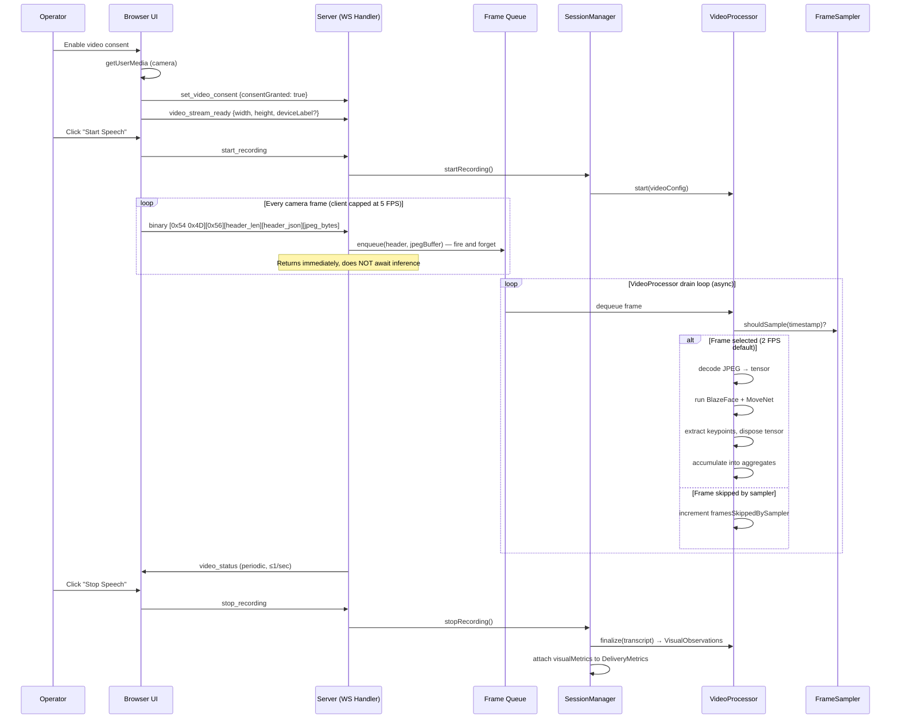
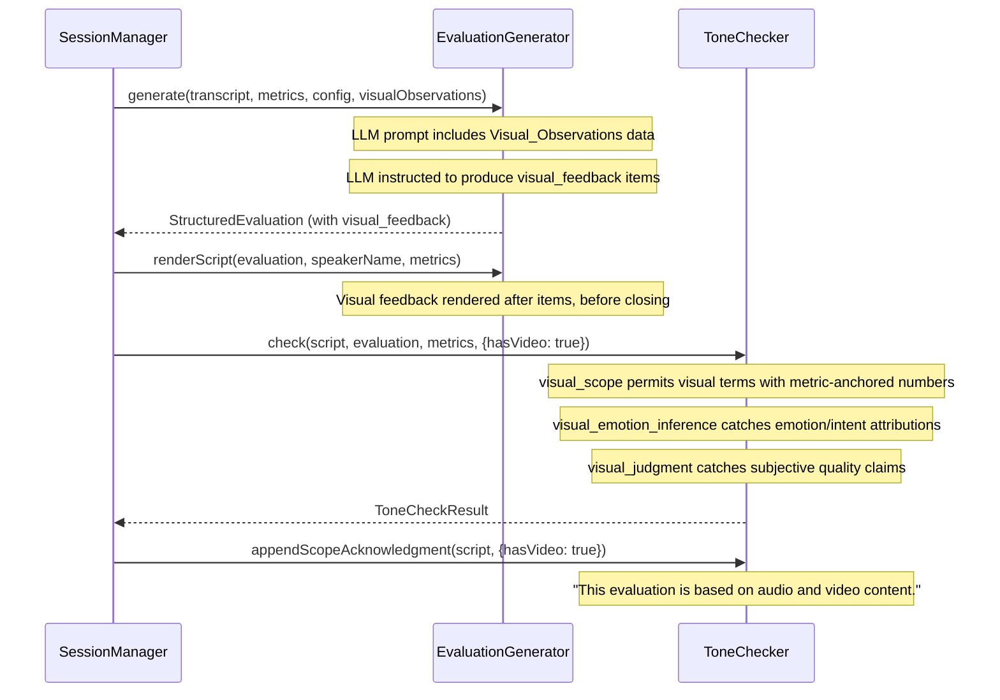
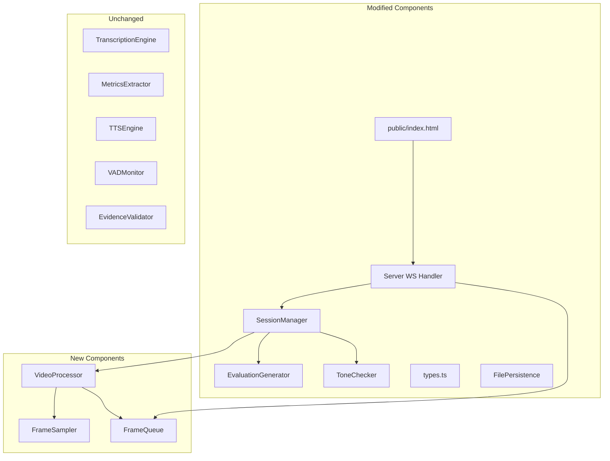

# Design Document: Phase 4 — Multimodal (Video / Delivery Coaching)

## Overview

Phase 4 adds a video processing pipeline that runs parallel to the existing audio pipeline, enabling the system to produce richer evaluations that include quantitative observations about the Speaker's non-verbal delivery. The pipeline captures camera frames from the client, samples them at a configurable rate (default 2 FPS), runs face/body detection to extract spatial keypoints, computes aggregate visual metrics, and feeds those metrics into the evaluation generator alongside existing audio-based data.

Three core design principles govern this phase:

1. **Observational only.** All visual feedback uses "I observed..." language backed by specific numeric measurements. No psychology, emotion, or intent inference. The Tone_Checker enforces this with new violation categories.

2. **Privacy-first.** Video frames are processed in-memory and dereferenced immediately after keypoint extraction. No frame data is stored, logged, or persisted. Only aggregate statistics (Visual_Observations) survive, following the same retention lifecycle as audio data.

3. **Audio-first resilience.** The video pipeline is strictly supplementary. Any video error — camera drop, model failure, processing timeout — is handled gracefully without affecting the audio evaluation pipeline. Video processing MUST NOT block audio frame handling on the WebSocket path.

4. **Determinism.** Given identical ordered frame stream and transcript within the same runtime + backend + model version, VisualObservations MUST be deterministic. All floating-point metrics use explicit rounding (4 decimal places). No non-deterministic TF.js operations. A `videoProcessingVersion` tuple (`{ tfjsVersion, tfjsBackend, modelVersions, configHash }`) is logged in-memory and allowed in metrics JSON for reproducibility tracking.

### Frame Processing Order (Invariant)

Every incoming frame follows this exact processing order. No step may be reordered:

1. **Reject malformed / stale frames** — Frames with invalid headers, timestamp regression, or timestamp jumps >2s are dropped before enqueue
2. **Enqueue** — Valid frames enter the bounded FrameQueue
3. **Apply backpressure drop** — If queue is full, oldest frame is dropped (O(1))
4. **Apply adaptive sampling decision** — If overloaded (>20% backpressure drops), halve effective rate with hysteresis
5. **Apply frame sampler selection** — FrameSampler decides if this frame falls within the sampling interval
6. **Process** — Selected frame goes through decode → inference → keypoint extraction → metric accumulation → tensor disposal

### Technology Stack

- **Runtime**: Node.js with TypeScript
- **Web Framework**: Express.js with raw WebSocket (`ws` library)
- **Frontend**: Vanilla HTML/CSS/JS in `public/index.html`
- **Testing**: Vitest + fast-check for property-based testing
- **Face/Body Detection**: TensorFlow.js with BlazeFace (face detection + head pose) and MoveNet (body/hand keypoints), running server-side in Node.js via `@tensorflow/tfjs-node`
- **Live Transcription**: Deepgram API (unchanged)
- **Post-Speech Transcription**: OpenAI gpt-4o-transcribe (unchanged)
- **LLM**: OpenAI GPT-4o with structured output (unchanged)
- **TTS**: OpenAI TTS API (unchanged)

### Key Design Decisions

1. **Video frames travel over the existing WebSocket connection using TM-prefixed binary framing.** A dedicated second WebSocket was considered but rejected — it adds connection management complexity (auth, reconnect, session binding). The existing WS already handles binary data; all binary frames now use a canonical envelope: `[0x54 0x4D ("TM")][type byte][uint24 header len][header JSON][payload]`. Video frames use type byte `0x56`, audio frames use type byte `0x41`. The server demultiplexes using the type byte — no heuristics. Only protocol version v1 is supported; malformed or incompatible frames are discarded silently. To protect audio-first delivery, the client prioritizes audio sends and the server routes video frames to an async queue without awaiting inference (see decision 9).

2. **Frame sampling happens server-side, not client-side.** The client sends frames at a capped rate (max 5 FPS). The server's Frame_Sampler selects frames at the configured rate (default 2 FPS). This keeps the client simple and lets the server adapt sampling dynamically if processing falls behind.

3. **TensorFlow.js runs server-side via `@tensorflow/tfjs-node`.** Browser-side inference was considered but rejected: it would compete with the AudioWorklet for CPU, vary wildly across client hardware, and require shipping model weights to the browser. Server-side inference is deterministic, testable, and doesn't affect client audio capture performance. **Operational constraints**: model warmup takes ~2-5s on first frame; memory footprint is ~200-500MB per loaded model pair. Max 2 concurrent video sessions recommended; additional sessions degrade to audio-only.

4. **All distance/position metrics are normalized by frame dimensions.** Raw pixel coordinates are meaningless across different cameras and resolutions. Body center-of-mass is normalized by frame width/height. Gesture displacement is normalized by body bounding box height. This makes thresholds portable across setups.

5. **Gaze_Direction tracks head pose, not eye gaze.** True eye gaze estimation requires high-resolution face crops and specialized models. Head pose (yaw/pitch from BlazeFace landmarks) is reliable at webcam resolution and sufficient for the "audience-facing vs notes-facing" classification. **Documented limitation**: accuracy assumes camera is roughly centered and at face height relative to the speaker. If the camera is off-axis (e.g., side table), the gaze breakdown becomes "camera-facing vs not" rather than "audience vs notes." This limitation is included in the visual feedback prompt instructions.

6. **Facial_Energy_Score uses per-session min-max normalization.** Scores are relative within a session, not comparable across sessions. This is intentional — the goal is to identify variation within a speech, not to compare speakers.

7. **Visual feedback items use a new `VisualFeedbackItem` type, not `EvaluationItem`.** Visual observations don't have transcript evidence quotes — they reference Visual_Observations metrics instead. Reusing `EvaluationItem` with an empty `evidence_quote` would violate the evidence validation pipeline. A separate type with `observation_data` keeps the type system honest.

8. **The `visual_scope` Tone_Checker category becomes context-dependent.** When video is available, visual terms are permitted but only when accompanied by a metric-anchored numeric measurement referencing a recognized metric key from the VisualObservations schema (not just any digit or metric-sounding word). When video is not available, the existing audio-only rules apply. This is implemented as a runtime flag passed to the Tone_Checker.

9. **Video frame processing is fire-and-forget on the WS handler path.** The WS message handler enqueues video frames into a bounded internal queue and returns immediately — it NEVER awaits inference. The VideoProcessor drains the queue on its own async loop. If the queue is full, frames are dropped (counted as `framesDroppedByBackpressure`). This guarantees that video processing latency cannot delay audio frame handling.

10. **Start-recording with video consent but no stream-ready proceeds audio-only.** Per Req 1.6, if the server hasn't received `video_stream_ready` when recording starts, it proceeds in audio-only mode and sends a recoverable error. This is a graceful fallback, not a hard rejection — the operator should not be blocked from recording because of a camera issue.

11. **`video_stream_ready` and `set_video_config` are protocol extensions justified by the camera handshake requirement (Req 1.5) and frame rate configurability (Req 2.9).** These are not in the original requirements list but are necessary protocol additions to implement the specified behavior.

12. **Gaze estimation uses EMA smoothing to reduce landmark jitter.** Raw yaw/pitch from BlazeFace 6-point landmarks is noisy frame-to-frame. A 3-frame exponential moving average smooths classifications without introducing significant lag at 2 FPS (1.5s effective window). The EMA resets when face detection fails for more than 1 second of elapsed time (not a fixed frame count) to avoid stale smoothing state biasing recovery at variable frame rates.

13. **Adaptive sampling under sustained overload with hysteresis.** If `framesDroppedByBackpressure` exceeds 20% of `framesReceived`, the VideoProcessor halves the effective sampling rate. This prevents the drain loop from falling permanently behind while still collecting useful data. To prevent oscillation under fluctuating load, hysteresis is applied: overload threshold is 20%, recovery threshold is 10%, with a 3-second cooldown window before restoring the configured rate.

14. **Finalization has a hard latency budget (3s max).** When `stopRecording()` is called, the drain loop processes remaining queued frames up to the budget, then finalizes with accumulated data. This prevents video processing from delaying evaluation delivery. Incomplete processing is acceptable; delayed TTS is not.

15. **Video quality is graded, not binary.** Three grades (high/degraded/poor) allow the evaluation generator to calibrate claim strength. "Poor" suppresses visual feedback entirely (including the transition sentence). "Degraded" adds uncertainty qualifiers. `videoQualityWarning` is derived as `videoQualityGrade !== "good"` — it is NOT stored independently, NOT separately computed. This prevents confident claims from weak data.

    **Video quality grade boundary conditions:**
    - **good**: `framesAnalyzed >= 0.8 * expectedSampleCount` AND face detected in ≥60% of analyzed frames AND no camera drop detected (no gap > cameraDropTimeoutSeconds)
    - **degraded**: `framesAnalyzed >= 0.5 * expectedSampleCount` AND (`framesAnalyzed < 0.8 * expectedSampleCount` OR camera drop recovered within session OR face detected in 30-59% of analyzed frames)
    - **poor**: `framesAnalyzed < 0.5 * expectedSampleCount` OR face detected in <30% of analyzed frames

    **Behavioral mapping in EvaluationGenerator:**
    - **good**: Normal visual feedback, all reliable metrics included (per-metric reliability flags still gate individual metrics)
    - **degraded**: Visual feedback with uncertainty qualifier ('Based on partial video coverage...'), unreliable metrics suppressed per-metric
    - **poor**: Visual feedback suppressed entirely (including transition sentence), note 'Video data was insufficient for visual observations' in evaluation

16. **Observation_data validation ties LLM claims to actual metrics.** The evaluation generator validates that each `visual_feedback` item's `observation_data` references a real metric name from the VisualObservations schema and that cited numeric values match actual values within ±1%. The ToneChecker also enforces that metric-anchored numbers require a recognized metric key AND a numeric value, with the metric key validated against the VisualObservations schema. References to non-existent metric fields are treated as violations.

17. **Audio always has WS priority over video.** The WS handler processes audio frames synchronously and video frames via fire-and-forget enqueue. Both use the TM-prefixed envelope with different type bytes. The client-side backpressure guard (2MB `bufferedAmount` threshold) drops video frames first. Audio is never starved by video traffic.

18. **Stale frame rejection happens BEFORE enqueue.** Frames with timestamp regression or jumps >2s are rejected at the WS handler level before entering the FrameQueue. This prevents stale frames from consuming queue capacity and ensures the queue only contains temporally valid frames.

19. **Resolution change mid-session resets baselines, not session.** When the Video_Processor detects a resolution change (frame dimensions differ from previous), it resets normalization baselines and EMA state but continues accumulating aggregates. The session is NOT restarted and accumulated data is preserved.

20. **Metric reliability gating.** Metrics are computed only from frames where detection confidence meets thresholds (face ≥ 0.5, pose ≥ 0.3). Windows with insufficient valid frames are excluded from aggregates. Per-metric reliability flags prevent unreliable metrics from appearing in evaluation feedback.

21. **Frame retention monitoring for metric bias.** If frame retention drops below 50% in any rolling 5-second window, `gesturePerSentenceRatio` is suppressed (set to null) and movement classification confidence is reduced. This prevents biased metrics from sparse data.

22. **Deterministic floating-point handling.** All metrics are rounded to 4 decimal places. No non-deterministic TF.js operations are used. This ensures bitwise-identical output for identical inputs within the same runtime + backend + model version. A `videoProcessingVersion` tuple is tracked for reproducibility.

## Architecture

### Video Pipeline Flow During Recording



### Evaluation Integration Flow



### Component Dependency Map



## Components and Interfaces


### 1. FrameQueue (`src/frame-queue.ts`) — NEW

A bounded, thread-safe queue that decouples the WS message handler from video inference. The WS handler enqueues frames; the VideoProcessor drains them asynchronously.

```typescript
export interface QueuedFrame {
  header: FrameHeader;
  jpegBuffer: Buffer;
  enqueuedAt: number;  // Date.now() for staleness detection
}

export class FrameQueue {
  private queue: QueuedFrame[];
  private maxSize: number;          // default: 20 (10 seconds at 2 FPS with headroom)
  private droppedByBackpressure: number;

  constructor(maxSize?: number);

  /** Enqueue a frame. If queue is full, drop the oldest frame and increment counter. Returns immediately. */
  /** Design intent: queue prioritizes freshness over continuity — the latest signal is always more valuable than stale frames for real-time analysis. */
  enqueue(header: FrameHeader, jpegBuffer: Buffer): void;

  /** Dequeue the next frame, or null if empty. */
  dequeue(): QueuedFrame | null;

  /** Number of frames dropped due to backpressure. */
  get framesDroppedByBackpressure(): number;

  /** Current queue depth. */
  get size(): number;

  /** Clear all queued frames. */
  clear(): void;
}
```

### 2. VideoProcessor (`src/video-processor.ts`) — NEW

The central video analysis component. Drains the FrameQueue, delegates sampling, runs inference, accumulates aggregates, and produces the final `VisualObservations`.

```typescript
export interface VideoConfig {
  frameRate: number;          // target FPS for sampling; default: 2, range: 1-5
  gestureDisplacementThreshold: number; // fraction of body bbox height; default: 0.15
  stageCrossingThreshold: number;       // fraction of frame width; default: 0.25
  stabilityWindowSeconds: number;       // rolling window for body stability; default: 5
  gazeYawThreshold: number;   // degrees from camera-facing for "audience-facing"; default: 15
  gazePitchThreshold: number; // degrees below horizontal for "notes-facing"; default: -20
  cameraDropTimeoutSeconds: number; // seconds without frames before declaring camera drop; default: 5
  queueMaxSize: number;       // max frames in the internal queue; default: 20
  maxFrameInferenceMs: number; // hard timeout per frame inference; default: 500
  staleFrameThresholdSeconds: number; // max age of frame before discard; default: 2.0
  finalizationBudgetMs: number; // hard max for finalize(); default: 3000
  minFaceAreaFraction: number;  // minimum face bbox area / frame area for gaze; default: 0.05
  faceDetectionConfidenceThreshold: number; // min confidence for face detection; default: 0.5
  poseDetectionConfidenceThreshold: number; // min confidence for pose detection; default: 0.3
  minValidFramesPerWindow: number; // min valid frames in a 5s window for metric inclusion; default: 3
  metricRoundingPrecision: number; // decimal places for metric rounding; default: 4
  facialEnergyEpsilon: number; // variance threshold below which facial energy is "low signal"; default: 0.001
  backpressureOverloadThreshold: number; // fraction of framesReceived triggering adaptive sampling; default: 0.20
  backpressureRecoveryThreshold: number; // fraction below which adaptive sampling recovers; default: 0.10
  backpressureCooldownMs: number; // cooldown before restoring configured rate; default: 3000
  frameRetentionWarningThreshold: number; // min retention rate in 5s window before metric degradation; default: 0.50
  motionDeadZoneFraction: number; // optional: min displacement to count as movement; default: 0.0 (disabled)
  // Per-metric coverage thresholds (coverage = validFramesForMetric / framesAnalyzed)
  gazeCoverageThreshold: number;          // default: 0.6
  facialEnergyCoverageThreshold: number;  // default: 0.4
  gestureCoverageThreshold: number;       // default: 0.3
  stabilityCoverageThreshold: number;     // default: 0.6
}

export interface FrameHeader {
  timestamp: number;  // seconds since client-side recording start (monotonic, for sampling/deltas)
  seq: number;        // incrementing frame sequence number (for ordering/gap detection)
  width: number;
  height: number;
}

export interface GazeBreakdown {
  audienceFacing: number;  // percentage 0-100
  notesFacing: number;     // percentage 0-100
  other: number;           // percentage 0-100
}

export interface VisualObservations {
  gazeBreakdown: GazeBreakdown;
  faceNotDetectedCount: number;
  totalGestureCount: number;
  gestureFrequency: number;         // gestures per minute
  gesturePerSentenceRatio: number | null;  // 0.0-1.0, null when suppressed due to low retention
  handsDetectedFrames: number;
  handsNotDetectedFrames: number;
  meanBodyStabilityScore: number;   // 0.0-1.0
  stageCrossingCount: number;
  movementClassification: "stationary" | "moderate_movement" | "high_movement";
  meanFacialEnergyScore: number;    // 0.0-1.0
  facialEnergyVariation: number;    // coefficient of variation
  facialEnergyLowSignal: boolean;   // true when variance < epsilon
  framesAnalyzed: number;
  framesReceived: number;
  framesSkippedBySampler: number;
  framesErrored: number;
  framesDroppedByBackpressure: number;
  framesDroppedByTimestamp: number; // frames dropped due to regression or >2s jump
  framesDroppedByFinalizationBudget: number; // frames remaining in queue after finalization budget expired
  resolutionChangeCount: number;    // number of resolution changes detected mid-session (debugging aid)
  videoQualityGrade: "good" | "degraded" | "poor";
  videoQualityWarning: boolean;     // derived: videoQualityGrade !== "good" — NOT stored independently
  finalizationLatencyMs: number;
  videoProcessingVersion: {         // in-memory metadata, allowed in metrics JSON
    tfjsVersion: string;
    tfjsBackend: string;
    modelVersions: { blazeface: string; movenet: string };
    configHash: string;
  };
  // Per-metric reliability indicators
  gazeReliable: boolean;
  gestureReliable: boolean;
  stabilityReliable: boolean;
  facialEnergyReliable: boolean;
}

export interface VideoProcessorDeps {
  faceDetector?: FaceDetector;   // BlazeFace wrapper
  poseDetector?: PoseDetector;   // MoveNet wrapper
}

export class VideoProcessor {
  private config: VideoConfig;
  private frameSampler: FrameSampler;
  private frameQueue: FrameQueue;
  private deps: VideoProcessorDeps;
  private stopped: boolean;
  private drainLoopRunning: boolean;

  // Accumulation state
  private gazeClassifications: Array<"audience-facing" | "notes-facing" | "other">;
  private faceNotDetectedCount: number;
  private gestureEvents: Array<{ timestamp: number }>;
  private previousHandKeypoints: number[][] | null;
  private previousBodyBboxHeight: number | null;
  private bodyCenterHistory: Array<{ timestamp: number; x: number; y: number }>;
  private facialEnergyDeltas: number[];
  private previousFaceLandmarks: number[][] | null;
  private framesAnalyzed: number;
  private framesReceived: number;
  private framesErrored: number;
  private lastFrameWallTime: number;       // wall-clock for camera drop detection
  private processingLatencies: number[];   // last 10 frame processing times
  private lastSeq: number;                 // for gap/reorder detection
  private framesDroppedByTimestamp: number; // timestamp/seq regression + jumps
  private framesDroppedByFinalizationBudget: number; // frames left after budget
  private resolutionChangeCount: number;   // resolution changes mid-session

  constructor(config: VideoConfig, deps: VideoProcessorDeps);

  /** Enqueue a frame for processing. Returns immediately (fire-and-forget). */
  enqueueFrame(header: FrameHeader, jpegBuffer: Buffer): void;

  /** Start the async drain loop. Called once when recording starts. */
  startDrainLoop(): void;

  /** Finalize and return aggregate VisualObservations. Stops drain loop. */
  finalize(transcriptSegments?: TranscriptSegment[]): VisualObservations;

  /** Stop processing. Clears queue, stops drain loop. All queued frames are discarded. */
  stop(): void;

  /** Get current processing stats for video_status messages. */
  getStatus(): { framesProcessed: number; framesDropped: number; processingLatencyMs: number };
}
```

**Drain loop (with stale frame guard, timestamp validation, and adaptive sampling with hysteresis):**

```typescript
/** Enqueue a frame — rejects stale/invalid frames BEFORE enqueue */
enqueueFrame(header: FrameHeader, jpegBuffer: Buffer): void {
  this.framesReceived++;
  // Reject malformed frames — explicit type checks to avoid falsy-zero bugs
  if (!header ||
      typeof header.timestamp !== "number" || header.timestamp < 0 ||
      typeof header.seq !== "number" || !Number.isInteger(header.seq) || header.seq < 0 ||
      jpegBuffer.length === 0) {
    this.framesErrored++;
    return;
  }
  // Reject seq regression (non-increasing seq — prevents reordered frames)
  if (this.lastSeq >= 0 && header.seq <= this.lastSeq) {
    this.framesDroppedByTimestamp++;
    return;
  }
  // Reject timestamp regression (non-monotonic)
  if (this.lastProcessedTimestamp > 0 && header.timestamp <= this.lastProcessedTimestamp) {
    this.framesDroppedByTimestamp++;
    return;
  }
  // Reject large timestamp jumps (>2s gap)
  if (this.lastProcessedTimestamp > 0 &&
      header.timestamp - this.lastProcessedTimestamp > 2.0) {
    this.framesDroppedByTimestamp++;
    return;
  }
  this.frameQueue.enqueue(header, jpegBuffer);
}

async startDrainLoop(): Promise<void> {
  this.drainLoopRunning = true;
  while (this.drainLoopRunning && !this.stopped) {
    const frame = this.frameQueue.dequeue();
    if (!frame) {
      await new Promise(resolve => setTimeout(resolve, 50));
      continue;
    }
    // Adaptive sampling with hysteresis
    const effectiveSampler = this.getEffectiveSampler();
    try {
      await this.processFrame(frame.header, frame.jpegBuffer, effectiveSampler);
    } catch (err) {
      this.framesErrored++;
    }
  }
}

/** Hysteresis-based adaptive sampling */
private getEffectiveSampler(): FrameSampler {
  // Backpressure ratio excludes frames dropped by timestamp validation —
  // those are upstream anomalies, not processing overload.
  // Only frames that actually entered the queue count for backpressure assessment.
  const eligibleFrames = this.framesReceived - this.framesDroppedByTimestamp;
  const backpressureRatio = eligibleFrames > 0
    ? this.frameQueue.framesDroppedByBackpressure / eligibleFrames
    : 0;
  if (this.isAdaptiveMode) {
    // In adaptive mode: recover only when below recovery threshold AND cooldown elapsed
    if (backpressureRatio < this.config.backpressureRecoveryThreshold &&
        Date.now() - this.adaptiveModeStartTime > this.config.backpressureCooldownMs) {
      this.isAdaptiveMode = false;
      return this.frameSampler;
    }
    return this.adaptiveSampler; // half rate
  } else {
    // Normal mode: enter adaptive when above overload threshold
    if (backpressureRatio > this.config.backpressureOverloadThreshold) {
      this.isAdaptiveMode = true;
      this.adaptiveModeStartTime = Date.now();
      return this.adaptiveSampler;
    }
    return this.frameSampler;
  }
}
```

**Finalization latency budget:**

```typescript
async finalize(transcriptSegments?: TranscriptSegment[]): Promise<VisualObservations> {
  const deadline = Date.now() + 3000; // 3s hard max
  this.drainLoopRunning = false;
  // Drain remaining queued frames within budget
  while (Date.now() < deadline) {
    const frame = this.frameQueue.dequeue();
    if (!frame) break;
    try {
      await this.processFrame(frame.header, frame.jpegBuffer, this.frameSampler);
    } catch { this.framesErrored++; }
  }
  // After budget expiration, remaining queue is cleared — not reused.
  // Count these separately from backpressure drops for observability.
  let remaining = 0;
  while (this.frameQueue.dequeue()) remaining++;
  this.framesDroppedByFinalizationBudget = remaining;
  this.finalizationLatencyMs = Date.now() - (deadline - 3000);
  return this.computeAggregates(transcriptSegments);
}
```

**Frame processing pipeline (per selected frame):**

1. Check `frameSampler.shouldSample(header.timestamp)` — if false, increment `framesSkippedBySampler`, return
2. Decode JPEG buffer to pixel tensor via `tf.node.decodeJpeg()`
3. Run BlazeFace: extract face bounding box + 6 facial landmarks
4. Run MoveNet: extract 17 body keypoints
5. Classify gaze direction from face landmarks (yaw/pitch estimation)
6. Detect gesture events from hand keypoint displacement vs previous frame
7. Update body center-of-mass history
8. Compute facial energy delta from face landmark movement vs previous frame
9. Dereference pixel tensor (`tensor.dispose()`)
10. Accumulate results into aggregate state
11. Record processing latency

**Head pose estimation from BlazeFace landmarks:**

BlazeFace provides 6 landmarks: right eye, left eye, nose, mouth, right ear, left ear. Yaw and pitch are estimated geometrically:

- **Yaw**: Computed from the ratio of nose-to-left-ear distance vs nose-to-right-ear distance, normalized by inter-ear distance. `yaw = atan2(rightDist - leftDist, interEarDist) * (180/π)`.
- **Pitch**: Computed from the vertical position of the nose relative to the eye midpoint, normalized by the eye-to-mouth distance. `pitch = atan2(noseMouthDist - eyeNoseDist, eyeMouthDist) * (180/π)`.

**Documented limitation**: Accuracy assumes camera is roughly centered and at face height relative to the speaker. If the camera is off-axis (e.g., side table), the gaze breakdown becomes "camera-facing vs not" rather than "audience vs notes." This limitation is included in the LLM prompt for visual feedback.

**Gaze classification (with EMA smoothing):**

```typescript
// EMA state maintained across frames
private smoothedYaw: number = 0;
private smoothedPitch: number = 0;
private emaAlpha: number = 0.5;  // 3-frame effective window at 2 FPS
private lastFaceDetectedTimestamp: number = 0; // for time-based EMA reset

function classifyGaze(
  faceLandmarks: number[][] | null,
  yawThreshold: number,  // default ±15°
  pitchThreshold: number, // default -20°
  minFaceAreaFraction: number, // default 0.05 (5% of frame area)
  faceArea: number,       // face bbox area / frame area
  frameTimestamp: number, // current frame timestamp
  faceConfidence: number, // detection confidence
  minConfidence: number,  // default 0.5
): "audience-facing" | "notes-facing" | "other" {
  if (!faceLandmarks || faceArea < minFaceAreaFraction || faceConfidence < minConfidence) {
    // Time-based EMA reset: reset if no face for > 1 second
    if (this.lastFaceDetectedTimestamp > 0 &&
        frameTimestamp - this.lastFaceDetectedTimestamp > 1.0) {
      this.smoothedYaw = 0;
      this.smoothedPitch = 0;
    }
    return "other";
  }
  this.lastFaceDetectedTimestamp = frameTimestamp;
  const rawYaw = estimateYaw(faceLandmarks);
  const rawPitch = estimatePitch(faceLandmarks);
  this.smoothedYaw = this.emaAlpha * rawYaw + (1 - this.emaAlpha) * this.smoothedYaw;
  this.smoothedPitch = this.emaAlpha * rawPitch + (1 - this.emaAlpha) * this.smoothedPitch;
  if (Math.abs(this.smoothedYaw) <= yawThreshold && this.smoothedPitch >= pitchThreshold) {
    return "audience-facing";
  }
  if (this.smoothedPitch < pitchThreshold) {
    return "notes-facing";
  }
  return "other";
}
```

**Gesture detection (with jitter protection):**

```typescript
function detectGesture(
  currentHandKeypoints: number[][] | null,
  previousHandKeypoints: number[][] | null,
  bodyBboxHeight: number,
  threshold: number,  // default 0.15
): boolean {
  // Jitter guard: require both current and previous hand keypoints
  // No gesture from isolated detection after hands-not-detected frames
  if (!currentHandKeypoints || !previousHandKeypoints) return false;
  if (bodyBboxHeight <= 0) return false;
  const maxDisplacement = computeMaxHandDisplacement(
    currentHandKeypoints, previousHandKeypoints
  );
  const normalizedDisplacement = maxDisplacement / bodyBboxHeight;
  return normalizedDisplacement > threshold;
}
```

**Note on gesture detection at 2 FPS**: At 2 FPS, quick gestures may be missed and slow oscillations may be double-counted. The system defines gestures as "large, sustained movements" — the 15% body-bbox-height threshold is calibrated for this. The `gesturePerSentenceRatio` metric is more reliable than raw gesture count because it measures "sentences with any gesture" rather than counting individual movements. **Queue backpressure bias**: If frames are dropped due to backpressure, the gap between consecutive sampled frames increases, which can exaggerate apparent displacement and overcount gestures. **Mitigation**: If frame retention drops below 50% in any rolling 5-second window, `gesturePerSentenceRatio` is suppressed (set to null) and movement classification confidence is reduced. The `gestureReliable` flag is set to false when insufficient valid frames exist.

**Body stability computation:**

```typescript
function computeBodyStability(
  centerHistory: Array<{ timestamp: number; x: number; y: number }>,
  windowSeconds: number,  // default 5
  frameWidth: number,
  frameDiagonal: number,
): { scores: number[]; crossings: number } {
  // Group centers into rolling windows of windowSeconds
  // For each window: max displacement of center-of-mass, normalized by frameDiagonal
  // Score = 1.0 - normalizedMaxDisplacement, clamped to [0, 1]
  // Stage crossing = horizontal displacement > stageCrossingThreshold * frameWidth
  //   between consecutive window centroids
}
```

**Camera drop detection:**

Uses wall-clock time (`lastFrameWallTime`). If `finalize()` is called and `Date.now() - lastFrameWallTime > cameraDropTimeoutSeconds * 1000`, set `videoQualityGrade` to "degraded" or "poor" based on frame retention. Grade is computed using `framesAnalyzed / expectedSampleCount` where `expectedSampleCount = durationSeconds * effectiveSamplingRate` (configured rate adjusted by adaptive sampling): "good" if `framesAnalyzed >= 0.8 * expectedSampleCount` and face detected ≥60% and no camera drop, "degraded" if 50-79% or camera drop recovered or face detected 30-59%, "poor" if < 50% or face detected <30%. `videoQualityWarning` is always derived as `videoQualityGrade !== "good"` — NOT stored independently.

**Resolution change handling:**

When the VideoProcessor detects a resolution change (frame `width` or `height` differs from previous frame), it:
1. Increments `resolutionChangeCount`
2. Resets the following state:
   - EMA smoothing state (smoothedYaw, smoothedPitch reset to 0)
   - Previous hand keypoints (set to null — prevents false gesture from cross-resolution displacement)
   - Previous face landmarks (set to null — prevents false facial energy delta)
   - Body center-of-mass reference positions for normalization
   - Stage crossing baseline (reset to current window centroid — prevents false crossing from resolution-induced position shift)
3. Preserves the following aggregates:
   - Gaze classification counts (audienceFacing, notesFacing, other)
   - Gesture event list (with timestamps)
   - Facial energy delta list (for min-max normalization)
   - Body stability window scores already computed
   - All frame counters (framesAnalyzed, framesReceived, etc.)
4. Does NOT restart the session or discard accumulated data
5. Stage crossing detection does NOT bridge across resolution changes — the crossing baseline resets to avoid false crossings from resolution-induced position shifts

**`gesturePerSentenceRatio` computation:**

Requires timestamped transcript segments. A "sentence" is defined as a `TranscriptSegment` (the same segmentation used by the transcription engine). For each segment, check if any gesture event timestamp falls within `[segment.startTime, segment.endTime]`. The ratio is `segmentsWithGestures / totalSegments`. If no transcript segments are provided, the ratio defaults to 0. Transcript timestamps MUST be speech-time aligned (post-final transcript); partial/interim transcript timestamps SHALL NOT be used. If frame retention drops below the configured threshold in any rolling 5-second window, the ratio is set to null.

**Fallback for sparse or unavailable transcript timing:** If transcript sentence timing is unavailable (no segments provided) or too sparse (fewer than 3 segments for a speech longer than 30 seconds), set `gesturePerSentenceRatio = null` and mark `gestureReliable = false`. This ties into Requirement 19 (metric reliability gating).

### 3. FrameSampler (`src/frame-sampler.ts`) — NEW

```typescript
export class FrameSampler {
  private intervalSeconds: number;  // 1 / frameRate
  private lastSampledTimestamp: number;

  constructor(frameRate: number);

  /** Returns true if this frame should be processed. */
  shouldSample(timestamp: number): boolean;

  /** Reset state for a new recording. */
  reset(): void;
}
```

**Sampling logic:**

```typescript
shouldSample(timestamp: number): boolean {
  if (timestamp - this.lastSampledTimestamp >= this.intervalSeconds) {
    this.lastSampledTimestamp = timestamp;
    return true;
  }
  return false;
}
```

### 4. Type Extensions (`src/types.ts`)

```typescript
// ─── Video Consent (Phase 4 — Req 1) ───────────────────────────────────────────

export interface VideoConsent {
  consentGranted: boolean;
  timestamp: Date;
}

// ─── Visual Metrics (Phase 4 — Req 9) ──────────────────────────────────────────

export interface VisualMetrics {
  gazeBreakdown: { audienceFacing: number; notesFacing: number; other: number };
  faceNotDetectedCount: number;
  totalGestureCount: number;
  gestureFrequency: number;
  gesturePerSentenceRatio: number | null; // null when suppressed due to low retention
  meanBodyStabilityScore: number;
  stageCrossingCount: number;
  movementClassification: "stationary" | "moderate_movement" | "high_movement";
  meanFacialEnergyScore: number;
  facialEnergyVariation: number;
  facialEnergyLowSignal: boolean;
  framesAnalyzed: number;
  videoQualityGrade: "good" | "degraded" | "poor";
  videoQualityWarning: boolean; // derived: videoQualityGrade !== "good" — NOT stored independently
  gazeReliable: boolean;
  gestureReliable: boolean;
  stabilityReliable: boolean;
  facialEnergyReliable: boolean;
  framesDroppedByFinalizationBudget: number;
  resolutionChangeCount: number;
  videoProcessingVersion: {
    tfjsVersion: string;
    tfjsBackend: string;
    modelVersions: { blazeface: string; movenet: string };
    configHash: string;
  };
}

// ─── Visual Feedback Item (Phase 4 — Req 8) ────────────────────────────────────

export interface VisualFeedbackItem {
  type: "visual_observation";
  summary: string;
  observation_data: string;  // formal grammar: "metric=<metricName>; value=<number><unit?>; source=visualObservations"
  explanation: string;       // 2-3 sentences, observational "I observed..." language
}

// ─── Extended StructuredEvaluation ──────────────────────────────────────────────
// Add optional field:
//   visual_feedback?: VisualFeedbackItem[];

// ─── Extended DeliveryMetrics ───────────────────────────────────────────────────
// Add optional field:
//   visualMetrics: VisualMetrics | null;

// ─── Extended Session ───────────────────────────────────────────────────────────
// Add fields:
//   videoConsent: VideoConsent | null;
//   videoStreamReady: boolean;
//   visualObservations: VisualObservations | null;
//   videoConfig: { frameRate: number };

// ─── New ClientMessage types ────────────────────────────────────────────────────
// | { type: "set_video_consent"; consentGranted: boolean; timestamp: string }
// | { type: "video_stream_ready"; width: number; height: number; deviceLabel?: string }  // deviceLabel optional — can leak personal hardware info
// | { type: "set_video_config"; frameRate: number }
// Note: video frames are binary with TM magic prefix [0x54 0x4D][0x56 type][header][payload], not JSON ClientMessages
// Note: audio frames are binary with TM magic prefix [0x54 0x4D][0x41 type][header][payload], not JSON ClientMessages

// ─── New ServerMessage types ────────────────────────────────────────────────────
// | { type: "video_status"; framesProcessed: number; framesDropped: number; processingLatencyMs: number }
```

### 5. SessionManager Changes (`src/session-manager.ts`)

**New dependency:**

```typescript
export interface SessionManagerDeps {
  // ... existing deps ...
  videoProcessorFactory?: (config: VideoConfig, deps: VideoProcessorDeps) => VideoProcessor;
}
```

**VideoProcessor storage:**

```typescript
private videoProcessors: Map<string, VideoProcessor> = new Map();
```

**New methods:**

```typescript
setVideoConsent(sessionId: string, consent: VideoConsent): void;
setVideoStreamReady(sessionId: string, width: number, height: number): void;
setVideoConfig(sessionId: string, config: { frameRate: number }): void;
feedVideoFrame(sessionId: string, header: FrameHeader, jpegBuffer: Buffer): void;
```

**`feedVideoFrame` — stale rejection before enqueue, fire-and-forget:**

```typescript
feedVideoFrame(sessionId: string, header: FrameHeader, jpegBuffer: Buffer): void {
  const session = this.getSession(sessionId);
  if (session.state !== SessionState.RECORDING) return;
  if (!session.videoConsent?.consentGranted) return;
  const processor = this.videoProcessors.get(sessionId);
  if (!processor) return;
  // Stale/invalid rejection happens inside enqueueFrame before enqueue
  processor.enqueueFrame(header, jpegBuffer);  // enqueue, do NOT await
}
```

**Modified methods:**

- `createSession()`: Initialize `videoConsent: null`, `videoStreamReady: false`, `visualObservations: null`, `videoConfig: { frameRate: 2 }`
- `startRecording()`: If `videoConsent?.consentGranted && videoStreamReady`, create VideoProcessor via factory, store in `this.videoProcessors`, call `startDrainLoop()`. If video consent granted but `videoStreamReady` is false, log warning and proceed audio-only (Req 1.6).
- `stopRecording()`: Stop VideoProcessor drain loop, call `finalize(session.transcript)` to get VisualObservations. Convert to `VisualMetrics` and attach to `session.metrics.visualMetrics`. Derive `videoQualityWarning` from `videoQualityGrade`. Remove from map.
- `panicMute()`: Stop and remove VideoProcessor (clears frame queue).
- `revokeConsent()`: Stop and remove VideoProcessor (clears frame queue), clear `visualObservations`, `videoConsent`, `videoStreamReady`.
- `generateEvaluation()`: Pass `session.visualObservations` to EvaluationGenerator when available. Suppress visual feedback entirely when `videoQualityGrade === "poor"`. Add uncertainty qualifier when `videoQualityGrade === "degraded"`. Skip unreliable metrics (per-metric reliability flags).
- `purgeSessionData()` (auto-purge timer): Clear `visualObservations`, reset `videoConsent` to null, reset `videoStreamReady` to false — alongside existing audio data purge.

### 6. Server Changes (`src/server.ts`)

**WebSocket boundary limits for robustness and privacy:**
- TM magic prefix (`0x54 0x4D`) required on all binary frames — frames without it are silently discarded
- Type byte must be `0x41` (audio) or `0x56` (video) — unrecognized types silently discarded
- Max header JSON byte length: 4096 bytes (reject frames with header length > 4096)
- Max JPEG byte size: 2MB (reject video frames with JPEG payload > 2MB)
- Max decoded resolution: 1920x1080 (reject video frames with width > 1920 or height > 1080)
These limits prevent accidental or hostile OOM conditions. Frames exceeding any limit are silently discarded and counted as `framesErrored`.

**New message handlers:**

- `handleSetVideoConsent()`: Validate IDLE state, parse ISO timestamp to Date, store on session
- `handleVideoStreamReady()`: Validate IDLE state, mark session ready. `deviceLabel` is accepted by the server for protocol compatibility but SHALL NOT be stored on the session, SHALL NOT be logged, SHALL NOT be included in any persisted output, and SHALL NOT be forwarded to any other component. The server discards it immediately after parsing. Additionally, no per-frame keypoints, frame headers, frame timestamps, frame sequence numbers, or sequence streams SHALL be persisted or logged.
- `handleSetVideoConfig()`: Validate IDLE state, validate frameRate in [1, 5] (reject with recoverable error if out of range)

**Binary message routing — type-byte demux, audio-first priority:**

```typescript
ws.on("message", (data: Buffer, isBinary: boolean) => {
  if (isBinary) {
    // Canonical TM-prefixed framing: [0x54 0x4D][type][uint24 header len][header JSON][payload]
    if (data.length >= 6 && data[0] === 0x54 && data[1] === 0x4D) {
      const typeByte = data[2];
      const headerLen = (data[3] << 16) | (data[4] << 8) | data[5];
      if (typeByte === 0x56) {
        // Video frame
        if (headerLen > 4096) return; // header too large, silently discard
        const headerJson = data.subarray(6, 6 + headerLen).toString("utf-8");
        let header: FrameHeader;
        try {
          header = JSON.parse(headerJson);
        } catch {
          return; // malformed header, silently discard
        }
        const jpegBuffer = data.subarray(6 + headerLen);
        // Fire-and-forget: enqueue, do NOT await
        sessionManager.feedVideoFrame(sessionId, header, jpegBuffer);
      } else if (typeByte === 0x41) {
        // Audio frame — always processed synchronously
        const headerJson = data.subarray(6, 6 + headerLen).toString("utf-8");
        const pcmBuffer = data.subarray(6 + headerLen);
        sessionManager.feedAudio(sessionId, pcmBuffer);
      } else {
        // Unrecognized type byte — silently discard
        return;
      }
    } else {
      // No TM magic prefix — silently discard (no legacy raw PCM support)
      return;
    }
  }
  // ... existing text message handling
});
```

**Key**: `feedVideoFrame` is synchronous (enqueue only). No `await` on the WS handler path. Audio frames are never delayed by video processing. The server uses the type byte for demultiplexing — no heuristics.

**Video status periodic sender:**

```typescript
let lastVideoStatusTime = 0;
// In a setInterval during RECORDING:
const now = Date.now();
if (now - lastVideoStatusTime >= 1000) {
  const processor = sessionManager.getVideoProcessor(sessionId);
  if (processor) {
    const status = processor.getStatus();
    sendMessage(ws, { type: "video_status", ...status });
    lastVideoStatusTime = now;
  }
}
```

**Client-side backpressure guard (in `public/index.html`):**

```javascript
const VIDEO_BACKPRESSURE_THRESHOLD = 2 * 1024 * 1024; // 2 MB
let clientFramesDropped = 0;

function sendVideoFrame(jpegBlob, timestamp, seq) {
  if (ws.bufferedAmount > VIDEO_BACKPRESSURE_THRESHOLD) {
    clientFramesDropped++;
    return; // skip this frame
  }
  // ... encode and send
}
```

### 7. EvaluationGenerator Changes (`src/evaluation-generator.ts`)

**Modified `generate()` signature:**

```typescript
async generate(
  transcript: TranscriptSegment[],
  metrics: DeliveryMetrics,
  config?: EvaluationConfig,
  visualObservations?: VisualObservations | null,
): Promise<GenerateResult>
```

**Modified `buildUserPrompt()`:**

When `visualObservations` is provided and non-null, append:

```text
## Visual Observations (from video analysis)
${JSON.stringify(visualObservations, null, 2)}

### Visual Feedback Instructions
- Produce 1-2 visual_feedback items based on the Visual Observations data above.
- Each item MUST use "I observed..." language.
- Each item MUST reference a specific metric name and its numeric value from the data above.
- Do NOT infer emotions, psychology, or intent from visual data.
- Frame observations as binary-verifiable statements with thresholds.
- Note: gaze direction tracks head pose, not eye gaze. Accuracy depends on camera placement.
- Example: "I observed that you faced the audience for 65% of the speech, which is below the typical 80% target for audience engagement."
```

When `visualObservations` has `videoQualityGrade === "degraded"`, add:

```text
- Video coverage was partial (camera dropped or insufficient frames). Qualify visual observations with uncertainty language (e.g., "Based on partial video coverage...").
```

When `visualObservations` has `videoQualityGrade === "poor"`, do NOT include the Visual Observations section in the prompt — suppress visual feedback entirely.

**"Byte-identical to Phase 3" definition:** When `visualObservations` is null or undefined, the following must be identical to Phase 3 output given the same transcript, metrics, and config:
- System prompt string (character-for-character identical)
- User prompt string (character-for-character identical)
- JSON schema in the system prompt (no `visual_feedback` key present)
- No visual transition sentence in rendered script

Whitespace normalization is NOT allowed — the prompts must be character-identical. This is verified by comparing SHA-256 hashes of the prompt strings. The intent is to guarantee that adding video support does not accidentally change audio-only evaluation behavior. Only internal logs, video pipeline state fields, and operational diagnostics may differ between Phase 3 and Phase 4 audio-only output.

**Modified `buildSystemPrompt()`:**

When visual observations are available and `videoQualityGrade !== "poor"`, add to the JSON schema:

```text
"visual_feedback": [
  {
    "type": "visual_observation",
    "summary": "string (brief label)",
    "observation_data": "string (formal grammar: 'metric=<metricName>; value=<number><unit?>; source=visualObservations', e.g., 'metric=gazeBreakdown.audienceFacing; value=65%; source=visualObservations')",
    "explanation": "string (2-3 sentences, observational, 'I observed...' language)"
  }
]
```

**Modified `renderScript()` — with over-stripping fallback:**

After rendering standard items and before the closing:

```typescript
if (evaluation.visual_feedback && evaluation.visual_feedback.length > 0) {
  // Filter out items that failed observation_data validation
  const validItems = evaluation.visual_feedback.filter(item =>
    validateObservationData(item, visualObservations)
  );
  // Only render visual section if valid items remain (over-stripping fallback)
  if (validItems.length > 0) {
    parts.push("Looking at your delivery from a visual perspective...");
    for (const item of validItems) {
      parts.push(item.explanation);
    }
  }
  // If all items stripped: no transition sentence, no visual section — clean removal
}
```

**Modified `parseEvaluation()`:**

Parse the optional `visual_feedback` array. If missing or empty, default to `undefined`.

### 8. ToneChecker Changes (`src/tone-checker.ts`)

**New violation categories:**

```typescript
// Add to ToneViolation.category union:
// | "visual_emotion_inference"
// | "visual_judgment"

const VISUAL_EMOTION_INFERENCE_PATTERNS: RegExp[] = [
  /\byou (?:looked|seemed?|appeared?) (?:nervous|uncomfortable|distracted|confident|anxious|worried|stressed|tense|frustrated|bored|excited|happy|sad|angry|scared|shy|timid|overwhelmed)\b/i,
  /\byour (?:face|expression|eyes|body language|gestures?) (?:showed|revealed|indicated|suggested|betrayed)\b/i,
  /\byou were trying to (?:appear|look|seem)\b/i,
  /\byou felt\b/i,
  /\byour (?:nervousness|anxiety|confidence|discomfort|frustration|tension|stress)\b/i,
  /\byou were (?:clearly |obviously )?(?:nervous|uncomfortable|confident|anxious)\b/i,
];

const VISUAL_JUDGMENT_PATTERNS: RegExp[] = [
  /\b(?:great|good|excellent|wonderful|fantastic|amazing|poor|bad|weak|awkward|terrible|impressive|effective|strong|natural) (?:eye contact|posture|gestures?|stage presence|body language|movement)\b/i,
  /\b(?:eye contact|posture|gestures?|stage presence|body language|movement) (?:was|were) (?:great|good|excellent|poor|bad|weak|awkward|effective|strong|natural|impressive)\b/i,
  /\blacked? (?:eye contact|gestures?|stage presence|movement)\b/i,
];
```

**Metric-anchored numeric measurement check (requires recognized metric key, numeric value, and optional threshold):**

A sentence is considered to have a metric-anchored numeric measurement if it contains ALL of: (a) a recognized visual metric key from the VisualObservations schema (e.g., `gazeBreakdown.audienceFacing`, `totalGestureCount`), (b) a numeric value tied to that metric, and (c) optionally a threshold reference. This is stricter than "has metric name and digit" — the ToneChecker validates that the `observation_data` field references an actual metric field present in the VisualObservations structure. References to non-existent metric fields are treated as `visual_scope` violations. A sentence like "I observed low gaze" is stripped; "I observed 65% audience-facing gaze" passes only if `gazeBreakdown.audienceFacing` is a real metric field. The cited value is additionally validated against the actual metric within ±1% tolerance during pre-render validation (not only in ToneChecker).

```typescript
const VISUAL_METRIC_KEYS = new Set([
  'gazeBreakdown.audienceFacing', 'gazeBreakdown.notesFacing', 'gazeBreakdown.other',
  'faceNotDetectedCount', 'totalGestureCount', 'gestureFrequency',
  'gesturePerSentenceRatio', 'meanBodyStabilityScore', 'stageCrossingCount',
  'movementClassification', 'meanFacialEnergyScore', 'facialEnergyVariation',
]);

const VISUAL_METRIC_TERMS = /\b(gaze|audience[- ]facing|notes[- ]facing|gesture|stability|stage.?crossing|facial.?energy|movement|body.?stability)\b/i;

function hasMetricAnchoredNumber(sentence: string): boolean {
  // Must contain a recognized metric term
  if (!VISUAL_METRIC_TERMS.test(sentence)) return false;
  // Must also contain a numeric value in metric context
  if (/\d+(\.\d+)?%/.test(sentence)) return true;
  if (/\d+(\.\d+)?\s*(gestures?|times|crossings?|frames?|seconds?|minutes?)\b/i.test(sentence)) return true;
  if (/\b(score|ratio|frequency)\b.*\d+\.\d+/i.test(sentence)) return true;
  if (/\d+\.\d+.*\b(score|ratio|frequency)\b/i.test(sentence)) return true;
  return false;
}

/** Validate that observation_data references an actual metric field in VisualObservations */
function validateMetricKeyExists(observationData: string): boolean {
  const metricMatch = observationData.match(/metric=([^;]+)/);
  if (!metricMatch) return false;
  const metricKey = metricMatch[1].trim();
  return VISUAL_METRIC_KEYS.has(metricKey);
}
```

**Context-dependent `visual_scope` check:**

```typescript
check(
  script: string,
  evaluation: StructuredEvaluation,
  metrics: DeliveryMetrics,
  options?: { hasVideo?: boolean },
): ToneCheckResult;
```

When `options.hasVideo` is true:
- Visual terms are permitted ONLY when the sentence also has a metric-anchored numeric measurement
- Visual terms without metric-anchored number → `visual_scope` violation

When `options.hasVideo` is false or undefined:
- Existing behavior: all visual terms are `visual_scope` violations

**Modified `appendScopeAcknowledgment()`:**

```typescript
appendScopeAcknowledgment(
  script: string,
  options?: { hasVideo?: boolean },
): string {
  const ack = options?.hasVideo
    ? "This evaluation is based on audio and video content."
    : "This evaluation is based on audio content only.";
  // ... existing append logic
}
```

### Visual Feedback Safety: Three-Stage Enforcement Pipeline

Visual feedback goes through three sequential enforcement stages before reaching the rendered script. This ensures that "digits present" never becomes a loophole for fabricated numbers:

1. **Generation-time constraints** — The LLM prompt and JSON schema instruct the model to use "I observed..." language, reference specific metric names and values, and never infer emotion/intent. The schema enforces the `VisualFeedbackItem` structure.

2. **Structural + numeric validation** (`validateObservationData`) — Each `visual_feedback` item's `observation_data` is parsed against the formal grammar. Metric names are resolved against actual `VisualObservations`. Cited numeric values are validated within ±1% of actual values. Items failing validation are stripped before rendering.

3. **Tone safety** (ToneChecker) — Emotion/judgment/scope stripping catches anything that slipped through generation-time constraints. `visual_emotion_inference` catches emotion/intent attributions. `visual_judgment` catches subjective quality claims. `visual_scope` ensures metric-anchored numbers accompany visual terms AND that referenced metric keys exist in the VisualObservations schema.

All three stages must pass for a visual feedback item to appear in the rendered script. If all items are stripped by stages 2 or 3, the visual section (including transition sentence) is removed entirely.

### 9. FilePersistence Changes (`src/file-persistence.ts`)

Include `visualMetrics` in the metrics JSON when present. No separate file — it's part of `metrics.json`. The system SHALL NOT persist or log per-frame keypoints, frame headers, frame timestamps, frame sequence numbers, sequence streams, or camera device labels. Only aggregated VisualObservations MAY survive session lifetime. No per-frame or reconstructable motion data SHALL be logged or persisted under any circumstances.

### 10. Frontend Changes (`public/index.html`)

**Video consent UI:**
- Toggle switch below existing audio consent, labeled "Enable Video (requires camera)"
- On enable: call `navigator.mediaDevices.getUserMedia({ video: true })`, on success send `video_stream_ready`, on failure revert toggle and show error
- Small video preview thumbnail during IDLE to confirm camera works

**Video frame streaming:**
- During RECORDING, capture frames from video MediaStream using `HTMLCanvasElement.toBlob('image/jpeg', 0.7)` at 5 FPS (client cap)
- Backpressure guard: skip frame if `ws.bufferedAmount > 2MB`
- Send each frame as binary WS message: `[0x54 0x4D][0x56][3-byte header len][header JSON with timestamp, seq, width, height][JPEG bytes]`
- Stop capturing on state change away from RECORDING

**Video status display:**
- Small indicator showing frames processed / dropped during recording
- Warning icon if `processingLatencyMs > 500`

**Video config:**
- Frame rate slider (1-5 FPS) in IDLE state, next to VAD config

## Data Models

### Session Fields (Phase 4 additions)

| Field | Type | Default | Mutable During Recording | Purged on Opt-Out | Purged on Auto-Purge |
|-------|------|---------|--------------------------|-------------------|---------------------|
| `videoConsent` | `VideoConsent \| null` | `null` | No | Yes | Yes |
| `videoStreamReady` | `boolean` | `false` | No | Yes (reset) | Yes (reset) |
| `visualObservations` | `VisualObservations \| null` | `null` | Yes (accumulated) | Yes | Yes |
| `videoConfig` | `{ frameRate: number }` | `{ frameRate: 2 }` | No | No (config) | No |

### VisualObservations (aggregate output)

| Field | Type | Description |
|-------|------|-------------|
| `gazeBreakdown` | `GazeBreakdown` | Percentage breakdown of gaze classifications (sums to 100%) |
| `faceNotDetectedCount` | `number` | Frames where face detection failed (subset of "other") |
| `totalGestureCount` | `number` | Total gesture events detected |
| `gestureFrequency` | `number` | Gestures per minute |
| `gesturePerSentenceRatio` | `number \| null` | Fraction of transcript segments with ≥1 gesture (0.0-1.0), null when suppressed |
| `handsDetectedFrames` | `number` | Frames where hand keypoints were found |
| `handsNotDetectedFrames` | `number` | Frames where hands were not detected |
| `meanBodyStabilityScore` | `number` | Mean stability across rolling windows (0.0-1.0) |
| `stageCrossingCount` | `number` | Significant horizontal position changes between windows |
| `movementClassification` | `string` | "stationary" (≥0.85), "moderate_movement" (0.5-0.84), "high_movement" (<0.5) |
| `meanFacialEnergyScore` | `number` | Mean facial movement intensity (0.0-1.0, per-session min-max normalized) |
| `facialEnergyVariation` | `number` | Coefficient of variation of facial energy |
| `framesAnalyzed` | `number` | Frames that went through inference successfully |
| `framesReceived` | `number` | Total frames received from client |
| `framesSkippedBySampler` | `number` | Frames not selected by FrameSampler |
| `framesErrored` | `number` | Frames that failed during decode/inference |
| `framesDroppedByBackpressure` | `number` | Frames dropped because queue was full |
| `framesDroppedByTimestamp` | `number` | Frames dropped due to timestamp/seq regression or >2s jump |
| `framesDroppedByFinalizationBudget` | `number` | Frames remaining in queue after finalization budget expired |
| `resolutionChangeCount` | `number` | Number of resolution changes detected mid-session (debugging aid) |
| `videoQualityGrade` | `string` | "good" (≥80% of expectedSampleCount AND face ≥60% AND no drop), "degraded" (50-79% or drop or face 30-59%), "poor" (<50% or face <30%) |
| `videoQualityWarning` | `boolean` | Derived: `videoQualityGrade !== "good"` — NOT stored independently |
| `facialEnergyLowSignal` | `boolean` | True when facial energy variance < epsilon |
| `gazeReliable` | `boolean` | False when insufficient valid frames for gaze metric |
| `gestureReliable` | `boolean` | False when insufficient valid frames for gesture metric |
| `stabilityReliable` | `boolean` | False when insufficient valid frames for stability metric |
| `facialEnergyReliable` | `boolean` | False when insufficient valid frames for facial energy |
| `videoProcessingVersion` | `object` | `{ tfjsVersion, tfjsBackend, modelVersions: { blazeface, movenet }, configHash }` — in-memory metadata, allowed in metrics JSON |

### Binary Frame Wire Format

> **Canonical format — v1 only.** All binary WebSocket messages use this envelope. No alternative formats exist. Malformed or incompatible frames SHALL be discarded silently.

```
Bytes 0-1:    0x54 0x4D (magic bytes "TM" — identifies a typed binary frame)
Byte 2:       Type byte: 0x41 = audio, 0x56 = video
Bytes 3-5:    Big-endian uint24 = header JSON byte length (max ~16MB structurally, capped at 4096 bytes by validation)
Bytes 6..6+N: UTF-8 JSON header (required fields vary by type — video: timestamp, seq, width, height; audio: timestamp, seq)
Bytes 6+N..:  Payload bytes (JPEG for video, PCM for audio)
```

Header JSON schema for video frames (all fields required):
```json
{
  "timestamp": 12.5,   // number, seconds since recording start, monotonically increasing
  "seq": 25,           // integer, strictly increasing per session, starts at 0
  "width": 640,        // integer, frame width in pixels
  "height": 480        // integer, frame height in pixels
}
```

`seq` is required end-to-end: in the `FrameHeader` type, in the wire format header JSON, in the codec encode/decode functions, and in the VideoProcessor validation logic. Frames without a valid integer `seq` field SHALL be rejected as malformed.

The server demultiplexes binary messages using the type byte at offset 2 — no heuristics. Audio frames no longer travel as raw untyped PCM; they use the same TM envelope with type byte `0x41`.

#### Wire Format Validation Rules

The server SHALL validate incoming binary frames at the WS boundary before any further processing:

1. **Magic prefix check**: First two bytes must be `0x54 0x4D` ("TM"); otherwise the frame is silently discarded
2. **Type byte check**: Byte at offset 2 must be `0x41` (audio) or `0x56` (video); unrecognized type bytes cause silent discard
3. **Header length cap**: `headerLen` (uint24 at bytes 3-5) must be ≤ 4096 bytes; reject if exceeded
4. **Payload cap (video)**: For video frames, `data.length - 6 - headerLen` must be ≤ 2MB (2,097,152 bytes); reject if exceeded
5. **Header JSON parse**: Must parse as valid JSON without throwing; reject on parse failure
6. **Required fields (video)**: Parsed header must contain `timestamp` (number ≥ 0), `seq` (non-negative integer), `width` (positive integer), `height` (positive integer); reject if any field is missing or wrong type
7. **Resolution cap (video)**: `width` must be ≤ 1920 and `height` must be ≤ 1080; reject if exceeded
8. **Minimum payload (video)**: JPEG bytes must be non-empty (length > 0); reject if empty

Rejected frames are silently discarded and counted as `framesErrored`. No error message is sent to the client (consistent with fire-and-forget design).


## Correctness Properties

*A property is a characteristic or behavior that should hold true across all valid executions of a system — essentially, a formal statement about what the system should do. Properties serve as the bridge between human-readable specifications and machine-verifiable correctness guarantees.*

### Property 1: Video consent independence from audio consent

*For any* session, setting or modifying video consent SHALL NOT change the audio Consent_Record, and setting or modifying the audio Consent_Record SHALL NOT change the Video_Consent. Both fields are independently stored and independently queryable.

**Validates: Requirements 1.3**

### Property 2: IDLE-only mutability for video settings

*For any* session not in IDLE state, attempts to call `setVideoConsent()`, `setVideoConfig()`, or `setVideoStreamReady()` SHALL throw an error, and the session's video consent, video config, and video stream ready fields SHALL remain unchanged.

**Validates: Requirements 1.4, 2.9**

### Property 3: Opt-out purges visual observations

*For any* session that has visual observations, calling `revokeConsent()` SHALL set `visualObservations` to null, `videoConsent` to null, and `videoStreamReady` to false. The session SHALL transition to IDLE state.

**Validates: Requirements 1.7**

### Property 4: No visual feedback without video observations

*For any* evaluation generated without visual observations (visualObservations is null or undefined), the resulting StructuredEvaluation SHALL NOT contain a `visual_feedback` field (or it SHALL be undefined/empty). The LLM prompt SHALL not contain a "Visual Observations" section.

**Validates: Requirements 1.8, 8.4**

### Property 5: Video frame guard — no processing without consent and RECORDING state

*For any* session where `state !== RECORDING` OR `videoConsent?.consentGranted !== true`, calling `feedVideoFrame()` SHALL be a no-op: no frames are enqueued, no state changes occur, and no errors are thrown.

**Validates: Requirements 1.9, 10.6, 10.7**

### Property 6: Frame sampler selects at configured rate

*For any* monotonically increasing sequence of frame timestamps and a configured frame rate R, the FrameSampler SHALL select at most R frames per second. Specifically, the time gap between any two consecutively selected frames SHALL be at least `1/R` seconds.

**Validates: Requirements 2.3**

### Property 7: Binary video frame format round-trip

*For any* valid FrameHeader (with timestamp, seq, width, height) and JPEG byte payload, encoding into the wire format `[0x54 0x4D][0x56][3-byte header length][header JSON][JPEG bytes]` and then decoding SHALL produce an identical FrameHeader and identical JPEG bytes. Similarly, for any valid audio header and PCM payload, encoding into `[0x54 0x4D][0x41][3-byte header length][header JSON][PCM bytes]` and decoding SHALL produce identical results.

**Validates: Requirements 10.4**

### Property 8: Gaze classification produces valid categories

*For any* set of face landmarks (or absence thereof), the gaze classification function SHALL return exactly one of: "audience-facing", "notes-facing", or "other". No other values are possible.

**Validates: Requirements 3.1**

### Property 9: Gaze percentages sum to 100% and account for all frames

*For any* sequence of gaze classifications from processed frames, the gaze breakdown percentages (audienceFacing + notesFacing + other) SHALL sum to 100% (within floating-point tolerance of ±0.01%). Additionally, `faceNotDetectedCount` SHALL be less than or equal to the count of "other" classifications, and `framesAnalyzed` SHALL equal the total number of classifications.

**Validates: Requirements 3.2, 3.3, 3.4**

### Property 10: Gesture detection respects displacement threshold

*For any* pair of consecutive sampled frames with known hand keypoints and body bounding box height, a Gesture_Event SHALL be detected if and only if the maximum hand keypoint displacement (normalized by body bbox height) exceeds the configured threshold (default 0.15).

**Validates: Requirements 4.1**

### Property 11: Gesture frequency is consistent with count and duration

*For any* VisualObservations with `totalGestureCount` G and speech duration D seconds, `gestureFrequency` SHALL equal `G / (D / 60)` (within floating-point tolerance).

**Validates: Requirements 4.3**

### Property 12: Hand detection frame counts are consistent

*For any* VisualObservations, `handsDetectedFrames + handsNotDetectedFrames` SHALL equal `framesAnalyzed`.

**Validates: Requirements 4.4**

### Property 13: Gesture per sentence ratio is bounded and consistent

*For any* set of gesture event timestamps and transcript segment boundaries where frame retention is above the configured threshold, `gesturePerSentenceRatio` SHALL be in the range [0.0, 1.0] and SHALL equal the number of segments containing at least one gesture event divided by the total number of segments. When frame retention is below the threshold, `gesturePerSentenceRatio` SHALL be null.

**Validates: Requirements 4.5**

### Property 14: Body stability score range and movement classification

*For any* sequence of body center-of-mass positions, the mean Body_Stability_Score SHALL be in the range [0.0, 1.0]. The movement classification SHALL be deterministic: "stationary" when mean score ≥ 0.85, "moderate_movement" when 0.5 ≤ mean score < 0.85, "high_movement" when mean score < 0.5.

**Validates: Requirements 5.1, 5.3**

### Property 15: Stage crossing detection respects threshold

*For any* pair of consecutive rolling windows with body center-of-mass positions, a Stage_Crossing SHALL be detected if and only if the horizontal displacement (normalized by frame width) exceeds the configured threshold (default 0.25).

**Validates: Requirements 5.2**

### Property 16: Distance normalization is resolution-invariant

*For any* set of body positions expressed in pixel coordinates, scaling all positions and frame dimensions by the same factor K SHALL produce identical normalized metrics (stability scores, crossing counts, gesture displacements). That is, the metrics are invariant to uniform resolution scaling.

**Validates: Requirements 5.4**

### Property 17: Facial energy min-max normalization

*For any* sequence of two or more facial energy deltas, after per-session min-max normalization, the minimum normalized value SHALL be 0.0 and the maximum SHALL be 1.0. For a sequence of identical deltas (zero variation / variance below epsilon), all normalized values SHALL be 0.0, variation SHALL be 0.0, and `facialEnergyLowSignal` SHALL be true.

**Validates: Requirements 6.1, 6.2**

### Property 18: Tone checker flags visual emotion inference and intent attribution

*For any* sentence containing a visual emotion inference pattern (e.g., "you looked nervous", "your expression showed anxiety", "you were trying to appear confident"), the Tone_Checker SHALL produce a violation with category `visual_emotion_inference`. *For any* sentence that does not match any visual emotion inference pattern, the Tone_Checker SHALL NOT produce a `visual_emotion_inference` violation for that sentence.

**Validates: Requirements 6.5, 7.1**

### Property 19: Tone checker flags visual judgment without metric-anchored measurement

*For any* sentence containing a subjective visual quality judgment without a metric-anchored numeric measurement (e.g., "great eye contact", "poor posture"), the Tone_Checker SHALL produce a violation with category `visual_judgment`. *For any* sentence containing a visual term accompanied by a metric-anchored numeric measurement (e.g., "audience-facing gaze was at 65%"), the Tone_Checker SHALL NOT produce a `visual_judgment` violation.

**Validates: Requirements 7.2**

### Property 20: Context-dependent visual scope enforcement with metric-anchored numbers

*For any* sentence containing a visual term (gaze, gesture, posture, movement, eye contact, stage presence, facial energy, body language, stability): when `hasVideo` is true and the sentence contains a recognized visual metric key from the VisualObservations schema AND a metric-anchored numeric measurement (percentage, count with unit, or decimal with metric term), the Tone_Checker SHALL NOT flag it as a `visual_scope` violation; when `hasVideo` is true and the sentence lacks either a recognized metric key or a metric-anchored number, the Tone_Checker SHALL flag it as a `visual_scope` violation; when `hasVideo` is false, the Tone_Checker SHALL flag it as a `visual_scope` violation regardless.

**Validates: Requirements 7.5, 7.7**

### Property 21: Visual feedback item structural validity

*For any* parsed VisualFeedbackItem from the LLM response, the item SHALL have `type === "visual_observation"`, a non-empty `summary` string, a non-empty `observation_data` string, and a non-empty `explanation` string.

**Validates: Requirements 8.3**

### Property 22: Script rendering order — visual feedback between items and closing

*For any* StructuredEvaluation with non-empty `visual_feedback`, the rendered script SHALL contain the visual feedback text after all standard evaluation items and before the closing paragraph. The visual feedback section SHALL be preceded by a transition sentence.

**Validates: Requirements 8.5**

### Property 23: No visual metrics without video

*For any* session where video was not used (no video consent or no visual observations), `deliveryMetrics.visualMetrics` SHALL be null, and all other DeliveryMetrics fields SHALL be computed identically to Phase 3 behavior.

**Validates: Requirements 9.3**

### Property 24: Video processing resilience — errors don't halt processing

*For any* sequence of frames where some frames cause processing errors (decode failure, model error), the VideoProcessor SHALL continue processing subsequent frames. The `framesErrored` count SHALL increase by the number of errored frames. If `framesAnalyzed < 0.5 * expectedFrames`, `videoQualityGrade` SHALL be "poor" (and `videoQualityWarning` derived as true).

**Validates: Requirements 12.1, 12.3**

### Property 25: Scope acknowledgment matches video availability

*For any* evaluation, the scope acknowledgment text SHALL be "This evaluation is based on audio and video content." when visual observations were used, and "This evaluation is based on audio content only." when they were not. The acknowledgment SHALL be the final sentence of the rendered script.

**Validates: Requirements 13.1, 13.2, 13.3**

### Property 26: Stale frame rejection preserves temporal integrity

*For any* frame with a timestamp that regresses (≤ last processed timestamp) or jumps more than 2 seconds from the last processed timestamp, the VideoProcessor SHALL discard the frame before enqueue without processing. The discarded frame SHALL NOT affect any accumulated metrics. `framesDroppedByTimestamp` SHALL be incremented.

**Validates: Requirements 16.2, 16.4, 16.5**

### Property 27: Adaptive sampling activates under sustained overload with hysteresis

*For any* session where `framesDroppedByBackpressure` exceeds 20% of `framesReceived`, the effective sampling rate SHALL be reduced to half the configured rate. The rate SHALL NOT restore until backpressure drops below 10% AND a 3-second cooldown has elapsed — preventing oscillation under fluctuating load.

**Validates: Requirements 15.5**

### Property 28: Finalization completes within latency budget

*For any* call to `finalize()`, the method SHALL return within 3 seconds. If queued frames remain after the budget expires, they SHALL be discarded and the result SHALL be computed from accumulated data only.

**Validates: Requirements 14.1, 14.2**

### Property 29: Video quality grading is deterministic

*For any* VisualObservations with known `framesAnalyzed` and `expectedSampleCount` (= durationSeconds * effectiveSamplingRate), `videoQualityGrade` SHALL be "good" when analyzed ≥ 80% of expectedSampleCount and face detected ≥60% and no camera drop, "degraded" when 50-79% or camera drop recovered or face detected 30-59%, and "poor" when < 50% or face detected <30%. `videoQualityWarning` SHALL be derived as `videoQualityGrade !== "good"` — it is NOT stored independently, NOT separately computed. Per-metric reliability flags SHALL independently gate each metric regardless of overall grade.

**Validates: Requirements 17.1, 17.2**

### Property 30: Observation data validation catches fabricated metrics

*For any* `VisualFeedbackItem` whose `observation_data` references a metric name not present in VisualObservations, or cites a numeric value differing by more than ±1% from the actual metric value, the item SHALL be stripped before script rendering.

**Validates: Requirements 7.8**

### Property 31: Gaze EMA smoothing reduces classification flicker

*For any* sequence of face landmarks with frame-to-frame yaw noise ≤ 5° (within threshold boundary), the smoothed gaze classification SHALL not change between consecutive frames. Without smoothing, the raw classification would flicker. The EMA SHALL reset only when no face is detected for more than 1 second of elapsed time (not a fixed frame count).

**Validates: Requirements 3.6**

### Property 32: Gesture jitter guard prevents false positives

*For any* frame where hand keypoints are detected but the previous frame had no hand keypoints (hands-not-detected), no Gesture_Event SHALL be registered regardless of displacement magnitude.

**Validates: Requirements 4.6**

### Property 33: Monotonic frame sequence

*For any* sequence of frames fed to the VideoProcessor, frame sequence numbers (`seq`) SHALL be strictly increasing among processed frames. Frames with non-increasing sequence numbers (seq ≤ last processed seq) SHALL be dropped and counted in `framesDroppedByTimestamp`. This prevents reorder corruption, replay artefacts, and duplicate frame processing — even when timestamps are technically monotonic.

**Validates: Requirements 16.2, 16.4, 16.6**

### Property 34: Deterministic visual observations

*For any* identical ordered frame stream and transcript, within the same runtime environment (same TF.js version, same TF.js backend, same model versions, same config hash), the VideoProcessor SHALL produce bitwise-identical VisualObservations across multiple runs. All floating-point metrics SHALL be rounded to 4 decimal places.

**Validates: Requirements 18.1, 18.2**

### Property 35: Memory safety — no tensor or buffer leaks

*For any* call to `finalize()` or `stop()`, the heap delta for TF.js tensors and native buffers SHALL be zero. No JPEG decode buffers or TF.js tensors SHALL be retained after the VideoProcessor lifecycle ends.

**Validates: Requirements 2.5, 11.1**

### Property 36: Metric reliability gating

*For any* VisualObservations where a metric's reliability flag is false (e.g., `gazeReliable === false`), the Evaluation_Generator SHALL NOT reference that metric in visual feedback items. Unreliable metrics SHALL be excluded from the LLM prompt's visual observations data.

**Validates: Requirements 19.3, 19.4**

### Property 37: Frame retention metric bias safeguard

*For any* rolling 5-second window where frame retention rate drops below the configured threshold (default 50%), `gesturePerSentenceRatio` SHALL be null and `gestureReliable` SHALL be false. Movement classification confidence SHALL be reduced.

**Validates: Requirements 15.6, 19.2**

### Property 38: Over-stripping fallback removes visual section entirely

*For any* evaluation where all `visual_feedback` items are stripped (by tone checking or observation data validation), the rendered script SHALL NOT contain the transition sentence ("Looking at your delivery from a visual perspective...") or any visual feedback text. The visual section SHALL be cleanly removed.

**Validates: Requirements 7.9**

### Property 39: Resolution change preserves aggregates

*For any* session where camera resolution changes mid-recording, the VideoProcessor SHALL reset normalization baselines and EMA state but SHALL NOT discard accumulated aggregates. Metrics computed before and after the resolution change SHALL both contribute to the final VisualObservations.

**Validates: Requirements 16.3**

### Property 40: Facial energy low-signal detection

*For any* sequence of facial energy deltas where variance is below epsilon, `facialEnergyLowSignal` SHALL be true, `meanFacialEnergyScore` SHALL be 0.0, and `facialEnergyVariation` SHALL be 0.0.

**Validates: Requirements 6.2**

## Error Handling

### Video Pipeline Errors

| Error | Handling | Impact on Audio Pipeline |
|-------|----------|--------------------------|
| Camera `getUserMedia` failure | Client reverts video consent toggle, shows error | None — audio consent unaffected |
| No `video_stream_ready` before recording start | Server starts audio-only, sends recoverable error (Req 1.6) | None — audio recording proceeds normally |
| JPEG decode failure | VideoProcessor logs, increments `framesErrored`, skips frame | None |
| BlazeFace/MoveNet inference error | VideoProcessor logs, increments `framesErrored`, skips frame | None |
| TensorFlow.js initialization failure | SessionManager proceeds audio-only, sends recoverable error | None |
| Camera feed drops (no frames for 5s) | VideoProcessor finalizes with available data, sets `videoQualityGrade` based on retention | None |
| Frame queue full (backpressure) | Oldest frame dropped, `framesDroppedByBackpressure` incremented | None |
| Client WS buffer overflow (>2MB) | Client skips sending frame, counts locally | None |
| Video frame received in non-RECORDING state | Silently discarded by `feedVideoFrame` guard | None |
| Video frame received without video consent | Silently discarded by `feedVideoFrame` guard | None |
| `set_video_config` with invalid frameRate | Server rejects with recoverable error | None |
| `set_video_consent` in non-IDLE state | Server rejects with recoverable error | None |

### Safety Violations in Evaluation

| Violation | Tone_Checker Category | Action |
|-----------|----------------------|--------|
| Emotion attribution from visual data | `visual_emotion_inference` | Strip sentence |
| Intent inference from visual data | `visual_emotion_inference` | Strip sentence |
| Psychological state from visual data | `visual_emotion_inference` | Strip sentence |
| Subjective visual quality judgment | `visual_judgment` | Strip sentence |
| Visual term without metric-anchored number (video available) | `visual_scope` | Strip sentence |
| Visual term (video not available) | `visual_scope` | Strip sentence (existing behavior) |
| All visual feedback items stripped | N/A (over-stripping fallback) | Remove visual section entirely including transition sentence |

### Graceful Degradation Hierarchy

1. **Full video + audio** (quality grade: good): All visual observations + standard evaluation. All metrics reliable. Per-metric reliability flags still gate individual metrics.
2. **Partial video** (quality grade: degraded): Available visual observations with uncertainty qualifier + standard evaluation. Unreliable metrics suppressed per-metric.
3. **Insufficient video** (quality grade: poor): Visual feedback suppressed entirely (including transition sentence), note in evaluation "Video data was insufficient for visual observations", audio-only evaluation.
4. **Video initialization failure**: Audio-only evaluation (Phase 3 behavior) + error notification
5. **No video consent**: Audio-only evaluation (Phase 3 behavior), no video processing at all
6. **All visual feedback stripped** (over-stripping): Visual section removed entirely from rendered script, no orphaned transition sentence

### Operational Constraints

- Model warmup: ~2-5s on first frame (BlazeFace + MoveNet loading)
- Memory footprint: ~200-500MB per loaded model pair
- Max concurrent video sessions: 2 recommended; additional sessions degrade to audio-only
- Bandwidth: ~100-400 KB/s at 5 FPS client cap, 640×480 JPEG quality 0.7

### Performance Envelope

| Resource | Budget | Action on Exceed |
|----------|--------|-----------------|
| Per-frame inference time | ≤ 200ms target, 500ms hard max | Drop frame, increment `framesErrored` |
| Finalization latency | ≤ 1.5s target, 3s hard max | Finalize with accumulated data, discard remaining queue |
| Frame queue memory | ≤ 20 frames (~4MB at 640x480 JPEG 0.7) | Drop oldest frame |
| TF.js model memory | ~200-500MB per model pair | Max 2 concurrent video sessions |
| WS video bandwidth | ~100-400 KB/s at 5 FPS | Client backpressure guard drops frames at 2MB buffered |
| CPU share (video) | Video inference yields to event loop every frame | Audio WS handler never blocked |

### Observation Data Validation

The `observation_data` field in `VisualFeedbackItem` follows a formal grammar:

```
observation_data := metric_ref (";" metric_ref)*
metric_ref      := "metric=" metric_name ";" "value=" number unit? ";" "source=visualObservations"
metric_name     := dotted_path          // e.g., "gazeBreakdown.audienceFacing"
number          := [0-9]+ ("." [0-9]+)?
unit            := "%" | "/min" | ""
```

Example: `metric=gazeBreakdown.audienceFacing; value=65%; source=visualObservations`

The EvaluationGenerator validates `visual_feedback` items before rendering using this grammar:

```typescript
function validateObservationData(
  item: VisualFeedbackItem,
  observations: VisualObservations,
): boolean {
  // Parse observation_data using the formal grammar above
  // For each metric_ref:
  //   1. Extract metric_name — resolve dotted path against VisualObservations
  //   2. Verify metric_name exists in VisualObservations
  //   3. Extract cited numeric value
  //   4. Verify cited value is within ±1% of actual value
  // Return false if any metric_ref fails validation
}
```

Items failing validation are stripped before script rendering. This prevents the LLM from fabricating numbers that don't match actual measurements.

Numbers in visual feedback sentences must appear only inside `observation_data` references. A rendered visual feedback sentence SHALL NOT contain numeric literals that are not derived from `observation_data`. This prevents unrelated numbers (e.g., years like '2026') from passing metric-anchored checks.

The set of allowed metric paths SHALL be enumerated from the `VisualObservations` type definition at build time (or hardcoded as a constant). `validateObservationData()` SHALL validate metric names against this allowlist. Free-form dotted paths that don't map to a real field SHALL be rejected.

#### Validation Semantics: ±1% Tolerance

The ±1% tolerance uses **relative error**: `|citedValue - actualValue| / |actualValue| <= 0.01`. Special case: when `actualValue` is 0, the cited value must also be exactly 0 (no relative error is meaningful for zero).

Validation compares the cited value against the **stored rounded value** (4 decimal places), not the pre-rounding intermediate value. This ensures validation stability: the same comparison is made regardless of when validation runs.

For percentages stored in [0, 100] range (e.g., `gazeBreakdown.audienceFacing = 65.0000`), the cited value "65%" is compared against 65.0000. The ±1% relative tolerance means 64.35–65.65 would pass.

Script rendering may format values for human readability (e.g., "65%" instead of "65.0000%"), but `observation_data` must cite the stored precision value for validation to succeed.

## Testing Strategy

### Property-Based Testing (fast-check)

Each correctness property above maps to a property-based test using `fast-check`. Tests run a minimum of 100 iterations each.

**Test file organization:**
- `src/video-processor.property.test.ts` — Properties 6, 8-17, 24, 26-28, 31-35, 37, 39-40
- `src/tone-checker.property.test.ts` — Properties 18-20, 25 (additions to existing file)
- `src/session-manager.property.test.ts` — Properties 1-5, 23, 29 (additions to existing file)
- `src/evaluation-generator.property.test.ts` — Properties 4, 21, 22, 30, 36, 38 (additions to existing file)
- `src/video-frame-codec.property.test.ts` — Property 7

**PBT library:** fast-check (already in use)

**Generator strategy:**
- `FrameHeader` generator: arbitrary timestamps (0-3600s), seq (0-100000), widths (320-1920), heights (240-1080)
- Face landmarks generator: arrays of 6 [x, y] pairs within frame bounds
- Body keypoints generator: arrays of 17 [x, y, confidence] tuples
- Gaze classification generator: one of the three valid categories
- VisualObservations generator: consistent aggregate objects with valid ranges
- Sentence generator for tone checker: combine visual terms with/without emotions, judgments, metric-anchored numbers, and plain digits (to test that plain digits like "2026" don't pass the metric-anchored check)

### Unit Testing (Vitest)

Unit tests cover specific examples, edge cases, and integration points:

- `src/video-processor.test.ts` — Frame processing pipeline, finalize behavior, camera drop detection, queue backpressure
- `src/frame-sampler.test.ts` — Sampling at various rates, edge cases (0 frames, single frame)
- `src/frame-queue.test.ts` — Bounded queue behavior, backpressure drops, clear
- `src/tone-checker.test.ts` — New violation categories with specific example sentences, metric-anchored number detection
- `src/session-manager.test.ts` — Video consent lifecycle, video processor creation/cleanup, consent revocation race
- `src/server.test.ts` — Binary frame parsing with magic byte, new message handlers, video status throttling
- `src/evaluation-generator.test.ts` — Visual feedback in prompt, script rendering with visual section

### Integration Testing

- End-to-end flow: consent → stream ready → start recording → feed frames → stop → finalize → evaluate
- Panic mute during video recording: verify video processor stopped, audio pipeline unaffected
- Opt-out during video recording: verify all video data purged, no further visual terms in script
- Video failure during recording: verify audio evaluation completes normally
- Consent revocation race: revoke consent while frames still arriving, verify no visual observations survive
- Backpressure: simulate slow detector + high frame rate, verify audio pipeline calls complete without waiting
