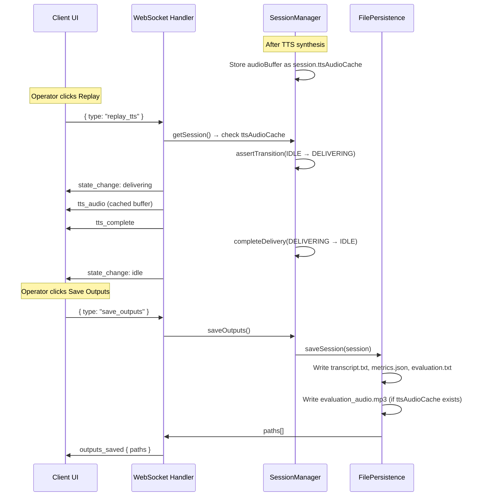

# Design Document: TTS Audio Replay and Save

## Overview

This feature extends the AI Toastmasters Evaluator with three capabilities:

1. **Server-side TTS audio caching** — After TTS synthesis, the audio buffer is stored in the session object so it can be replayed without re-calling OpenAI.
2. **Replay via WebSocket** — A new `replay_tts` client message triggers the server to re-send the cached audio buffer using the existing `tts_audio`/`tts_complete` message sequence, with proper state transitions (IDLE → DELIVERING → IDLE).
3. **Audio file persistence** — When "Save Outputs" is clicked, the cached TTS audio buffer is written to `evaluation_audio.mp3` alongside the existing output files.

The design follows the existing patterns: session data lives in memory only, the TTS audio cache follows the same retention lifecycle as other session data, and file persistence remains opt-in only.

## Architecture

The feature touches four existing components with minimal new abstractions:



### Key Design Decisions

1. **Cache in session object, not a separate store.** The TTS audio buffer is a single field (`ttsAudioCache: Buffer | null`) on the existing `Session` interface. This keeps it subject to the same lifecycle (auto-purge, opt-out purge, new-recording clear) without any additional cleanup logic.

2. **Replay uses the same IDLE → DELIVERING → IDLE state transition.** This reuses all existing echo prevention (mic hard-stop, cooldown), panic mute cancellation (runId increment), and UI state management. No new states needed.

3. **No client-side audio caching.** The audio is always streamed from the server on replay. This keeps the client simple and ensures the server remains the single source of truth for data lifecycle. The audio buffer is typically 100-500KB (a 2-3 minute MP3), so re-sending it over WebSocket is fast.

4. **Audio saved as MP3.** OpenAI TTS returns MP3 by default. We store the raw buffer as-is and write it directly to disk — no transcoding needed.

5. **Graceful degradation on audio save failure.** If writing the audio file fails, the other output files are still saved. The error is logged but doesn't block persistence of transcript, metrics, and evaluation.

## Components and Interfaces

### 1. Session Interface Extension (`src/types.ts`)

Add a single field to the `Session` interface:

```typescript
export interface Session {
  // ... existing fields ...
  ttsAudioCache: Buffer | null; // cached TTS audio for replay (in-memory only)
}
```

### 2. WebSocket Protocol Extension (`src/types.ts`)

Add `replay_tts` to `ClientMessage`:

```typescript
export type ClientMessage =
  | /* ... existing variants ... */
  | { type: "replay_tts" };
```

No new `ServerMessage` variants needed — replay uses the existing `tts_audio`, `tts_complete`, and `state_change` messages.

### 3. SessionManager Changes (`src/session-manager.ts`)

**`generateEvaluation()`** — After successful TTS synthesis, store the audio buffer:

```typescript
// After: const audioBuffer = await this.deps.ttsEngine.synthesize(trimmedScript);
session.ttsAudioCache = audioBuffer;
return audioBuffer;
```

**`startRecording()`** — Clear the cache when starting a new recording (already clears other data):

```typescript
session.ttsAudioCache = null;
```

**`replayTTS()`** — New method:

```typescript
replayTTS(sessionId: string): Buffer | undefined {
  const session = this.getSession(sessionId);
  if (!session.ttsAudioCache) return undefined;
  this.assertTransition(session, SessionState.DELIVERING, "replayTTS");
  session.state = SessionState.DELIVERING;
  return session.ttsAudioCache;
}
```

This is synchronous — no API calls, just a state transition and buffer return.

### 4. Server WebSocket Handler (`src/server.ts`)

Add a `replay_tts` case to the message handler that:
1. Calls `sessionManager.replayTTS(sessionId)`
2. If buffer returned: sends `state_change: delivering`, `tts_audio`, `tts_complete`, `completeDelivery()`, `state_change: idle`, starts purge timer
3. If no buffer: sends recoverable error

### 5. FilePersistence Changes (`src/file-persistence.ts`)

**`saveSession()`** — After writing the existing three files, check for `session.ttsAudioCache`:

```typescript
if (session.ttsAudioCache) {
  const audioPath = join(dirPath, "evaluation_audio.mp3");
  await writeFile(audioPath, session.ttsAudioCache);
  savedPaths.push(audioPath);
}
```

Wrapped in try/catch so audio write failure doesn't block other saves.

### 6. Client UI Changes (`public/index.html`)

- Add a replay button (`btn-replay`) next to the existing controls
- Track `hasTTSAudio` boolean (set true when `tts_audio` is received, cleared on new recording/opt-out)
- Show replay button in IDLE state when `hasTTSAudio && hasEvaluationData`
- On click: send `{ type: "replay_tts" }`, apply same echo prevention as `onDeliverEvaluation()`
- Hide during DELIVERING, RECORDING states
- Disable during cooldown

### 7. Purge Integration (`src/server.ts`)

**`purgeSessionData()`** — Add `ttsAudioCache` to the purge:

```typescript
export function purgeSessionData(session: Session): void {
  // ... existing purges ...
  session.ttsAudioCache = null;
}
```

## Data Models

### Session Object Extension

| Field | Type | Default | Lifecycle |
|---|---|---|---|
| `ttsAudioCache` | `Buffer \| null` | `null` | Set after TTS synthesis. Cleared on: new recording start, auto-purge, opt-out purge. Never written to disk except via explicit "Save Outputs". |

### Privacy Classification Update

| Data Type | Contains PII | Sent to Provider | Retention |
|---|---|---|---|
| TTS audio cache (MP3) | Yes (synthesized voice of evaluation, may contain speaker name) | None (derived from OpenAI TTS response, cached locally) | In-memory only. Purged on session end or opt-out. Persisted only on explicit "Save Outputs" as evaluation_audio.mp3. |

### Output Directory Structure (Updated)

```
output/{YYYY-MM-DD_HH-mm-ss}_{sessionId}/
  transcript.txt
  metrics.json
  evaluation.txt
  evaluation_audio.mp3    ← NEW (only if TTS audio was cached)
```

### WebSocket Message Flow for Replay

```
Client → Server:  { type: "replay_tts" }
Server → Client:  { type: "state_change", state: "delivering" }
Server → Client:  { type: "tts_audio", data: <ArrayBuffer> }
Server → Client:  { type: "tts_complete" }
Server → Client:  { type: "state_change", state: "idle" }
```

This is identical to the initial delivery flow, so the client's existing TTS playback and echo prevention logic handles replay with zero changes to the playback pipeline.


## Correctness Properties

*A property is a characteristic or behavior that should hold true across all valid executions of a system — essentially, a formal statement about what the system should do. Properties serve as the bridge between human-readable specifications and machine-verifiable correctness guarantees.*

The following properties are derived from the acceptance criteria prework analysis. Each property is universally quantified and suitable for property-based testing.

### Property 1: TTS audio cache stored after synthesis

*For any* session where TTS synthesis succeeds, the session's `ttsAudioCache` field SHALL equal the buffer returned by `TTSEngine.synthesize()`, and `generateEvaluation()` SHALL return that same buffer.

**Validates: Requirements 1.1**

### Property 2: Panic mute preserves TTS audio cache

*For any* session that holds a non-null `ttsAudioCache`, calling `panicMute()` SHALL leave `ttsAudioCache` unchanged (same buffer reference and content).

**Validates: Requirements 1.3**

### Property 3: Purge clears TTS audio cache

*For any* session that holds a non-null `ttsAudioCache`, calling `purgeSessionData()` SHALL set `ttsAudioCache` to `null`.

**Validates: Requirements 1.4**

### Property 4: New recording clears TTS audio cache

*For any* session in IDLE state that holds a non-null `ttsAudioCache`, calling `startRecording()` SHALL set `ttsAudioCache` to `null`.

**Validates: Requirements 1.5**

### Property 5: Replay returns cached buffer and transitions state

*For any* session in IDLE state with a non-null `ttsAudioCache`, calling `replayTTS()` SHALL return a buffer equal to `ttsAudioCache` AND transition the session state to DELIVERING. Subsequently calling `completeDelivery()` SHALL transition the session back to IDLE.

**Validates: Requirements 2.1, 2.4**

### Property 6: Audio file persistence if and only if cache exists

*For any* session, calling `saveSession()` SHALL include `evaluation_audio.mp3` in the returned paths array if and only if `session.ttsAudioCache` is non-null. When included, the file content SHALL equal the `ttsAudioCache` buffer.

**Validates: Requirements 4.1, 4.2, 4.3**

## Error Handling

### Replay with No Cache (Req 2.2)
When `replay_tts` is received and `ttsAudioCache` is null, the server sends a recoverable error: `"No TTS audio available for replay."` The session state remains unchanged (IDLE).

### Replay in Wrong State (Req 2.3)
When `replay_tts` is received and the session is not in IDLE state, `replayTTS()` throws an invalid state transition error. The server catches this and sends a recoverable error. The session state remains unchanged.

### Audio File Write Failure (Req 4.4)
If writing `evaluation_audio.mp3` fails, the error is logged, and the remaining output files (transcript.txt, metrics.json, evaluation.txt) are still saved. The returned paths array includes only the files that were successfully written. A warning is logged indicating the audio file could not be saved.

### TTS Playback Failure During Replay
If the client encounters an audio playback error during replay, the same fail-safe silent mode applies: playback stops, the written evaluation remains displayed, and the session transitions to IDLE. The replay button remains available for another attempt.

### Panic Mute During Replay
If panic mute is triggered during replay playback, the existing panic mute behavior applies: session transitions to IDLE, runId increments, client stops TTS playback. The `ttsAudioCache` is preserved (consistent with panic mute preserving data), so the operator can replay again.

## Testing Strategy

### Property-Based Testing

Use `fast-check` (already available in the project via Vitest) for property-based tests. Each property test runs a minimum of 100 iterations.

| Property | Test File | What It Generates |
|---|---|---|
| Property 1: Cache stored after synthesis | `src/session-manager.property.test.ts` | Random audio buffers (1–100KB), mock TTS engine returning them |
| Property 2: Panic mute preserves cache | `src/session-manager.property.test.ts` | Random audio buffers set as ttsAudioCache |
| Property 3: Purge clears cache | `src/server.property.test.ts` | Random audio buffers set as ttsAudioCache |
| Property 4: New recording clears cache | `src/session-manager.property.test.ts` | Random audio buffers set as ttsAudioCache |
| Property 5: Replay returns cached buffer | `src/session-manager.property.test.ts` | Random audio buffers, sessions in IDLE state |
| Property 6: Audio file persistence iff cache | `src/file-persistence.property.test.ts` | Random sessions with/without ttsAudioCache, random audio buffers |

Each property test is tagged with: `Feature: tts-audio-replay-and-save, Property {N}: {title}`

### Unit Tests

Unit tests complement property tests by covering specific examples and edge cases:

- **Replay with no cache** — verify recoverable error response (Req 2.2)
- **Replay in DELIVERING state** — verify state transition rejection (Req 2.3)
- **Audio file write failure** — verify other files still saved (Req 4.4)
- **UI replay button visibility** — verify show/hide logic across state transitions (Req 3.1–3.5)
- **WebSocket replay_tts handler** — verify full message sequence (state_change → tts_audio → tts_complete → state_change)
- **Purge timer reset on replay** — verify auto-purge timer restarts after replay delivery completes
