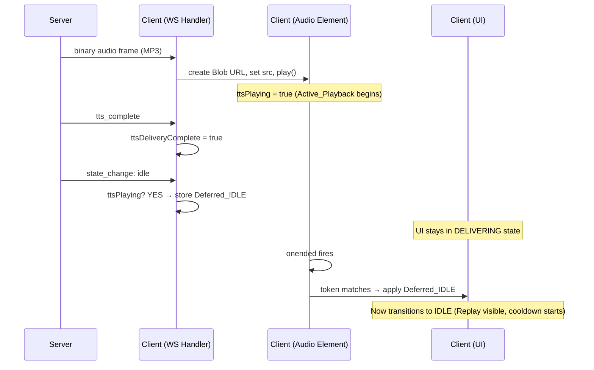
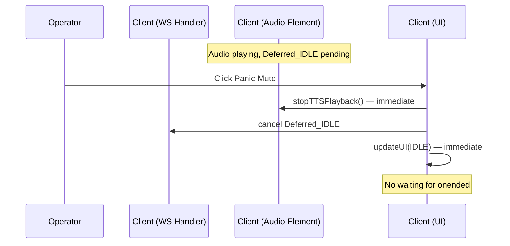

# Design Document: TTS Playback Glitch Fix

## Overview

This design addresses the race condition between server-side state transitions and client-side audio playback in the TTS delivery path. The server sends `tts_complete` and `state_change: idle` synchronously after the binary audio frame, but `HTMLAudioElement.play()` is asynchronous — the browser hasn't started decoding/playing when the IDLE transition fires. The resulting DOM mutations (hiding speaking indicator, showing Replay button, starting cooldown) cause a brief audio glitch.

The fix is entirely client-side. The server protocol remains unchanged. The client introduces a deferred IDLE transition mechanism: when `state_change: idle` arrives while TTS audio is in Active_Playback, the visual IDLE transition is held until the audio element's `onended` event fires. Panic mute bypasses the deferral unconditionally.

## Architecture

The change is scoped to the client-side JavaScript in `public/index.html`. No server-side changes are needed.



### Panic Mute Override Flow



## Components and Interfaces

### New Client-Side State Variables

All changes are in the `<script>` block of `public/index.html`:

```javascript
/** Monotonic counter for playback instance identification */
let playbackInstanceToken = 0;

/** Pending deferred IDLE transition, or null if none */
let deferredIdleTransition = null;
// Shape: { token: number } | null

/**
 * Latch for the "IDLE arrives before ttsPlaying=true" ordering edge case.
 *
 * Set when state_change: idle arrives while ttsPlaying is false AND
 * we are in any non-IDLE state (not just DELIVERING — this handles reconnect
 * oddities, missed state_change: delivering, or state already flipped due to
 * other UI logic). Does NOT fire on redundant IDLE→IDLE. Idempotent: won't
 * re-latch if already set.
 *
 * Token-stamped: stores the playbackInstanceToken at latch time. When
 * handleTTSAudio consumes the latch, it only creates a deferral if the
 * latch token matches expected progression (i.e., the new playback token
 * is exactly latchToken + 1). This prevents a stale latch from an earlier
 * session phase from "attaching" to unrelated audio (e.g., replay triggered
 * much later). If the token doesn't match, the latch is cleared without
 * creating a deferral.
 *
 * Consumed by handleTTSAudio: if pendingIdleFromServer is non-null when
 * handleTTSAudio runs, it checks the token and either creates a deferral
 * (token matches) or discards the latch (stale).
 *
 * Cleared by: handleTTSAudio (consumed or discarded), forceStopTtsAndCancelDeferral()
 * (force-stop paths), and transitionToIdle() (normal IDLE application).
 */
let pendingIdleFromServer = null;
// Shape: { tokenAtLatch: number } | null
```

### Modified Functions

#### `handleStateChange(newState)` — Primary Change

Current behavior: always calls `updateUI(newState)` for IDLE transitions.

New behavior: when `newState === IDLE` and `ttsPlaying` is true, store a `deferredIdleTransition` with the current `playbackInstanceToken` instead of calling `updateUI`. The deferral is keyed on Active_Playback, not on `previousState === DELIVERING` — this handles edge cases like reconnects, rapid transitions, or missed `state_change: delivering` messages.

```javascript
function handleStateChange(newState) {
  const previousState = currentState;

  // Echo prevention: hard-stop mic when entering DELIVERING state
  if (newState === SessionState.DELIVERING) {
    hardStopMic();
  }

  // If leaving DELIVERING due to panic mute (going to IDLE without tts_complete),
  // force-stop playback. But if ttsDeliveryComplete is true, let audio play naturally.
  if (previousState === SessionState.DELIVERING && newState !== SessionState.DELIVERING) {
    if (!ttsDeliveryComplete) {
      // Panic mute or error — force stop
      forceStopTtsAndCancelDeferral(); // Clears deferral, bumps token, stops audio, clears ttsPlaying
    }
  }

  // ── IDLE transition decision chain (explicit else-if to prevent reorder mistakes) ──
  // Branch A: ttsPlaying is true → defer
  if (newState === SessionState.IDLE && ttsPlaying) {
    if (!ttsAudioElement || !ttsAudioElement.src) {
      console.warn("[TTS] ttsPlaying is true but audio element/src missing — possible bug");
    }
    // Idempotent: don't overwrite an existing deferral
    if (deferredIdleTransition === null) {
      deferredIdleTransition = { token: playbackInstanceToken };
    }
    // Cooldown will start when deferred IDLE is applied
    return; // Do NOT call updateUI yet
  }

  // Branch B: not playing, non-IDLE state → latch (IDLE arrived before audio)
  // Token-stamped: store current playbackInstanceToken so handleTTSAudio can
  // verify the latch is from the expected session phase (new token = latch + 1).
  // If handleTTSAudio never runs (e.g., server error, no audio sent), the latch
  // is harmless — transitionToIdle() clears it, and force-stop paths clear it too.
  else if (newState === SessionState.IDLE && !ttsPlaying && currentState !== SessionState.IDLE) {
    if (pendingIdleFromServer === null) {
      pendingIdleFromServer = { tokenAtLatch: playbackInstanceToken };
    }
    // Don't transition yet — wait for handleTTSAudio to consume the latch
    return;
  }

  // Branch C: not playing, already IDLE or no latch needed → immediate transition
  // All non-deferred IDLE transitions go through transitionToIdle() — single unified path.
  else if (newState === SessionState.IDLE) {
    transitionToIdle();
    return;
  }

  // Branch D: non-IDLE state → pass through
  updateUI(newState);
}
```

#### `handleTTSAudio(audioData)` — Minor Change

Increment `playbackInstanceToken` before setting `ttsPlaying = true` so the token is bound to this specific playback instance. The `onended` handler cleans up state first (set `ttsPlaying = false`, cleanup audio resources), then applies the deferred IDLE — this ensures `updateUI` sees consistent flags.

```javascript
function handleTTSAudio(audioData) {
  // ... existing validation ...

  // ── MUST-NOT-REFACTOR ORDERING INVARIANT ──
  // The following steps MUST execute in exactly this order. Reordering any
  // step (especially moving latch consumption after play() or after setting
  // ttsPlaying) can reintroduce the race condition this fix exists to prevent.
  // Encode this ordering in the property model (Property 11).
  //
  // Explicit ordering: token++ → capture → consume latch → set handlers → ttsPlaying=true → play()

  // 1. Increment token for this new playback instance
  playbackInstanceToken++;
  // 2. Capture token for closure
  const currentToken = playbackInstanceToken;

  // 3. Consume the pendingIdleFromServer latch: if IDLE arrived before this
  // function ran (ordering edge case), create the deferral now, bound to the
  // new token. Token validation: only consume if the latch token matches
  // expected progression (latchToken + 1 === currentToken). This prevents a
  // stale latch from an earlier session phase from "attaching" to unrelated
  // audio (e.g., replay triggered much later after other state changes).
  // If the token doesn't match, the latch is stale — discard it.
  if (pendingIdleFromServer !== null) {
    const latchIsRelevant = (pendingIdleFromServer.tokenAtLatch + 1 === currentToken);
    pendingIdleFromServer = null; // Always clear — consumed or discarded
    if (latchIsRelevant && deferredIdleTransition === null) {
      deferredIdleTransition = { token: currentToken };
    }
  }

  // 3. Set handlers BEFORE play() so they're ready for immediate events
  ttsAudioElement.onended = function () {
    // Clean up state FIRST so updateUI sees consistent flags
    ttsPlaying = false;
    cleanupTTSAudio();
    // Then apply deferred IDLE (which calls updateUI)
    applyDeferredIdle(currentToken);
  };

  ttsAudioElement.onerror = function (e) {
    // onerror: triggerTTSFailSafe owns the force-stop internally
    triggerTTSFailSafe();
  };

  // 4. Set ttsPlaying=true immediately before play() — covers the decode gap
  ttsPlaying = true;

  // 5. Call play()
  // ... rest of existing code (set src, play()) ...
  ttsAudioElement.play().then(function () {
    console.log("[TTS] play() promise resolved, audio is playing");
  }).catch(function (err) {
    console.error("[TTS] play() promise rejected:", err);
    // play() can reject without firing onerror — triggerTTSFailSafe owns the force-stop
    triggerTTSFailSafe();
  });
}
```

#### `applyDeferredIdle(token)` — New Function

```javascript
/**
 * Applies a deferred IDLE transition if the token matches.
 * Called from onended handler after ttsPlaying and cleanup are done.
 *
 * No-op cases (both are safe and expected):
 * - deferredIdleTransition is null (no deferral was pending — e.g., audio ended
 *   before state_change: idle arrived, or deferral was already cancelled)
 * - Token mismatch (stale onended from a previous/cancelled playback)
 *
 * This is the single entry point for deferred IDLE application.
 * It calls transitionToIdle() which handles both updateUI and cooldown
 * in a consistent order.
 *
 * @param {number} token - The playback instance token from the onended closure
 */
function applyDeferredIdle(token) {
  if (deferredIdleTransition === null) return; // No deferral pending — no-op
  if (deferredIdleTransition.token !== token) return; // Stale event — ignore

  deferredIdleTransition = null;
  transitionToIdle();
}

/**
 * Single authoritative function for transitioning to IDLE with cooldown.
 * Avoids double-cooldown bugs by keeping updateUI + cooldown in one place.
 * Order: updateUI first (pure visual state flip), then startCooldown (timers/side effects).
 * This prevents micro-hiccups from cooldown DOM/timer work before the UI state is consistent.
 *
 * Idempotent: if already in IDLE with cooldown running (cooldownTimerId !== null),
 * no-op. The guard is `currentState === SessionState.IDLE && cooldownTimerId !== null`
 * — this is precise enough to distinguish "already IDLE with cooldown active" from
 * "IDLE but cooldown wasn't started" (e.g., recovery paths that reach IDLE without
 * going through normal delivery). Using just `currentState === IDLE` would skip
 * cooldown in legitimate cases where UI is IDLE but cooldown wasn't started yet.
 *
 * ALL code paths that transition to IDLE must go through this function —
 * including triggerTTSFailSafe(), applyDeferredIdle(), and handleStateChange().
 * This prevents divergence where some paths miss cooldown or start it twice.
 */
function transitionToIdle() {
  // Precise idempotency: skip only if already IDLE AND cooldown is running.
  // If IDLE but no cooldown (recovery path), we still need to start cooldown.
  if (currentState === SessionState.IDLE && cooldownTimerId !== null) return;
  pendingIdleFromServer = null; // Clear latch — we're applying IDLE now
  updateUI(SessionState.IDLE);
  startCooldown();
}
```

#### `cancelDeferredIdle()` — New Function

**Responsibility split**: `cancelDeferredIdle()` handles deferral cancellation and token invalidation ONLY. It does NOT touch `ttsPlaying` or stop playback. `forceStopTtsAndCancelDeferral()` is the single composite primitive that calls both `cancelDeferredIdle()` and `stopTTSPlayback()`. ALL force-stop and error paths MUST use `forceStopTtsAndCancelDeferral()` — never call `cancelDeferredIdle()` alone in a force-stop context.

**`ttsPlaying` lifecycle contract**: `ttsPlaying` must be set to `true` immediately before `play()` is called, and set to `false` in ALL of these exit paths:

- `onended` handler (directly: `ttsPlaying = false`)
- `onerror` handler (via `forceStopTtsAndCancelDeferral()` → `stopTTSPlayback()`)
- `play().catch()` handler (via `forceStopTtsAndCancelDeferral()` → `stopTTSPlayback()`)
- `stopTTSPlayback()` (directly)
- `forceStopTtsAndCancelDeferral()` (via `stopTTSPlayback()`)

`cancelDeferredIdle()` does NOT clear `ttsPlaying` — it is a pure deferral/token operation. This is safe because it is never called alone in force-stop paths; `forceStopTtsAndCancelDeferral()` always wraps it.

If any exit path fails to clear `ttsPlaying`, a dead deferral can occur (Property 9 violation).

```javascript
/**
 * Cancels any pending deferred IDLE transition and invalidates the current
 * playback token so that late onended events from a previous playback
 * cannot apply a future deferral.
 *
 * DOES NOT clear ttsPlaying or stop playback — that is the responsibility
 * of stopTTSPlayback(). Use forceStopTtsAndCancelDeferral() for force-stop paths.
 *
 * Called internally by forceStopTtsAndCancelDeferral().
 */
function cancelDeferredIdle() {
  deferredIdleTransition = null;
  // Monotonic bump: any in-flight onended closure holding the old token
  // will fail the token match in applyDeferredIdle()
  playbackInstanceToken++;
}
```

#### `forceStopTtsAndCancelDeferral()` — New Function

Single composite primitive for ALL force-stop and error paths. Eliminates the foot-gun where a future refactor calls `cancelDeferredIdle()` without `stopTTSPlayback()` (leaving `ttsPlaying === true` and causing a dead deferral) or vice versa.

```javascript
/**
 * Composite force-stop: cancels deferral, bumps token, clears latch, stops audio,
 * clears ttsPlaying.
 *
 * Post-conditions hold immediately after the call:
 * - deferredIdleTransition === null
 * - pendingIdleFromServer === null
 * - playbackInstanceToken bumped (late onended events are harmless due to token
 *   invalidation + handler nulling in stopTTSPlayback)
 * - ttsPlaying === false
 * - audio element event handlers nulled
 *
 * Note: this is NOT truly atomic against queued browser events — a late onended
 * CAN still fire after this call returns. That is safe because the token bump +
 * handler nulling ensures late callbacks are no-ops. Do not assume "no late
 * callbacks possible"; assume "late callbacks are harmless."
 *
 * ALL force-stop paths (panic mute, revoke consent, ws close, onerror, play reject)
 * MUST call this instead of calling cancelDeferredIdle() and stopTTSPlayback() separately.
 */
function forceStopTtsAndCancelDeferral() {
  cancelDeferredIdle();  // Clear deferral + bump token
  pendingIdleFromServer = null; // Clear latch
  stopTTSPlayback();     // Stop audio + clear ttsPlaying + null handlers
}
```

#### `onPanicMute()` — Minor Change

Add `cancelDeferredIdle()` call before `stopTTSPlayback()`:

```javascript
function onPanicMute() {
  hardStopMic();
  forceStopTtsAndCancelDeferral(); // Atomic: cancel deferral + bump token + stop audio + clear ttsPlaying
  clearCooldown();
  pipelineStage = "idle";
  pipelineRunId = 0;
  wsSend({ type: "panic_mute" });
  updateUI(SessionState.IDLE);
  showInterruptionBanner();
}
```

#### `ws.onclose` — Minor Change

Add `cancelDeferredIdle()` to the WebSocket close handler so a disconnect during deferred state triggers the fail-safe:

```javascript
ws.onclose = function () {
  // ... existing code ...
  // Fail-safe: if WS drops during playback, deferred state, pending latch,
  // or any non-IDLE state, stop everything. The pendingIdleFromServer check
  // covers the case where the latch is set (e.g., PROCESSING→IDLE with
  // !ttsPlaying) and the socket drops before handleTTSAudio runs.
  if (ttsPlaying || deferredIdleTransition !== null || pendingIdleFromServer !== null || currentState !== SessionState.IDLE) {
    triggerTTSFailSafe(); // Owns force-stop internally: forceStopTtsAndCancelDeferral() + show written eval + transitionToIdle()
  }
  // ... existing code ...
};
```

#### `onRevokeConsent()` — Minor Change

Add `cancelDeferredIdle()` alongside existing `stopTTSPlayback()`:

```javascript
function onRevokeConsent() {
  // ... existing confirmation dialog ...
  hardStopMic();
  forceStopTtsAndCancelDeferral(); // Atomic: cancel deferral + bump token + stop audio + clear ttsPlaying
  clearCooldown();
  wsSend({ type: "revoke_consent" });
}
```

## Data Models

No new data models. The change introduces two client-side variables:

| Variable | Type | Default | Purpose |
|---|---|---|---|
| `playbackInstanceToken` | `number` | `0` | Monotonic counter incremented on each new TTS playback. Binds a Deferred_IDLE to a specific playback instance. |
| `deferredIdleTransition` | `{ token: number } \| null` | `null` | Stores the pending IDLE transition. Non-null means the UI should stay in DELIVERING until `onended` fires with a matching token. |
| `pendingIdleFromServer` | `{ tokenAtLatch: number } \| null` | `null` | Token-stamped latch for the "IDLE arrives before ttsPlaying=true" ordering edge case. Set when `state_change: idle` arrives while in any non-IDLE state but `ttsPlaying` is false. Stores the `playbackInstanceToken` at latch time. `handleTTSAudio` only consumes it if the token matches expected progression (latchToken + 1 === new token); otherwise discards as stale. |

### State Invariants

1. `deferredIdleTransition !== null` implies `ttsPlaying === true` (or was true when the deferral was created, or `pendingIdleFromServer` was consumed by `handleTTSAudio`)
2. `deferredIdleTransition.token <= playbackInstanceToken` (token is always from a current or past playback)
3. After `cancelDeferredIdle()`: `deferredIdleTransition === null`, `playbackInstanceToken` bumped. `ttsPlaying` is NOT modified — use `forceStopTtsAndCancelDeferral()` in force-stop paths to also clear `ttsPlaying` and `pendingIdleFromServer`
4. `playbackInstanceToken` is monotonically increasing (never decremented or reset) — bumped both on new playback and on cancellation
5. `triggerTTSFailSafe()` always calls `forceStopTtsAndCancelDeferral()` internally (idempotent if already stopped), shows written evaluation, and calls `transitionToIdle()`. Callers never force-stop before calling it — single entry point, no double-stop/double-cooldown risk
6. `ttsPlaying` is set `false` on every exit path (onended directly, onerror/play-reject/ws-close via triggerTTSFailSafe→forceStopTtsAndCancelDeferral→stopTTSPlayback, panic-mute/revoke via forceStopTtsAndCancelDeferral→stopTTSPlayback) — no dead deferrals
7. `pendingIdleFromServer` is cleared on every path that resolves the IDLE question: consumed or discarded by `handleTTSAudio` (token match → deferral created; token mismatch → discarded), cleared by `forceStopTtsAndCancelDeferral()`, cleared by `transitionToIdle()`. It is never left dangling. Token validation (`latchToken + 1 === currentToken`) prevents a stale latch from an earlier session phase from attaching to unrelated audio
8. `transitionToIdle()` idempotency guard: `currentState === SessionState.IDLE && cooldownTimerId !== null`. This is precise — it distinguishes "IDLE with cooldown active" (no-op) from "IDLE without cooldown" (needs cooldown start, e.g., recovery paths)
9. `playbackInstanceToken` is only incremented by `handleTTSAudio` (new playback) and `cancelDeferredIdle` (force-stop/cancellation). No other code path may increment it. This invariant is required by the latch's `+1` progression check — if any other site increments the token, `latchToken + 1 === currentToken` will silently discard legitimate latches


## Correctness Properties

*A property is a characteristic or behavior that should hold true across all valid executions of a system — essentially, a formal statement about what the system should do. Properties serve as the bridge between human-readable specifications and machine-verifiable correctness guarantees.*

The client-side deferral logic is a small state machine with clear invariants. The properties below are derived from the acceptance criteria and cover the core state transitions, edge cases, and safety overrides.

### Property 1: Deferred IDLE round-trip

*For any* event sequence where `state_change: idle` arrives while `ttsPlaying` is true, the client should store a `deferredIdleTransition` with the current `playbackInstanceToken`, keep the UI in DELIVERING state, and only transition to IDLE when `onended` fires with a matching token — at which point `startCooldown` is called.

**Validates: Requirements 1.1, 1.2, 1.4, 3.2**

### Property 2: Immediate IDLE when not playing

*For any* client state where `ttsPlaying` is false and `deferredIdleTransition` is null, receiving `state_change: idle` should immediately transition the UI to IDLE with no deferral stored.

**Validates: Requirements 1.3**

### Property 3: Duplicate idle idempotency

*For any* client state where `deferredIdleTransition` is non-null, receiving additional `state_change: idle` messages should not modify the existing `deferredIdleTransition` token, should not trigger `updateUI`, and should not call `startCooldown`.

**Validates: Requirements 1.6**

### Property 4: Stale token rejection

*For any* `deferredIdleTransition` with token T, an `onended` event with token T' where T' ≠ T should leave `deferredIdleTransition` unchanged and should not trigger `updateUI` or `startCooldown`.

**Validates: Requirements 1.7**

### Property 5: Panic mute always clears deferral and playback

*For any* client state (with or without a pending `deferredIdleTransition`, with or without active TTS playback), triggering panic mute should result in `deferredIdleTransition === null`, `ttsPlaying === false`, and `currentState === SessionState.IDLE`.

**Validates: Requirements 2.1, 2.2**

### Property 6: Abort during deferral triggers fail-safe

*For any* client state where `deferredIdleTransition` is non-null, if an abort event occurs (TTS audio error, `play()` rejection, or WebSocket disconnect), the client should cancel the deferral (`deferredIdleTransition === null`), invalidate the token, stop playback (`ttsPlaying === false`), ensure the evaluation panel is visible, and transition to IDLE.

**Validates: Requirements 4.1, 4.2, 4.3**

### Property 7: Cancellation invalidates token

*For any* client state, after `cancelDeferredIdle()` is called, a late `onended` event carrying the previous `playbackInstanceToken` value should not apply any IDLE transition, because the token has been bumped and will fail the match in `applyDeferredIdle()`.

**Validates: Requirements 1.7, 2.3**

### Property 8: play() rejection doesn't deadlock

*For any* client state where `ttsPlaying` is true and `play()` rejects (Promise catch fires without `onerror`), the client should cancel any pending deferral, invalidate the token, stop playback, show the written evaluation, and transition to IDLE. The system must not remain stuck in DELIVERING with no way to recover.

**Validates: Requirements 4.3**

### Property 9: No dead deferral

*For any* client state where a Deferred_IDLE is pending and `ttsPlaying` subsequently becomes false (via `onended`, `onerror`, `play()` rejection, `stopTTSPlayback()`, or `triggerTTSFailSafe()`), the deferred transition is eventually applied — either via `applyDeferredIdle()` token match in `onended`, or via `cancelDeferredIdle()` + fail-safe in error/stop paths. The UI must always reach IDLE; it must never remain stuck in DELIVERING with `ttsPlaying === false` and a stale deferral.

Test scope: generated event sequences must include: `state_change: idle` arriving before `handleTTSAudio`, `ws.onclose` while playing but before deferral is created, duplicate `onended` events, `play()` rejection without `onerror`.

**Validates: Requirements 1.2, 4.1, 4.2, 4.3**

### Property 10: No premature replay visibility

*For any* client state where `ttsPlaying` is true, the UI state must not be IDLE (and therefore the Replay button must not be visible) unless a forced-stop path (panic mute, fail-safe, or `stopTTSPlayback()`) has been executed. Equivalently: `ttsPlaying === true` implies `uiState !== IDLE` unless the transition was via a force-stop path. The test model must include a `forcedStop: boolean` flag, set by panic mute / revoke / fail-safe actions; Property 10 asserts: if `ttsPlaying && !forcedStop` then `uiState !== IDLE`. This is the direct encoding of the original bug — any regression that calls `transitionToIdle()` or `updateUI(IDLE)` while audio is still playing will violate this property.

**Validates: Requirements 1.4, 1.8**

### Property 11: pendingIdleFromServer latch correctness

*For any* event sequence where `state_change: idle` arrives while `currentState !== IDLE` and `ttsPlaying === false`, the client should set `pendingIdleFromServer = { tokenAtLatch: playbackInstanceToken }` (idempotent — no re-latch if already non-null) and NOT transition to IDLE. The condition uses `currentState !== IDLE` rather than `currentState === DELIVERING` to handle reconnect oddities and missed state transitions. It does NOT fire on redundant IDLE→IDLE. If `handleTTSAudio` subsequently runs, it should check token progression (`latchToken + 1 === currentToken`): if match, consume the latch and create a `deferredIdleTransition` bound to the new playback token; if mismatch, discard the latch without creating a deferral (stale latch from earlier session phase). If a force-stop event occurs before `handleTTSAudio` runs, `forceStopTtsAndCancelDeferral()` should clear the latch. The latch must never be left dangling — after any terminal event (IDLE applied, force-stop, or fail-safe), `pendingIdleFromServer` must be null.

The ordering within `handleTTSAudio` is a must-not-refactor invariant: `token++` → `capture token` → `consume latch` → `set handlers` → `ttsPlaying = true` → `play()`. Reordering any step (especially moving latch consumption after `play()` or after setting `ttsPlaying`) can reintroduce the race condition.

**Validates: Requirements 1.10**

## Error Handling

| Scenario | Behavior |
| --- | --- |
| `onerror` on TTS_Audio_Element during deferral | Cancel deferral (with token bump), stop playback, show written evaluation, transition to IDLE via `triggerTTSFailSafe()`. |
| WebSocket disconnect during deferral | Cancel deferral (with token bump), stop playback, show written evaluation, transition to IDLE via `triggerTTSFailSafe()`. |
| `play()` promise rejection | Cancel deferral (with token bump), stop playback, show written evaluation, transition to IDLE via `triggerTTSFailSafe()`. Browsers can reject `play()` without firing `onerror`. |
| Stale `onended` from previous playback | Ignored via token mismatch check in `applyDeferredIdle()`. Token was bumped by `cancelDeferredIdle()` on the previous cancellation. No state change. |
| Panic mute during any state | Unconditional cleanup: cancel deferral (with token bump), stop playback, clear cooldown, transition to IDLE. Late `onended` from bumped token is harmless. |
| Revoke consent during deferral | Cancel deferral (with token bump), stop playback, clear cooldown. Server handles data purge. |
| Multiple rapid `state_change: idle` messages | Idempotent — first one creates the deferral, subsequent ones are no-ops. |
| `state_change: idle` arrives before `handleTTSAudio` (any non-IDLE state, ttsPlaying=false) | `pendingIdleFromServer` latch set (idempotent). `handleTTSAudio` consumes latch and creates deferral retroactively. If `handleTTSAudio` never runs, latch is cleared by force-stop or `transitionToIdle()`. |

## Testing Strategy

### Property-Based Testing

The deferral logic is a pure state machine that can be modeled and tested with property-based testing. We model the client state as a simple object and generate random event sequences.

Library: `fast-check` (already used in the project for existing property tests).

Each property test should run a minimum of 100 iterations.

**Test approach**: Create a lightweight model of the client state machine (currentState, ttsPlaying, deferredIdleTransition, playbackInstanceToken) and generate random sequences of events (handleTTSAudio, handleStateChange(idle), onended, panicMute, audioError, wsDisconnect). After each sequence, assert the relevant property invariants.

**Tag format**: `Feature: tts-playback-glitch-fix, Property N: <property_text>`

### Unit Testing

Unit tests cover specific scenarios and edge cases:

1. Happy path: deliver → audio plays → idle arrives (deferred) → onended fires → UI transitions to IDLE
2. No-defer path: idle arrives when not playing → immediate transition
3. Panic mute during deferral → immediate IDLE, deferral cancelled, token bumped, ttsPlaying false
4. Audio error during deferral → fail-safe, deferral cancelled, token bumped, ttsPlaying false
5. WebSocket disconnect during deferral → fail-safe, deferral cancelled, token bumped, ttsPlaying false
6. WebSocket disconnect mid-playback (no deferral yet) → fail-safe, ttsPlaying false
7. Replay path follows same deferral logic as initial delivery
8. Stale onended (token mismatch after cancellation) → ignored
9. Duplicate idle messages during deferral → idempotent
10. play() rejection during deferral → fail-safe, deferral cancelled, token bumped, ttsPlaying false
11. Late onended after panic mute cannot apply IDLE (token was bumped)
12. No dead deferral: every path that sets ttsPlaying=false also resolves any pending deferral
13. IDLE arrives before ttsPlaying=true (pendingIdleFromServer latch): idle arrives while DELIVERING but ttsPlaying is false → latch set with token → handleTTSAudio checks token progression, consumes latch and creates deferral → onended applies deferred IDLE
14. Latch cleared by force-stop: pendingIdleFromServer is non-null, panic mute fires before handleTTSAudio → latch cleared, no dangling state
15. Latch set, no audio ever arrives: pendingIdleFromServer is non-null, handleTTSAudio never runs (server error, dropped binary frame) → ws.onclose or triggerTTSFailSafe fires → forceStopTtsAndCancelDeferral clears latch, transitionToIdle reaches IDLE, no stuck state
16. transitionToIdle() idempotency: already IDLE with cooldown running → no-op; IDLE without cooldown (recovery path) → starts cooldown

### Test File Location

Tests will be added to a new test file or integrated into existing client-side test infrastructure. Since the client code is in `public/index.html` (inline script), the testable logic should be extracted into functions that can be tested in isolation. The state machine functions (`handleStateChange`, `applyDeferredIdle`, `cancelDeferredIdle`) operate on module-level variables, so tests will need to set up and tear down state.

Given the project's existing test pattern (`.test.ts` and `.property.test.ts` files in `src/`), the deferral logic tests can be written as a `src/tts-playback-deferral.test.ts` and `src/tts-playback-deferral.property.test.ts` that test extracted helper functions or simulate the state machine.
