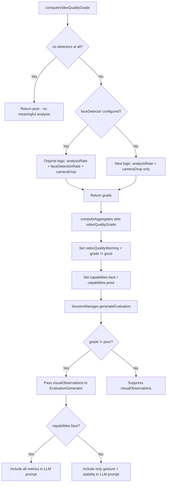

# Design Document: Video Quality Always Poor Bugfix

## Overview

The `computeVideoQualityGrade` method in `VideoProcessor` unconditionally checks `faceDetectionRate`, even when no `faceDetector` is configured via `VideoProcessorDeps`. Since `SessionManager.startRecording()` creates the `VideoProcessor` with empty deps (`{}`), every frame increments `faceNotDetectedCount`, driving `faceDetectionRate` to 0 and the grade to `"poor"`. This cascades into `generateEvaluation`, where `visualObservations` are suppressed when `videoQualityGrade === "poor"`, making all video analysis useless.

Running without a `faceDetector` is a **supported pose-only mode** — `SessionManager` wiring is correct as-is. In this mode, only pose-based metrics (gesture, body stability) are valid. Face-based metrics (gaze, facial energy) are unavailable and must be treated as such by all consumers via the `capabilities` flag.

## Scope

The fix touches three components:

1. **VideoProcessor** (`src/video-processor.ts`): grade computation logic, face-counter guards, capabilities emission, video-time duration refactor.
2. **EvaluationGenerator** (`src/evaluation-generator.ts`): capabilities-based face-metric exclusion in `buildUserPrompt`.
3. **VisualObservations** (`src/types.ts`): new `capabilities` field.

`SessionManager` requires no code changes — its existing `videoQualityGrade !== "poor"` suppression logic already handles the passthrough correctly once the grade is computed correctly. However, SessionManager passthrough behavior is normatively specified in Requirement 6 and verified in task 8.

## Architecture



## Terminology

The following terms are used consistently across requirements, design, and tasks:

- **Quality_Grade**: `"good"` | `"degraded"` | `"poor"` — exactly three values, no others.
- **Video_Quality_Warning**: `videoQualityWarning = (videoQualityGrade !== "good")`. Consistent with Phase 4 spec (Req 17.2) — not an override.
- **Analysis_Rate**: `Math.min(1, framesAnalyzed / expectedSampleCount)` — clamped to `[0, 1]`. Uses video-time (`lastReceivedTimestamp`) for duration.
- **Camera_Drop**: `Date.now() - lastFrameWallTime > config.cameraDropTimeoutSeconds * 1000` (wall-clock, default 5s timeout). Used only for real-time stall detection.
- **Pose-only mode**: `VideoProcessor` instantiated without `faceDetector`. Gesture and body stability metrics are valid. Gaze and facial energy metrics are unavailable.
- **Capabilities**: `{ face: boolean; pose: boolean }` — the sole authoritative signal for metric availability. Takes precedence over per-metric reliability flags (`gazeReliable`, `facialEnergyReliable`) for gating decisions.

## Components and Interfaces

### Modified Interface: `VisualObservations` (in `src/types.ts`)

Add a `capabilities` field:

```typescript
interface VisualObservations {
  // ... existing fields unchanged ...
  capabilities: {
    face: boolean;  // true iff deps.faceDetector was defined
    pose: boolean;  // true iff deps.poseDetector was defined
  };
}
```

`capabilities` is the sole authoritative signal for metric availability. Consumers MUST NOT infer availability from zero values, structural field presence, or per-metric reliability flags. When `capabilities.face === false`, gaze and facial energy fields are structurally present but semantically unavailable. The existing `gazeReliable` and `facialEnergyReliable` flags remain on the interface for backward compatibility with Phase 4 consumers, but `capabilities` takes precedence for all gating decisions introduced by this bugfix.

Req 5.1, 5.2, 5.3, 5.4

### Modified Method: `VideoProcessor.processFrame`

Current behavior: always pushes a gaze classification and increments `faceNotDetectedCount` when face is not valid, regardless of whether a face detector exists.

Fixed behavior:

- When `this.deps.faceDetector` is undefined: push `"other"` for gaze classification (preserves frame counting), but do NOT increment `faceNotDetectedCount`. Skip facial energy computation.
- When `this.deps.faceDetector` is defined: preserve existing behavior unchanged.

Req 4.1, 4.2, 4.3

### New Field: `VideoProcessor.lastReceivedTimestamp`

Add a private field `lastReceivedTimestamp: number` (initialized to 0) that tracks the maximum `FrameHeader.timestamp` seen across all frames entering `enqueueFrame`, regardless of whether the frame was sampled, analyzed, or errored. This is updated before any sampling or processing decisions.

This replaces `lastProcessedTimestamp` as the duration source for `expectedSampleCount`. Using the max received timestamp (rather than last processed) ensures that frames dropped by sampling or inference errors do not deflate the duration and inflate `analysisRate`.

Req 8.1

### Modified Method: `VideoProcessor.computeVideoQualityGrade`

Current behavior: always computes `faceDetectionRate` and uses it in threshold checks. `faceDetectionRate < 0.3` → `"poor"` (always true when no face detector).

Fixed behavior:

- Guard: if `expectedSampleCount <= 0`, return `"poor"`.
- Guard: if `!this.deps.faceDetector` AND `!this.deps.poseDetector` (no detectors), return `"poor"`.
- Clamp `analysisRate` to `[0, 1]` before threshold checks.
- Check `this.deps.faceDetector` presence.
- If absent (but pose available): grade based solely on `analysisRate` thresholds (≥0.8 for `"good"`, ≥0.5 for `"degraded"`, <0.5 for `"poor"`) with camera drop capping grade to at most `"degraded"`.
- If present: preserve existing dual-metric logic unchanged.

Req 1.1–1.5, 2.1–2.3, 3.1–3.3, 7.1, 7.3, 8.3, 8.4

### Modified Method: `VideoProcessor.computeAggregates`

- Compute `videoDurationSeconds` from `this.lastReceivedTimestamp` (max frame header timestamp received, monotonic) for `expectedSampleCount`. Wall-clock `Date.now() - this.recordingStartTime` is NOT used for this computation. Other uses of wall-clock `durationSeconds` in `computeAggregates` (gesture frequency, sparse transcript check) are unchanged — those measure real elapsed time for rate calculations.
- Clamp `analysisRate` via `Math.min(1, framesAnalyzed / expectedSampleCount)` before passing to `computeVideoQualityGrade`.
- Add `capabilities: { face: !!this.deps.faceDetector, pose: !!this.deps.poseDetector }` to the returned `VisualObservations`.
- `videoQualityWarning` remains `videoQualityGrade !== "good"` (unchanged).

Req 5.1–5.3, 8.1–8.3, 8.5

### Modified Method: `EvaluationGenerator.buildUserPrompt`

- When `visualObservations.capabilities.face === false`: exclude `gazeBreakdown`, `faceNotDetectedCount`, `meanFacialEnergyScore`, `facialEnergyVariation`, `facialEnergyLowSignal` from the filtered observations object. Do not check `gazeReliable` or `facialEnergyReliable` — `capabilities` is the sole gate. Only gesture and stability metrics are included.
- This is normative: `capabilities.face === false` means face metrics are unavailable, period.

Req 5.4, 6.3

## Data Models

The `VisualObservations` interface gains one new required field:

```typescript
capabilities: {
  face: boolean;  // true iff deps.faceDetector was defined
  pose: boolean;  // true iff deps.poseDetector was defined
};
```

All existing fields remain structurally unchanged. The `videoQualityGrade` field continues to hold `"good"` | `"degraded"` | `"poor"`. The `videoQualityWarning` field continues to be derived as `videoQualityGrade !== "good"`.

The existing per-metric reliability flags (`gazeReliable`, `gestureReliable`, `stabilityReliable`, `facialEnergyReliable`) remain on the interface for backward compatibility. However, `capabilities` takes precedence: when `capabilities.face === false`, face-dependent fields are semantically unavailable regardless of reliability flag values.

## Camera Drop Downgrade Rules

Camera drop detection is normative in grade computation:

1. Camera drop caps grade to at most `"degraded"` — a grade that would otherwise be `"good"` is downgraded to `"degraded"`.
2. Camera drop does NOT upgrade a grade — if already `"degraded"` from Analysis_Rate/Face_Detection_Rate, it stays `"degraded"`.
3. Camera drop does NOT change a `"poor"` grade — `"poor"` remains `"poor"`.
4. Detection uses wall-clock time: `Date.now() - lastFrameWallTime > config.cameraDropTimeoutSeconds * 1000`.
5. `lastFrameWallTime` is set to `Date.now()` each time a frame enters `processFrame`. If no frames have been received (`lastFrameWallTime === 0`), camera drop is not detected.

Req 3.1–3.4

## Analysis Rate Precision

- `expectedSampleCount = videoDurationSeconds * effectiveSamplingRate`
  - `videoDurationSeconds = this.lastReceivedTimestamp` — the maximum `FrameHeader.timestamp` seen across all received frames (monotonic, seconds since client recording start)
  - `effectiveSamplingRate = config.frameRate` (normal) or `config.frameRate / 2` (adaptive mode)
  - Wall-clock `Date.now() - recordingStartTime` is NOT used for this computation
- `analysisRate = Math.min(1, framesAnalyzed / expectedSampleCount)` — clamped to `[0, 1]`
- Guard: `expectedSampleCount <= 0` → return `"poor"`

**Why `lastReceivedTimestamp` instead of `lastProcessedTimestamp`**: `lastProcessedTimestamp` only advances when a frame passes sampling and is successfully analyzed. If frames are dropped by the sampler or error during inference, `lastProcessedTimestamp` lags behind the actual video duration, deflating `expectedSampleCount` and inflating `analysisRate`. Using the max received timestamp gives the true video duration regardless of processing outcomes.

**Why video-time instead of wall-clock**: Wall-clock duration includes camera warmup delay — the gap between `startRecording()` and the first frame arriving. This inflates `expectedSampleCount` and depresses `analysisRate`, potentially forcing a `"poor"` grade even when all received frames were successfully analyzed. Video-time measures only the interval during which frames were actually produced.

Req 8.1–8.5

## Correctness Properties

### Property 1: No-face-detector grade depends solely on analysisRate and cameraDrop

_For any_ `VideoProcessor` instantiated without a `faceDetector` (but with a `poseDetector`), and _for any_ combination of `framesAnalyzed`, `expectedSampleCount`, `faceNotDetectedCount`, and `cameraDropDetected`:

- `analysisRate >= 0.8` and no camera drop → `"good"`
- `analysisRate >= 0.8` and camera drop → `"degraded"`
- `0.5 <= analysisRate < 0.8` → `"degraded"` (camera drop has no additional effect)
- `analysisRate < 0.5` → `"poor"` (camera drop has no additional effect)

The `faceNotDetectedCount` value SHALL have no effect on the grade.

Validates: Req 1.1, 1.2, 1.3, 1.4, 3.1, 3.2, 3.3

### Property 2: Face-detector grade preserves original dual-metric behavior

_For any_ `VideoProcessor` instantiated with a `faceDetector`, and _for any_ combination of `analysisRate`, `faceDetectionRate`, and `cameraDropDetected`:

- `analysisRate >= 0.8` AND `faceDetectionRate >= 0.6` AND no camera drop → `"good"`
- `analysisRate < 0.5` OR `faceDetectionRate < 0.3` → `"poor"`
- Otherwise → `"degraded"`

Validates: Req 1.5, 2.1, 2.2, 2.3

### Property 3: faceNotDetectedCount remains 0 without face detector

_For any_ `VideoProcessor` instantiated without a `faceDetector`, and _for any_ sequence of frames processed, `faceNotDetectedCount` SHALL be 0 in the resulting `VisualObservations`.

Validates: Req 4.1

### Property 4: Non-poor grade without face detector passes visual observations

_For any_ session where `VideoProcessor` has no `faceDetector` and produces a `videoQualityGrade` of `"good"` or `"degraded"`, the `SessionManager.generateEvaluation` method SHALL pass the `VisualObservations` object (non-null) to the `EvaluationGenerator.generate` call.

Validates: Req 6.1

### Property 5: Capabilities reflect detector configuration

_For any_ `VideoProcessor`, the `capabilities` field in the returned `VisualObservations` SHALL satisfy:

- `capabilities.face === true` iff `deps.faceDetector` was defined
- `capabilities.pose === true` iff `deps.poseDetector` was defined

Validates: Req 5.1, 5.2, 5.3

### Property 6: No detectors forces poor grade

_For any_ `VideoProcessor` instantiated with `capabilities.face === false` AND `capabilities.pose === false`, the returned `videoQualityGrade` SHALL be `"poor"` regardless of `analysisRate` or `cameraDropDetected`.

Validates: Req 7.1, 7.3

## Error Handling

No new error paths are introduced. The method continues to return `"poor"` for `expectedSampleCount <= 0` as a guard. All existing error handling in `VideoProcessor` and `SessionManager` remains unchanged.

## Testing Strategy

### Property-Based Testing

Use `fast-check` (already a project dependency) with `vitest`. Each property test runs a minimum of 100 iterations.

- **Property 1** test: Generate random `(framesAnalyzed, expectedSampleCount, faceNotDetectedCount, cameraDropDetected)` tuples. Instantiate `VideoProcessor` with no `faceDetector` but with a `poseDetector`. Assert grade matches analysisRate + cameraDrop thresholds regardless of `faceNotDetectedCount`.
  - Tag: **Feature: video-quality-always-poor, Property 1**

- **Property 2** test: Generate random `(framesAnalyzed, expectedSampleCount, faceDetectedFrames, cameraDropDetected)` tuples. Instantiate `VideoProcessor` with a mock `faceDetector`. Assert grade matches the original dual-metric thresholds.
  - Tag: **Feature: video-quality-always-poor, Property 2**

- **Property 3** test: Generate random frame sequences processed by a `VideoProcessor` with no `faceDetector`. Assert `faceNotDetectedCount === 0` in the resulting `VisualObservations`.
  - Tag: **Feature: video-quality-always-poor, Property 3**

- **Property 4** test: Generate random sessions where the `VideoProcessor` has no face detector and produces non-poor grades. Assert that `generateEvaluation` receives non-null `visualObservations`.
  - Tag: **Feature: video-quality-always-poor, Property 4**

- **Property 5** test: Generate random `VideoProcessorDeps` configurations. Assert `capabilities` matches detector presence.
  - Tag: **Feature: video-quality-always-poor, Property 5**

- **Property 6** test: Generate random `(framesAnalyzed, expectedSampleCount, cameraDropDetected)` tuples with no detectors. Assert grade is always `"poor"`.
  - Tag: **Feature: video-quality-always-poor, Property 6**

### Unit Testing

- `expectedSampleCount = 0` returns `"poor"` regardless of face detector presence
- Camera drop caps `"good"` to `"degraded"` without face detector
- Camera drop caps `"good"` to `"degraded"` with face detector
- Camera drop does not change `"poor"` grade
- Boundary values: `analysisRate` exactly at 0.5 and 0.8 thresholds
- `analysisRate > 1.0` is clamped to 1.0
- `faceNotDetectedCount` remains 0 after processing frames without face detector
- `capabilities.face` and `capabilities.pose` reflect deps configuration
- `EvaluationGenerator.buildUserPrompt` excludes gaze/facial energy when `capabilities.face === false`
- Camera warmup delay (wall-clock gap before first frame) does not inflate expectedSampleCount or force `"poor"` grade
- No detectors forces `"poor"` grade regardless of analysisRate
- `lastReceivedTimestamp` tracks max frame header timestamp (not last processed)
